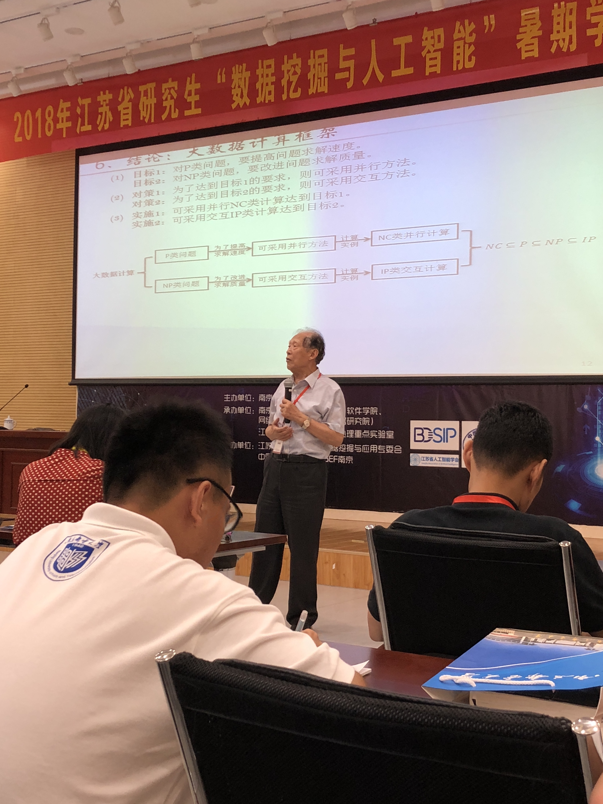

### Day 1: 开幕 & 讲座报告

今天，是暑期学校正式开幕的第一天，开幕式在上午八点正式开始。

首先，副校长蒋国平教授等多人进行了致辞，大致表达了希望我们从暑期学校中学到更多的知识和充实自我的期望。

开幕式及致辞

然后，结束了开幕式，我们在场外进行了合影留念（照片还未拿到，待补充）

紧接着，正式开始了暑期学校的学习。

#### 蒋国平教授：复杂网络:理论及其应用

说实在的，第一场讲座实在是非常学术的，以至于当时听得非常朦胧，但是还好，由于是第一场，还是记录了很多的笔记。刚开始比较基础，都是数据结构的内容，慢慢就开始高深了=_=

首先，蒋国平教授把讲座分为了四部分：网络拓扑结构、网络行为特征、复杂网络的同步和传播以及网络控制。

讲座的纲要

1. 网络拓扑

   首先，介绍了网络有诸多的类别: Internet网、交通网、生物网络、神经网络等。

   网络的构成：结点(Vertex) + 连边(Edge)

   网络的典型特征: 1.聚类系数：形容节点间的稠密程度

   			     2.二八定律 -> 较大的度数数量少

   然后引入了度分布:网络中随机选取一个节点度为k的概率$P(k) = N_k / N$

   经典的六度分离：地球上任意两个人之间的平均距离是6

   最后，介绍了三种生成模型，其中最有代表性的是Scale-free Network，

   

   该算法的思想是：根据某一概率，随机加入新的节点；然后，根据某一新的概率，随机选取两个点，并将这两个点之间连边。

   特点：

   1. 具有连通性
   2. 度多的节点，连边多，数量少，符合日常的生活规律
   3. 节点可以不断增加，有增长机制

2. 网络行为特征

   

   这一部分主要与生活现象联系紧密，研究的也不单纯是理论

   1. 群体性：在一个群体中，数量越大，越容易形成集聚，即抱团现象
   2. 同步性与非同步性：两者之间的行为可为同步可为非同步（这部分有些迷，不是很懂）

3. 复杂网络的同步与传播

   这一部分主要介绍了网络与网络之间的联系与模型。

   

   网络可分为两种：平均网络（符合泊松分布）以及抑制网络（先高后低的形状）

   模型有三种模型: SIS、SIR和SI传播模型

   

   这一段听得头皮发麻！真的是触摸到知识的盲区了，表达式看的也挺懵，不懂不懂......

4. 网络控制

   这一段主要说明了节点与节点之间的联系与沟通。一个网络的正常运转当且仅当各个节点都能得到很好地联系与认可。（我和学长一起想到了区块链的应用233，主要就是各个节点相互认可，去中心化的一种思想）

总结：第一场讲座比较学术，前半段还好，后半段简直头皮发麻🌚但给我最深的印象还是蒋老师的试验方法：从一个理想情况开始，先不考虑其他可能情况，当简单情况研究成熟后再慢慢加上新的影响要素。

#### 王东CTO：运满满在大数据和AI的应用

讲真，这是上午听得最爽的一场了！！因为是首席技术总监（CTO）的缘故，这个讲座非常的技！术！化！

王总通过对公司所获得的大数据进行的处理与加工，从而得到对用户有效的信息，然后精确地将货物与司机匹配在一起，得到利益的最大化。这场讲座我觉得干货满满，不像之前的学术化，很多的思想和工程算法都能听懂，真的是有种大彻大悟的感觉😂接下来我会就着图分析一下运满满公司是怎样利用大数据来精准推荐的。

首先，这是该公司大数据平台的一个架构。公司旗下的两款APP，分别对应着供货端与司机端。目标是把相应的货物匹配到最合适的司机上，然后收取合理的利润。

车货匹配：首先，这是一个建模的过程，首先定位了需要解决的问题：匹配问题、推荐问题与用户画像。

匹配问题：可以通过基于内容与协同过滤的算法来解决货物与司机的匹配

推荐问题：将最适合的司机对应最适合的货物，利用了推荐算法与规则算法

用户画像：通过手机各个用户在APP上的行为，将用户进行归类与打标签，并且对于不同的用户采用不同的风险控制模型进行用户管理，采用的是分类算法

经过上述算法的优化，运满满大大缩短了货物的匹配时间。平均匹配时间从以前的三天下降到了一小时

另外，在定价策略方面，也要考虑到供给关系、货主司机画像、旺季与淡季和地区因素。

紧接着，介绍了最新的无人驾驶技术，包括了以下方面:规划、感知、预测、决策、控制

运满满公司在码头和高速试行的无人卡车项目

最后，王总提出了智慧物流的概念：融合了机器视觉，自然语言，人脸识别（防疲劳），智能客服，语音发货，智能助手等技术。

真的是技术大牛，百度T9，这简历无敌了=_=

总结：在大数据时代，企业是最容易将技术用于实践的地方。由于企业掌握了T级的大数据，如何从众多数据中提炼并发掘出数据背后的实际价值是最重要的。今天听了王总的分享，对app的推荐算法又明白了一些。而企业中的大数据平台分为很多模块，如何将各个模块协同处理，每个模块之间又如何进行连接与合作也是重要的一环。听完今天的技术分享，更让我认识到了自己的不足，还要再多多学习。

#### 陈国良院士：大数据并行与交互式计算

嗯，终于轮到了压轴人物出场了：毕业于中国科学院大学的陈院士！这也是我第一次能见到院士。现已80高龄的陈国良院士仍然非常精神，着实令人敬佩。今天陈院士分享的主题是理论计算问题，接下来我会简要将重点整理在下方。

首先，在生活中，我们经常遇到要求解一系列问题。在求解中，我们一般运用时间复杂度来记录解决所需要的时间。如果是线性时间内能得到解决，那么就是O(kn),k为常数，如果时间为一个多项式，那么计算的时间将会显著变大，这时我们可以通过降低复杂度的方法进行求解与优化。

接下来，陈院士引入了P与NP问题的定义。所谓P类问题，就是可以在多项式时间内可以**计算**出的问题；所谓NP类问题，就是能在多项式时间内通过**猜测**将答案猜出来，且只能猜一次（注：从这可以发现，NP问题很少有直观的解法，更多的方法是通过碰运气进行求解）

那么，现在问题来了，这是一般的情况下，那么，在超大规模的数据情况下，原来的方法结论还成立吗？当然不能成立了。为了解决大规模的问题，针对P类问题，由于原来可经多项式时间内求解，故我们可以采用并行的方法，对原有的算法进行加速，通过并行提高速度；针对NP类问题，由于原先只能猜一次，所以我们可以采用交互式计算的方法，即**多猜几次**，通过对原有的计算方法进行改良的方法，从而改进猜测的质量。

接下来，陈院士话锋一转，谈到了计算科学的三要素：

1. 计算手段机械化：则通过一个既定的程序来求解
2. 计算描述抽象化：在理论研究中，要找到一个普适性的方法，使得对于任何一种生活中的情况，都能得到对应的解决方案，而不应只停留在具体案例上
3. 计算过程自动化：在计算中，算法应能自动脱离人的控制而完成，而不应被人的行为所影响

紧接着，陈院士介绍了图灵机，分为了确定图灵机和不确定图灵机，区别在于是否只有唯一的一条路线可供选择。

最后，陈院士展示了一个框架，通过框架，我们能够更轻松地了解P与NP问题的关联与区别。

总结：陈国良院士今天的讲座还是很通俗易懂的，没有讲到过多的理论知识，听起来还是比较容易懂的。在讲座中间，陈院士还回顾了自己上大学时候的一些所见所闻与奇闻异事，其中偷爬窗户占座那段我觉得最有意思😂生活中陈院士还是一个挺幽默的老师，在学术上他也是非常厉害的。通过今天的讲座，我了解了以前一直听说的P与NP问题到底是什么，以及发现计算问题，离我们并不遥远。衷心希望陈院士能在三尺讲台上再奉献更多精彩的讲座！

#### 陈可佳博士：金融+机器学习

最后一场，也是传说中的，陈可佳女博士带来的机器学习讲座。

这场讲座我个人觉得，虽然面十分广，但是感觉不够精，很多部分都在泛泛而谈，再加上后期精力有些跟不上了，所以笔记做的有些少，望理解=_=

首先，由于金融行业的特殊性，在金融行业的深度学习中的参数，需要经过理论推导与证明安全后，才能投入使用，故此，在金融中的风险控制中：

1. 主要是基于计量经济学理论
2. 统计学为主要分析方法

那么，在机器学习中，**特征工程**也是很重要的一环，选取一个良好的特征训练，将会收到更好的效果。反之，则会直接影响预判结果的正确性。

在使用机器学习进行选股时，股票因子与权重占有很重要的位置；复杂情况下，多因子选股时，要分清每一因子所影响的范围及互相间的变化，谨慎选择最优的方案。

那么，这就是Day 1的全部内容，感谢各位的留意与观看，我们明天再见😀晚安💤

