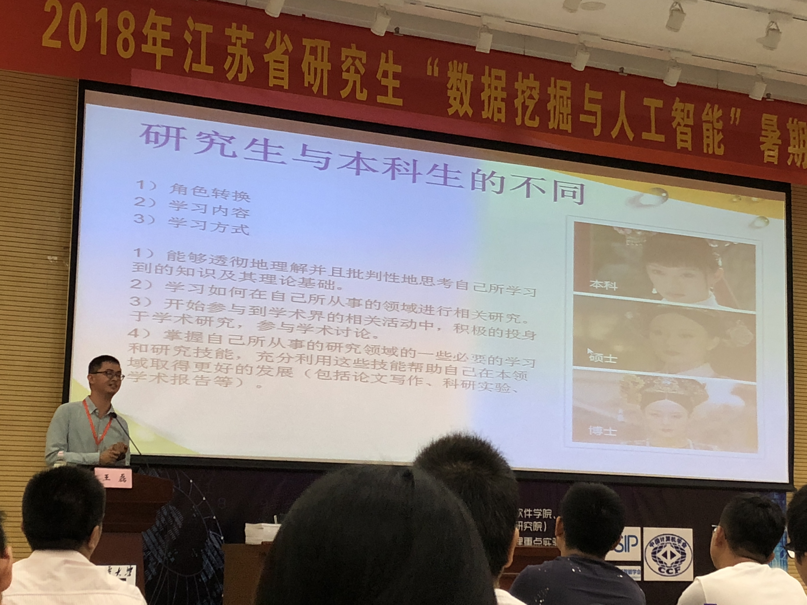
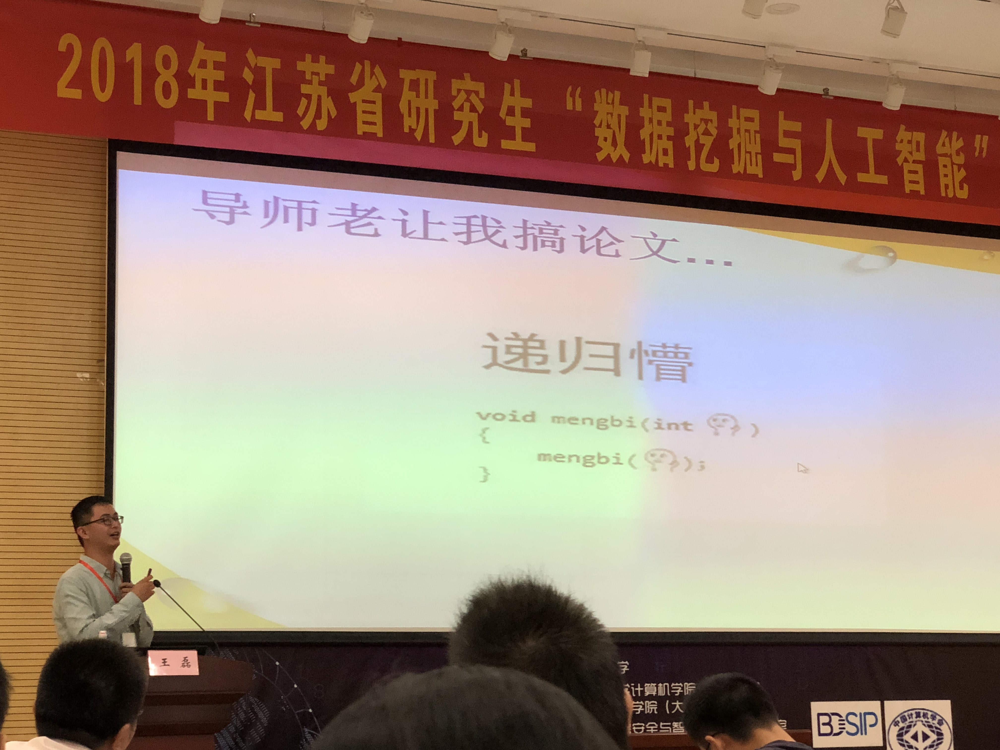
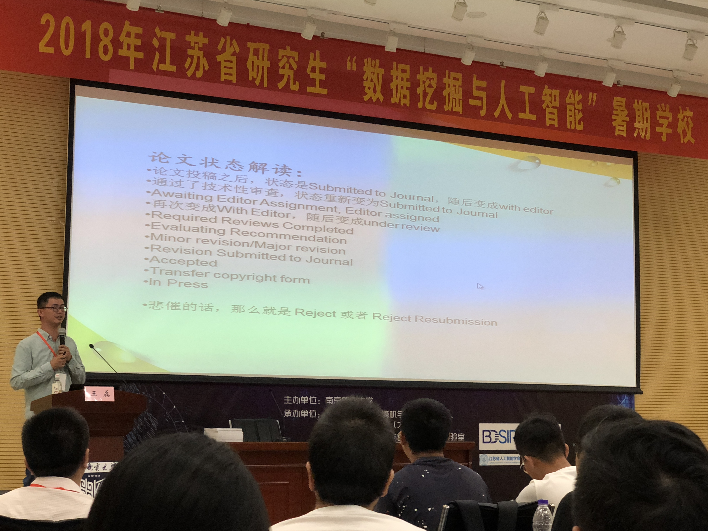
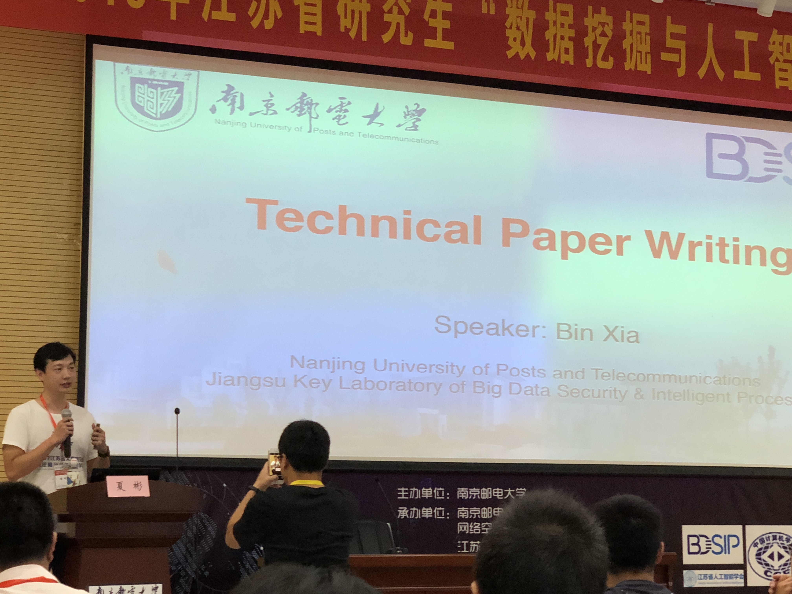
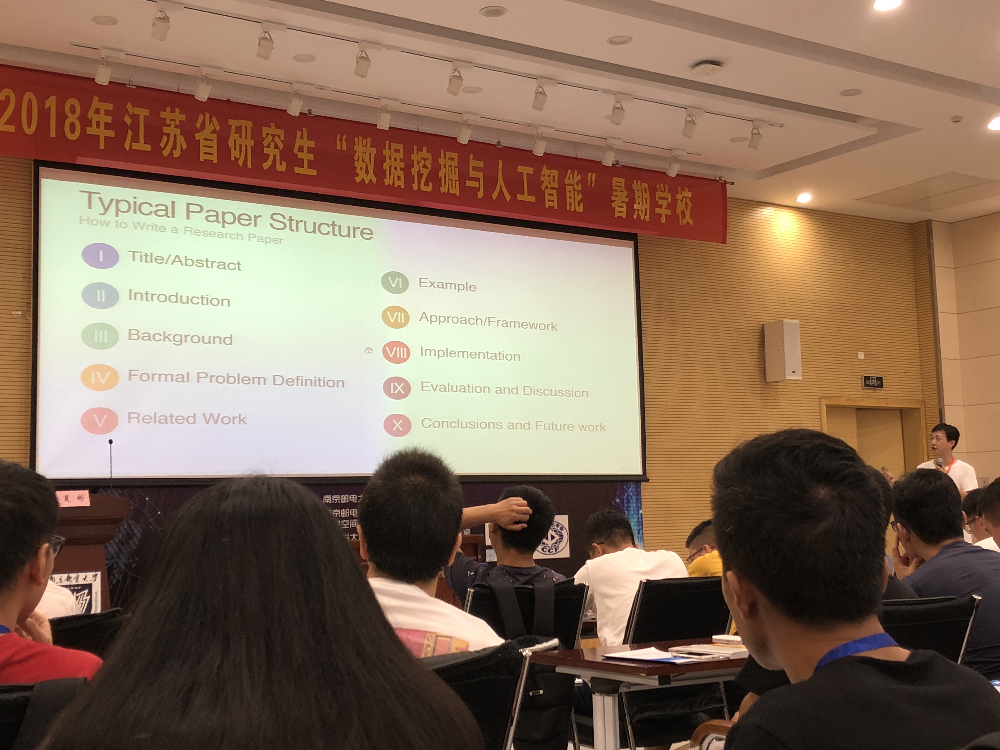
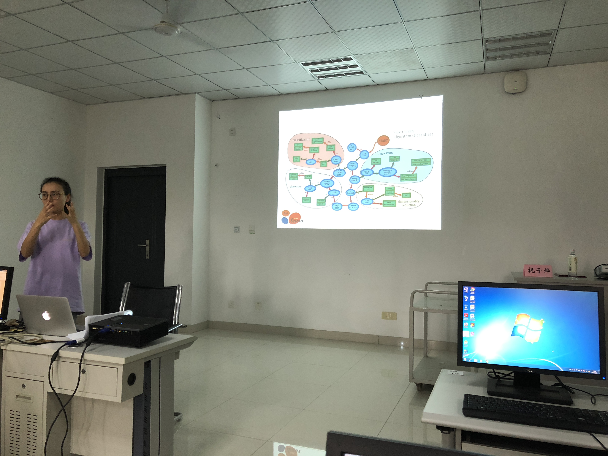

### Day 2: 科研方法写作 & 大数据实践

首先非常抱歉，由于今天晚上事情比较多，导致我真正开始写的时间已经是比较晚了，所以没能很及时更新当天的笔记，内容也会进行适当的缩水，还是希望大家能够理解，谢谢！

今天主要讲授的是关于科研方法写作与大数据实践部分，分上下午。上午为讲座，下午为上机。下面我会将两块分开来记录。

#### 科研方法：王磊博士

本次科研方法讲座，主要讲述了进入研究生阶段后，应该注意的一些事情，怎样与导师相处以及怎样提高自己。

首先，王磊教授分享了为什么要进入研究生阶段：提升自己的能力、格局、平台和朋友圈；然后，主要分析了研究生与本科生的不同。在撰写论文时，与本科阶段不同，不是按部就班，而应该有所创新，通过与导师接触，或是各种学术交流学术报告中获取自己的灵感，同时在自己的空闲时间要了解学术潮流，多关心身边人在做什么以及自己能不能从中借鉴。

几个重要的观点与论述中心：

1. 研究生选题：

   - 导师提供idea，照做，相对轻松
   - 导师不管，可以自己学，选取自己真正感兴趣的方向，这类导师也不能说不好，留给自主的时间将会更多

2. 如何获得好的idea:

   - 大量阅读文献，多听学术报告，多与同行探讨
   - 广泛阅读文献
   - 多联系周边的教授，多交流，找机会认识牛人

3. 关于论文投稿阶段：见图

   

   论文提交后的发稿流程，大致为图上所示

4. 比较好用的文献管理工具：Zotero，自动排版，能自动生成简洁、规范的文献布局

5. 决定论文在周刊中的重要程度：1. 周刊的影响因子 2. H-Index反应作者的学术水平（可在Google Scholar查到）

6. 既然选择了科研的道路，就注定自己有时候是孤独的，所以要享受工作，做个工作狂

总结：我很欣赏王磊博士的演讲，生动中又穿插着幽默，听起来非常有趣，不累。虽然科研方法离我还有一段距离，但分享的一些经历在我的生活也是息息相关的。

#### 科研写作：夏彬博士

紧接着，就来到了第二部分：科研写作部分。在这一部分中，夏彬博士主要分析的是英文论文的写作技巧，故这一块的PPT与课件都是英文形式的。科研写作，里面蕴含了非常多的技巧与注意点，夏博士提到了很多很多的技巧，但限于篇幅与时间，我只将重要部分提炼出来。

首先，这是一篇正常论文的结构，夏博士将其中每一块都分开，然后细说了其中的注意点。

其中：

1. Abstract:需要简介精炼，把文章核心研究点用较少篇幅阐释一下，具体的问题和研究方法应在后续中详细说明。

2. Introduction:主要是一个简介，经常被认为是Abstract的补充说明，这一部分不是必须要的部分，但是一旦要进行补充，一般的闪光点就应该从中提现出来。

   Background:经常被用作论文的研究背景、学术背景。同样，不同的期刊都有不同的背景侧重：例如在生物信息学这种交叉学科中，如果投偏重生物的期刊，则background应重点交代大数据的场景；同样，如果投偏重数据挖掘的期刊，则background应侧重生物学的背景，不同类期刊有不同类的侧重。

3. Formal Problem Definition:是一个具体的问题描述。在理论研究中，由于问题有时候会十分抽象，所以经常会通过这一块对问题进行一个解释，试图让研究人员能够更清楚地了解问题。

   Related Work:通常会在中间大致提到相似的研究还有哪些人在做。与最后的Reference不同，此时只需提到，不需要细致到期刊文章。

4. Example:是文章中如果涉及到一个具体的案例，则会在此处提出，作为对一个问题的解释。通过提出案例，能让研究人员更容易理解相关的概念。

   Approach/Framework:这部分通常是论文的重点。为了达到目标和效果，作者运用了什么样的方法和框架，其中涉及到了什么算法，算法的可行性、效率如何。这里主要解决的就是论文中的How问题。

5. Implementation:是论文的一个算法的实现。如果论文中的现象能通过实验得到复现的话，将会大大加强该理论的可靠性。但implementation并不是必须的部分，也是可选的。

   Evaluation & Discussion:是对已有研究的结果进行一个评估和讨论。在此处，作者不应回避研究中出现的问题和研究的局限性，而应将positive和negative的两面都进行一个阐述。

6. Conclusions & Future Work:是对自己的一个研究进行的总结，和对未来可能的进一步研究提出的一个展望。在这一块，要用尽可能精炼的语言，提取出自己大体上的一个思想，通过怎样的过程达到了怎样的结果。切忌长篇大论，要简洁。

自此，就是每一块的分论述，我认为这也是这场讲座的核心（打字打到手指都有些发麻了😂）就写这么多了

#### Python大数据实践: 刘晓迁

Python大数据实战呢，虽然是上机，但是感觉，由于之前已经自学了一段，所以现在感觉也没有什么太大的难度。代码我放在了ppt的文件夹中，有需要的可以自行查看。

Python实战主要给我们介绍了Python的基本语法，numpy与matplotlib,jupyter,scipy的使用，再到后面的决策树算法实现（但是决策树的性能并不是很好），还是不错的，但难度有些低，也没有上升到代码开发的这种高度，所以也没有太多的可以记录的。

好，这就是Day 2的全部内容，非常感谢现在还能关注我文章的同学，写完的时候已经是凌晨，但是做完的感觉还是很舒服的😂大家晚安💤