### Day 3: 讲座报告

#### 关于多视图统计学习和矩阵复原的一点贡献：蓝超博士

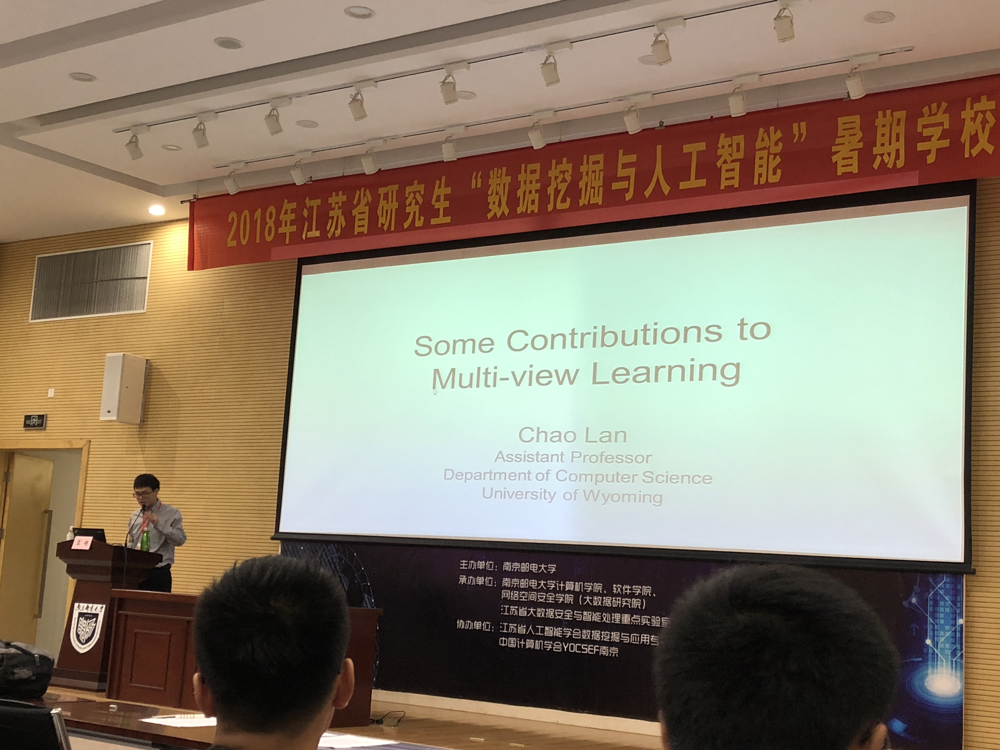

第一场报告是由蓝超博士带来的。蓝博士的讲座有一个很特别的现象，由于经常在国外演讲，他比较喜欢在中间询问是否有问题并希望听众能在讲座中间打断他提问。或许这是国外跟中国的一个区别吧。

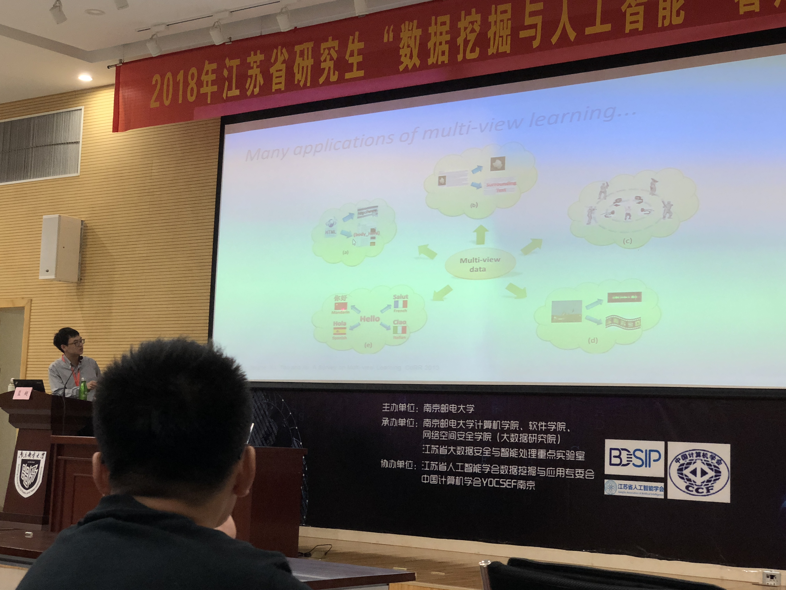

首先，蓝博士主要介绍了多视图的概念和特征，并强调了机器学习的特征：对多组特征进行的相互标注。

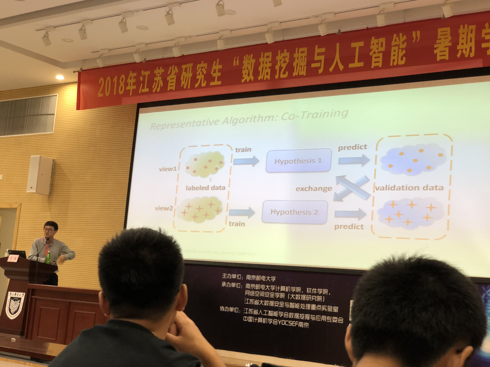

然后，蓝博士介绍了Co-Learning和Co-Regularization两种算法。第一种算法适用于半监督学习方法，主要通过标记一个，然后迁移到另一个视图进行标记；由于第一种算法比较耗时，而且工作量比较大，故简化并优化了第一种算法到Co-Regularization。这个算法的特征是通过公式进行计算与建立损失函数进行最小化优化，从而收敛到一个范围，能够更快地达到目标。

接着，蓝博士介绍了多视图的聚类：首先，聚类是算类与类之间的关系，然后以一个值进行相似度的比较，将联系紧密的类进行标记并联系起来。

为了改进无监督学习的样本复杂度，通常运用一种叫联合矩阵分解(Collective Matrix Factorization)的方式进行分而治之的求解。

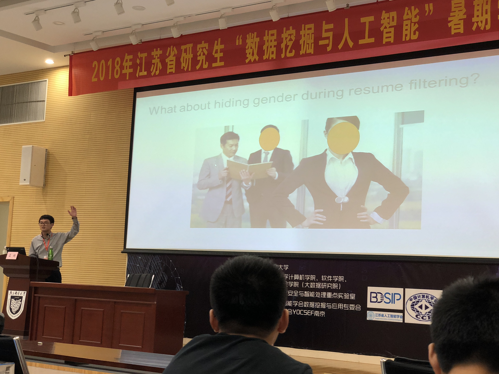

最后，蓝教授通过举机器学习中，出现的性别歧视的现象，提出了机器学习的公平性问题。这是一个在机器学习中普遍出现的问题。在做决策时，由于样本也是采集于生活中，这类歧视不可避免，于是就会将训练后的模型也带入其中。为了解决这类问题，我们要对样本集进行一些模糊化的处理（例如隐藏性别等某些可能会导致歧视的方面），然后再丢入模型进行训练。

总结：我很喜欢蓝超博士的讲座特点，比较生动具体，不是非常理论，但也让我们理解了很多的概念与实验。而且，我也是第一次感受，在中间问大家有没有搞懂的这种现象的，还是挺有趣的。

#### 2DPCA表示学习（模式识别）:杨健博士

讲真，这是我听过最懵的讲座！上来就讲PCA我也是很醉啊。没有任何铺垫直接就开始各种公式理论推导，简直头皮发麻……实在是没有搞懂他在讲什么，课件我也放到了ppt文件下，有需要的同学可查看该课件，我就不再分析了。

#### 人工智能与图像识别: 刘青山博士

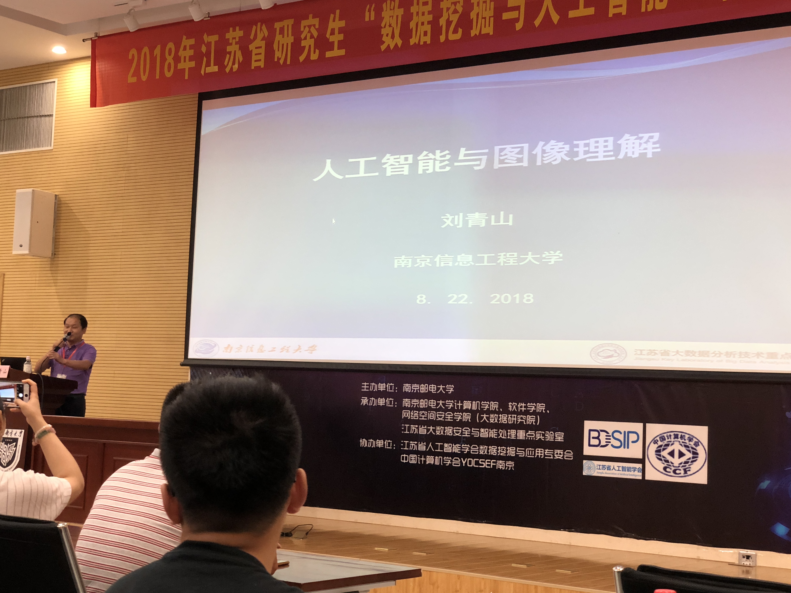

首先，想为刘博士点个赞。这场讲座是我觉得最有意思的一场讲座之一。这次讲座中，第一次出现了演示环节，而且做出来的东西性能特别高效，不同于其他任何的框架臃肿的特性，当然这些都是后话。

首先，刘博士介绍了人工智能已上升到了国家战略，并主要专注于大数据智能、群体智能、跨媒体智能等多种方面。

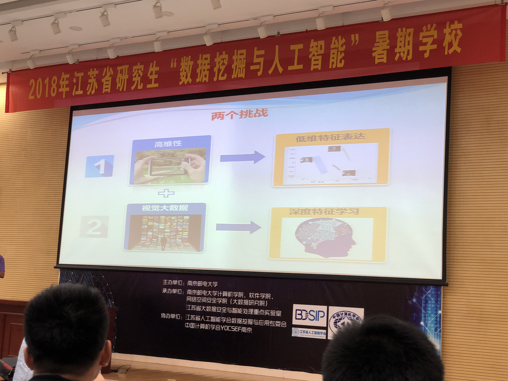

然后，刘博士提出了两大挑战，并由此引入了怎样将高位数据进行降维。我们可以通过主成成分分析（PCA）的方法，剔除少量的细节，从而将高维度的细节降维，从而缩短计算时间与复杂度。还经常用的一种方法为SVM，效果同理。

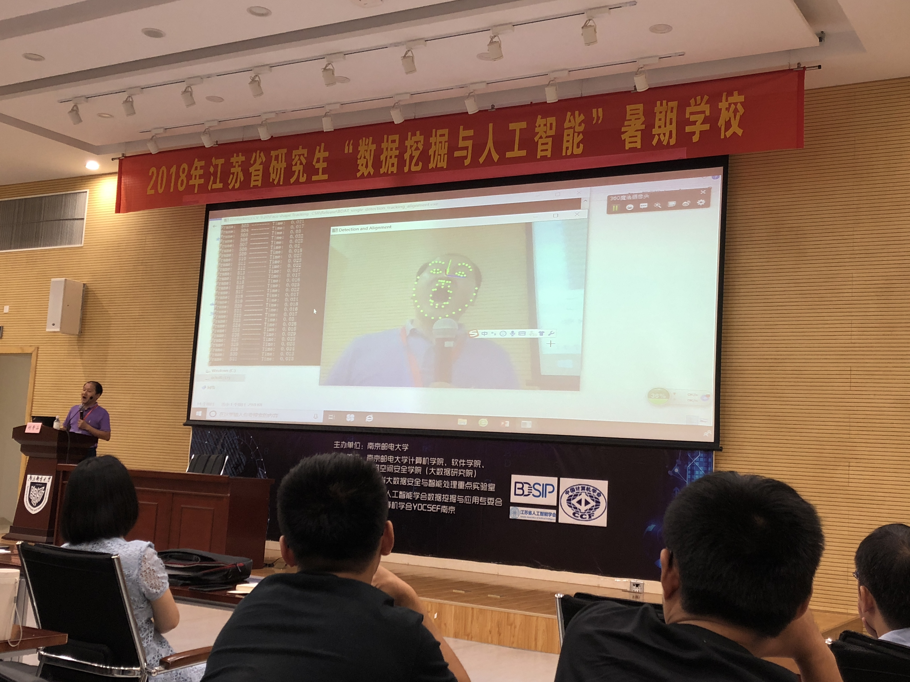

最后，刘博士现场演示了人脸识别的技术。该识别技术不仅很准，而且速度性能还特别的好，真的很好奇是用怎样的算法进行的优化=_= 这张图我感觉也是今日最佳了😂

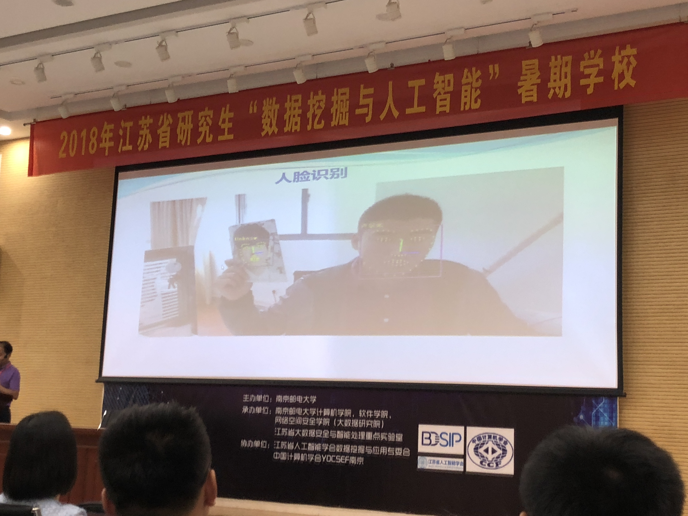

这张也是非常好玩了，还和<del>杨洋</del>某位明星同台出镜了2333这个人脸识别率，真的是相当的高。

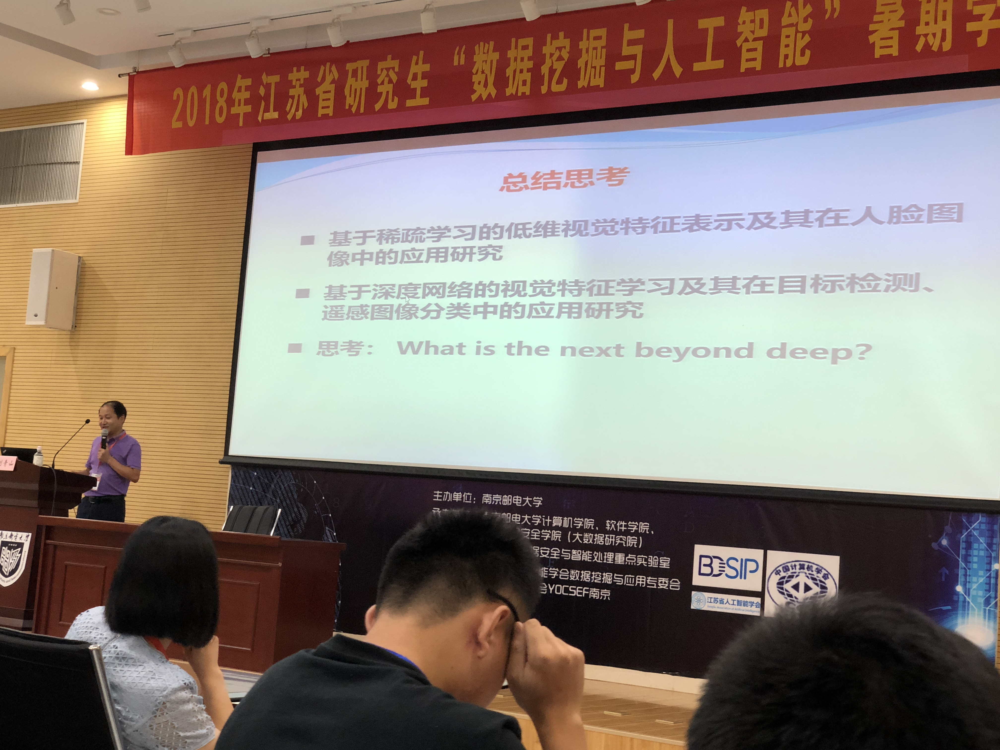

最后，刘博士进行了总结，并希望我们展望未来，去通过不懈的努力去追寻真理。

#### 强化学习简介：俞扬博士

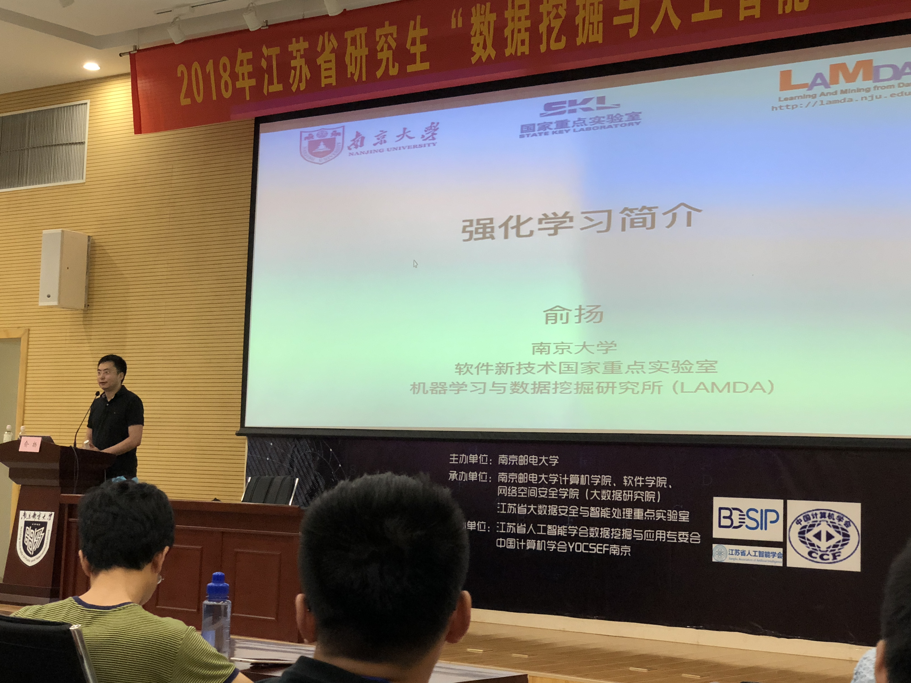

俞博士，主要讲的是强化学习的相关内容。如果将强化学习与监督学习进行一个比较的话，强化学习侧重决策，而监督学习则偏重于预测，是两种不同的任务。而现在很多的游戏等多种反馈的任务，使用强化学习都可以得到一个很好的结果。

应用：

1. 游戏，机器通过一次次试错玩出高分

2. AlphaGo System
3. 推荐系统（根据商品的特征）

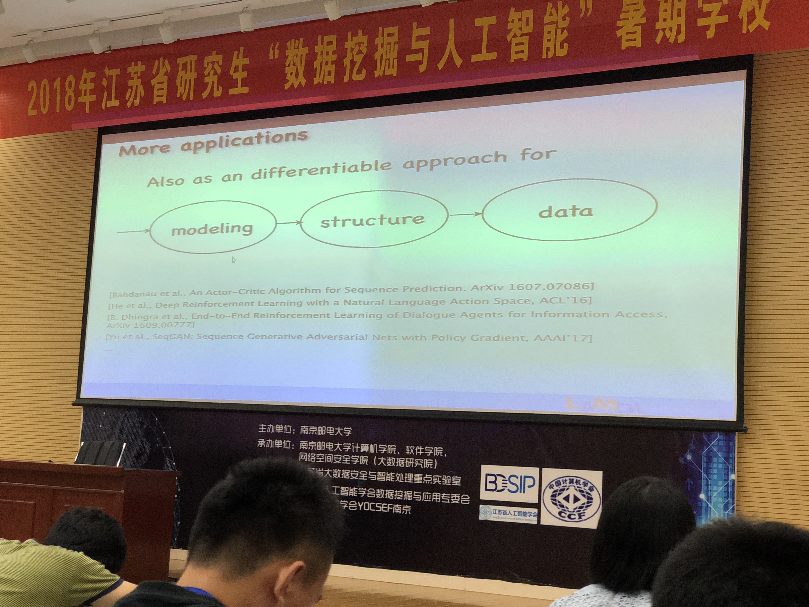

这段是一个三部曲的流程图，分别是建模，组织架构和数据

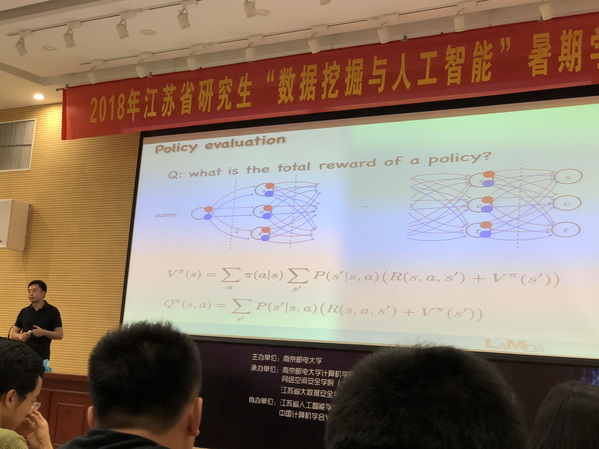

一个常用的算法架构，常用作policy-free模式中