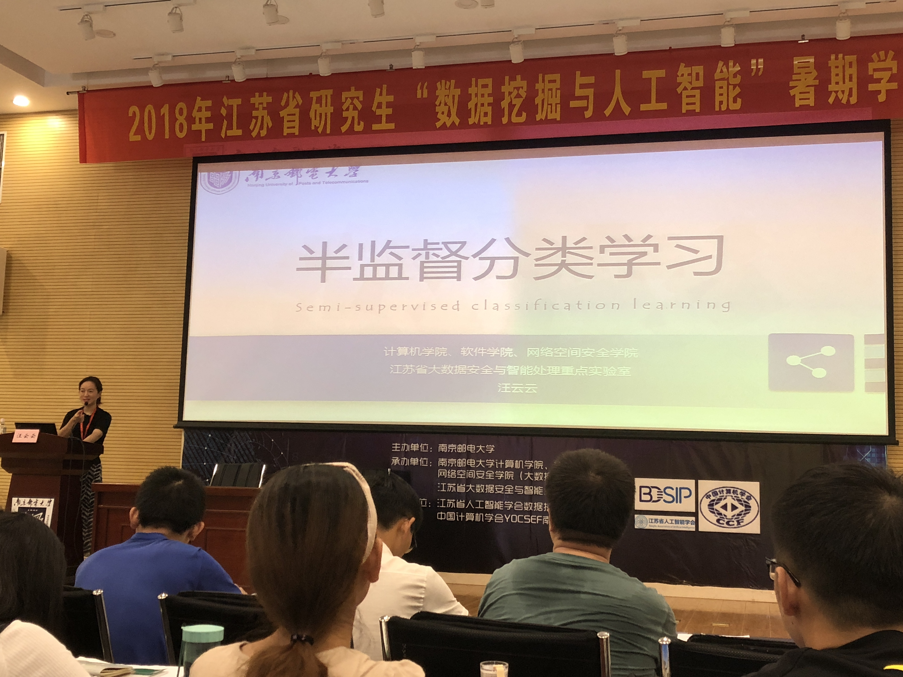

### Day 4: 学术报告 & 深度学习实践

#### 半监督分类学习: 汪云云博士

分类学习：训练数据--训练->学习模型--预测->新数据

应用：征信评估、文本分类、图像分类

普通的监督分类学习：寻找一个分类函数，能够尽可能好地将数据分为两类。每个数据样本都会被贴上标签进行学习。缺点：标注费时费力，有时候不可取。

半监督分类： 利用大量无标记样本和少量有标记样本进行训练

学习方法：

- 生成式方法：估计参数，期望最大化。
- 大间隔半监督分类方法：使用SVM算法。最大化所有样本上的类间间隔（有标记+无标记）
- 基于图的半监督分类方法：基于流形结构图（以到线段长度为准），然后通过分类函数最小化值。
- 协同训练（**co-training**）方法：分别训练两个学习模型，然后将有信心的样本加入并迭代训练。

学习原理：

- 目的：利用无标号样本帮助提升学习性能。聚类假设、模型假设
- 聚类假设：如果在分布上靠近，互相聚成一类，则符合聚类假设
- 模型假设：符合某一种模型的特征。在这种情况下，就可以使用模型假设。

研究挑战：

- 半监督学习的不安全特性：有时，利用半监督学习可能会造成性能下降。

  原因：部分无标号样本不可靠—>对无标记样本进行选择

- 引入平衡因子，解决半监督学习的不安全问题

相关工作：

1. 弱监督分类学习
2. 迁移机器学习:同构+异构的迁移学习
   - 基于实例的迁移学习
   - 基于特征的迁移学习
   - 基于参数的迁移学习
   - 基于关系的迁移学习

#### 数据处理过程中的隐私保护：杨庚教授

互联网发展：互联网->+互联网->互联网+

棱镜门事件，标志着隐私问题开始得到注意。

如何定位到一个黑客地点和行为呢？

(这部分，杨教授从一个案例出发，详细叙述了怎样从网上发现该黑客，并从蛛丝马迹中一步步定位到这个人的。非常有意思！)

隐私泄露的方面：

- 个人信息泄露：电话住址等

- 受钓鱼网站欺骗
- 城市监控

安全问题产生原因：

- 软件bug
- 硬件设备
- 用户过失
- 自然灾害
- 管理缺失

隐私保护的目标：

- 机密性：加密，入侵检测，防火墙
- 完整性：数字签名，水印，病毒检测
- 可用性：访问控制，用户授权，审计
- 不可否认/可控性

数据环境的安全问题：

- 数据本身的信息泄露

- 数据宿主的隐私信息泄露

- 数据使用者的隐私信息泄露
- 数据处理隐私信息泄露

差分隐私：给附近加入一些噪声，使得信息经过截获后减少损失。

常用噪声机制：

- Laplace机制
- 指数机制

主成分分析的差分隐私保护：

主成分分析，简称PCA，是一种利用降维的方式把多变量转换为主要几个变量的统计分析方法。

这些主要变量能够表示原始数据的绝大部分信息，揭示数据的本质。

差分隐私和主成分分析的结合方式：

- 输入扰动：对协方差矩阵加噪，计算主成分特征向量
- 输出扰动：直接计算主成分特征向量，对低维空间加噪