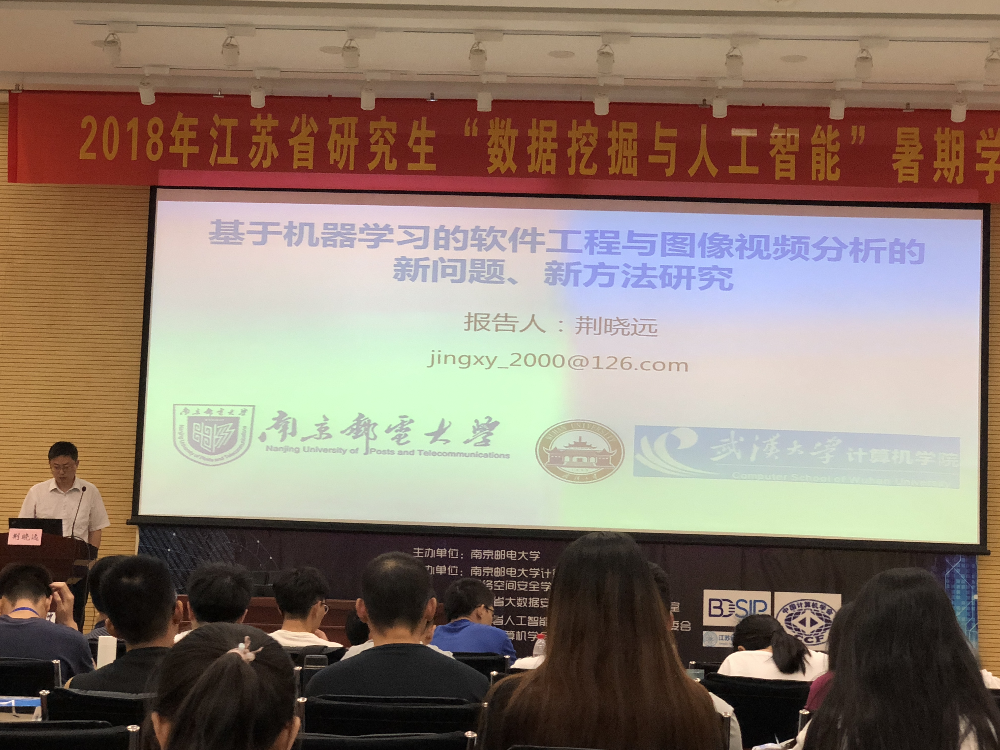
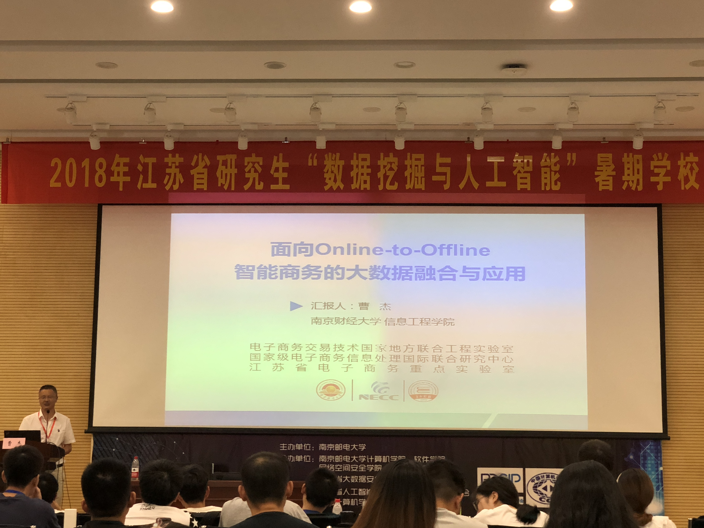
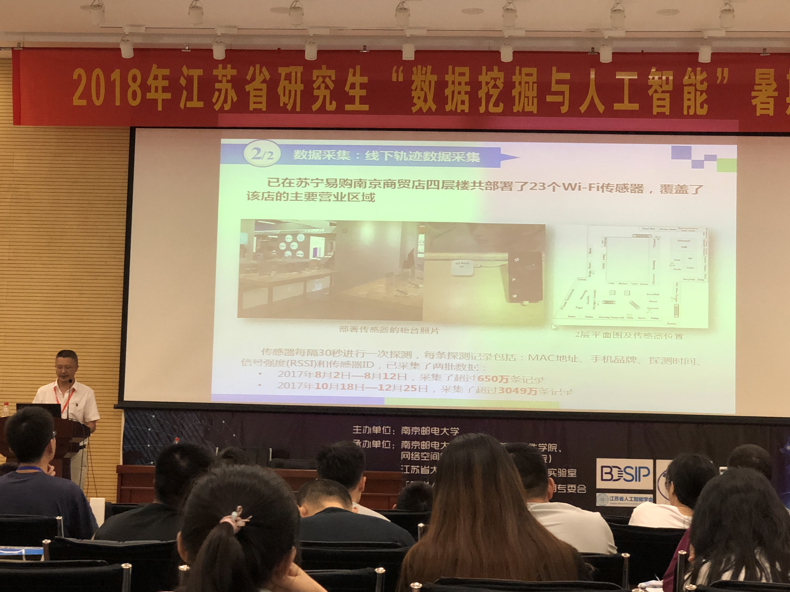
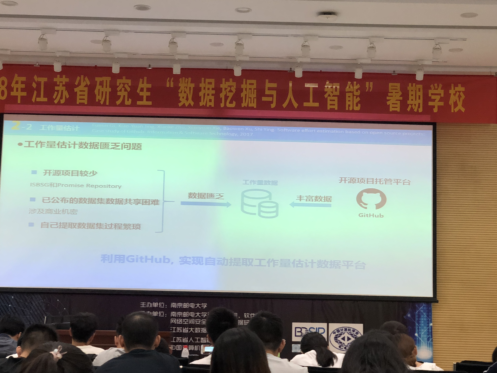
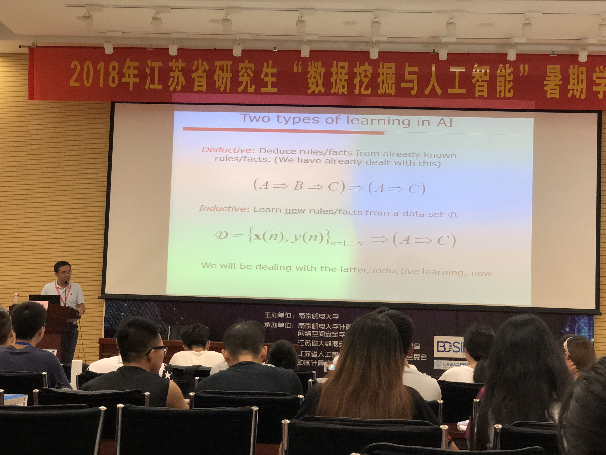
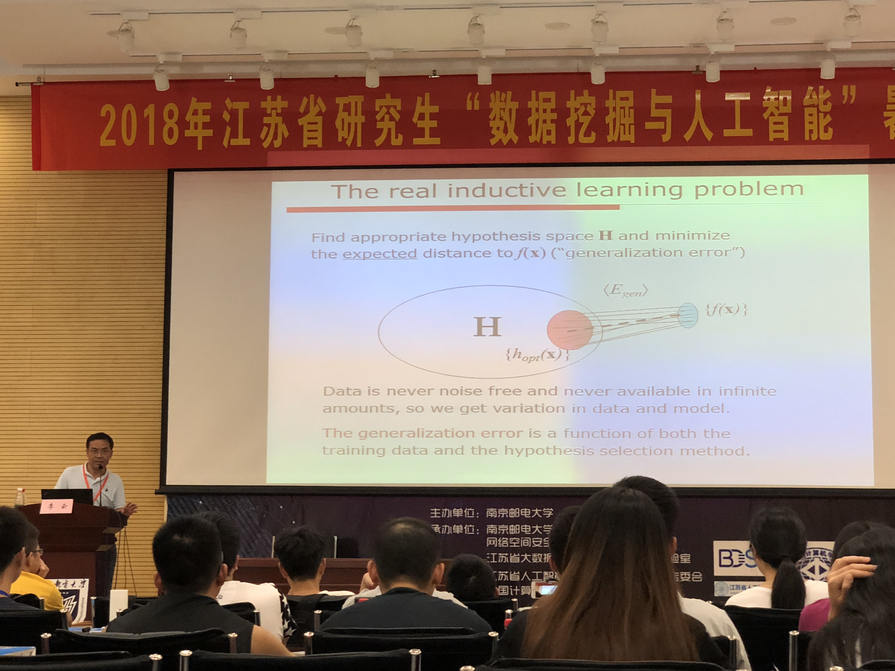
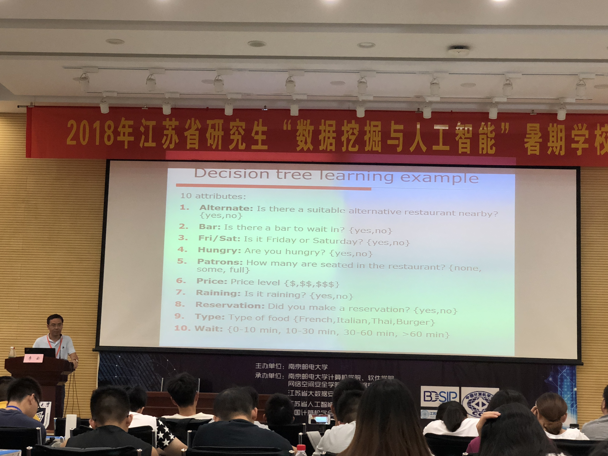

### Day 5: 学术报告

[TOC]

#### 基于机器学习的软件工程与图像视频分析的新问题、新方法研究：荆晓远



偏向自动化学院的机器学习：硬件 + 软件

图像视频分析方向聚焦于行人重识别，高位数据特征提取技术

**软件缺陷预测**

困难：类不平衡、误分类代价

不同软件模块之间存在一定相似性。通过构造软件缺陷数据的稀疏表示

**类不平衡问题：**

- 项目内：数据类的不平衡分布导致了缺陷预测的准确率较低
- 跨项目：现有的处理跨项目类不平衡的缺陷预测方法中，在欠采样和过采样的进程中会伴随原始信息的丢失以及综合信息的加入

解决方法：

- 项目内：引入子类判别分析（SDA）

**基于典型相关分析的异质跨公司缺陷预测：**

```flow
st=>start: 在现实中，
不同公司的软件缺陷
无论在度量类型还是
度量集的大小都是不同的
op1=>operation: 异质问题
op2=>operation: 统一源数据和目标公司数据的度量表
e=>end
st->op1->op2->e
```

**软件工作量估计：**

工作量估计是软件开发的关键步骤

工作量估计研究内容：

1. 工作量估计数据缺失不全
2. 工作量估计数据隐私保护
3. 工作量估计数据缺乏问题

#### 面向O2O智能商务的大数据挖掘与应用：曹杰院长



O2O: Online To Offline

异构数据类型：

- 结构化交易数据
- 轨迹数据
- 日志数据
- 用户生成内容，文本数据
- 网络结构......



研究方面：

- 数据层面
- 模型层面
- 应用层面
- 系统层面

轨迹数据研究：

- 驻留热点识别
- 时序价值模式挖掘
- 轨迹模式语义建模与标注



关键问题与技术路线：

- 多渠道知识融合
- 协同演化推荐
- 广告精准投放

#### 机器学习及其对抗性研究：李云教授



两方面：

- 分类
- 回归

数据拟合中，选用模型尽可能要简单，考虑模型的复杂度

机器学习中，通过**分类器**，捕捉其中的细节，进行交叉检验

Procedure: Feature -> Classifier -> Cross Validation

线性回归：$f(x) = g_{\theta}(x) + \epsilon$



<center>本图为真实的一个机器学习问题</center>

方式：

- 决策树（Disition Tree）
  - 思想：分而治之(Divide and Conquer)
  - 通过不同取值把样本分割
  - 通过学习近似学习出hypothesis参数



<center>此图为决策树的例子</center>

#### 多智能体强化学习中的博弈与均衡：高阳博士

大数据的4V特征：

- 海量（Volume）
- 快速多变（Velocity）
- 多样性（Variety）
- 不准确性（Veracity）

**博弈推理技术：**

已有推理技术：

- 基于逻辑的演绎推理方法 -> 适用于小规模问题
- 结合统计的归纳推理方法 -> 适用于大数据场景

大规模博弈问题应用：

1. 网络广告中的延迟反馈
2. 交互学习中，买彩票概率问题
3. One-Shot Game，囚犯问题

博弈方法：

1. 马尔科夫博弈

- 学习方法和思路：
  - 单Agent学习
  - 多Agent联合学习
  - 对抗学习

知识复用/平衡迁移

总结：

- 大数据决策导致大规模博弈推理
- 多智能体强化学习是一种复杂的计算泛型
- 非共享支付矩阵情况下的博弈均衡协商机制
- 想死博弈的博弈均衡迁移
- 系数交互下的知识迁移和博弈

