### Day 7: 学术报告

[TOC]

#### 人工智能（AI）及机器学习简介：陈松灿教授

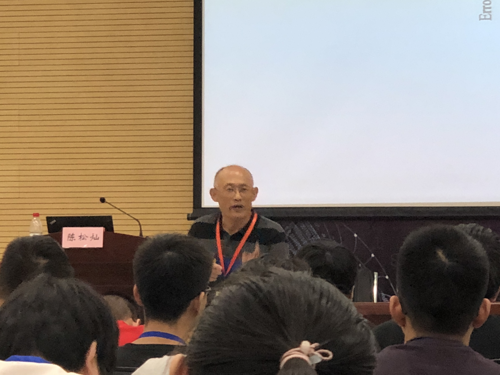

- AI简史和技术、局限和挑战
- 机器学习简介

应用：

- AlphaGo Zero
- 图像识别
- 无人驾驶
- 医学诊断
- 脑瘤诊断
- 金融工程

发展历程:萌芽期、推理期、知识期、学习期

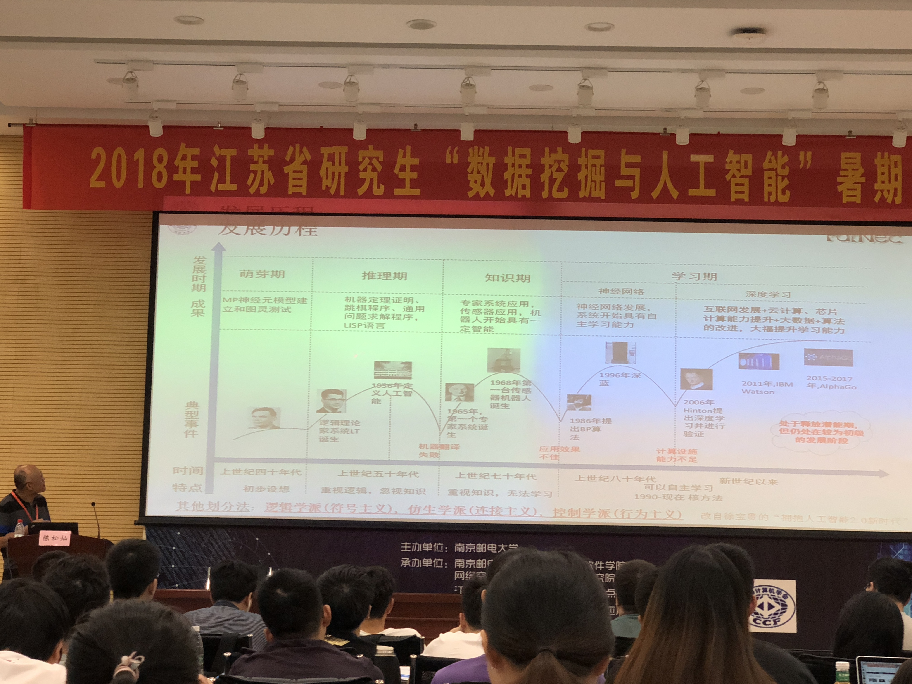

三种形态：

- 弱人工智能：擅长于单方面的人工智能
- 强人工智能：在各个方面都能和人类比肩的人工智能
- 超人工智能：在某些方面可以超过人的方面

**机器学习：**

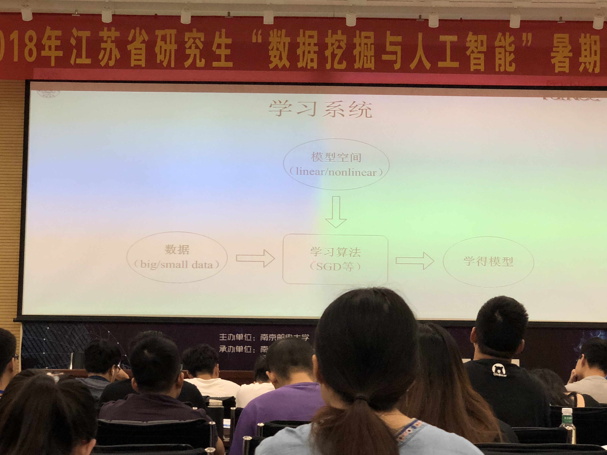

回顾历程：逻辑推理 -> 知识工程 -> 机器学习（AI的核心）

> 推理；知识：专家系统；学习

当前AI的局限与挑战

- 目前AI成功的应用主要在感知领域
- 共同面对的挑战
  - 安全的AI：不确定性问题，不可解释性问题
  - 小数据，大任务范式
  - 物理、社会常识缺乏
  - 认知问题
  - 知识表示，运用、理解
  - 数据共享，隐私保护问题

技术层面：四大趋势 -> 九大挑战

我国AI目标：

1. 大数据智能
2. 跨媒体智能
3. 自主智能
4. 混合增强智能

4大开放创新平台：

1. 自动驾驶：百度
2. 城市大脑：阿里
3. 医疗影像：腾讯
4. 智能语音：科大讯飞

学习系统：模型空间，数据，学习算法，学得模型

数据层面：

- 静态与动态

- 小数据与大数据

- 同质与异质

- 单态与多态
- 小类数与大类数

学习方法关系图

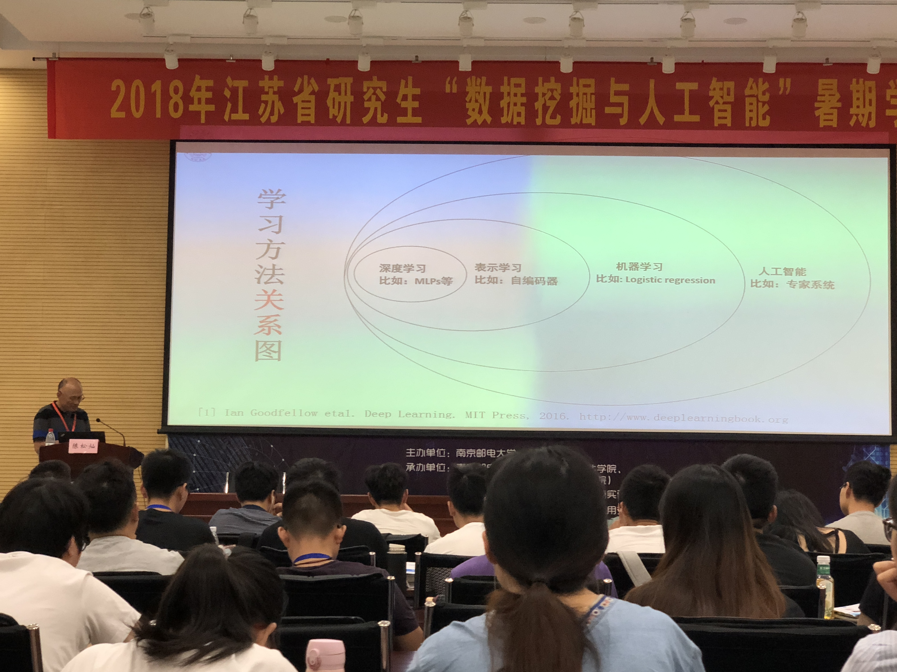

机器学习：建模和模型的选择

相关要素：

- 模型、映射函数f(.)刻画
- 确定目标、损失函数并优化获得模型
- 评测：泛化性能（可解释为举一反三的能力）

模型选择指导原则：

- 没有免费午餐定理（No Free Lunch Theorem） -> 模型选择

  没有天生优越的学习器，只有相对好的

- 丑小鸭定理（Ugly Duckling Theorem）-> 特征表示(Representation Learning)

  没有天生好的特征，只有结合了问题表示的知识表示才是好的

  -> 表示学习（Representation Learning）

为何用正则化？

意图：病态 -> 良态

Tikhonov正则化：借助某个辅助非负泛函/模型实现解的稳定化

深度学习网络中的：

1. 全衰减(Weight Decay)
2. 退出（Dropout）
3. 早期终止（Early Stopping）

本质：结合问题先验去建模

> 泛化Generalization = 数据Data + 知识Knowledge

总结：在有限样本下为未来建模，涉及：

- 特征层面
- 模型层面
- 优化层面

需要关注的机器学习方法

挑战依然存在，目前AI还在路上，还远远未成为理论完备的学科，任重道远。问题不在于技术，而是利益如何分配。

#### 稀疏学习模型及其优化：陈蕾

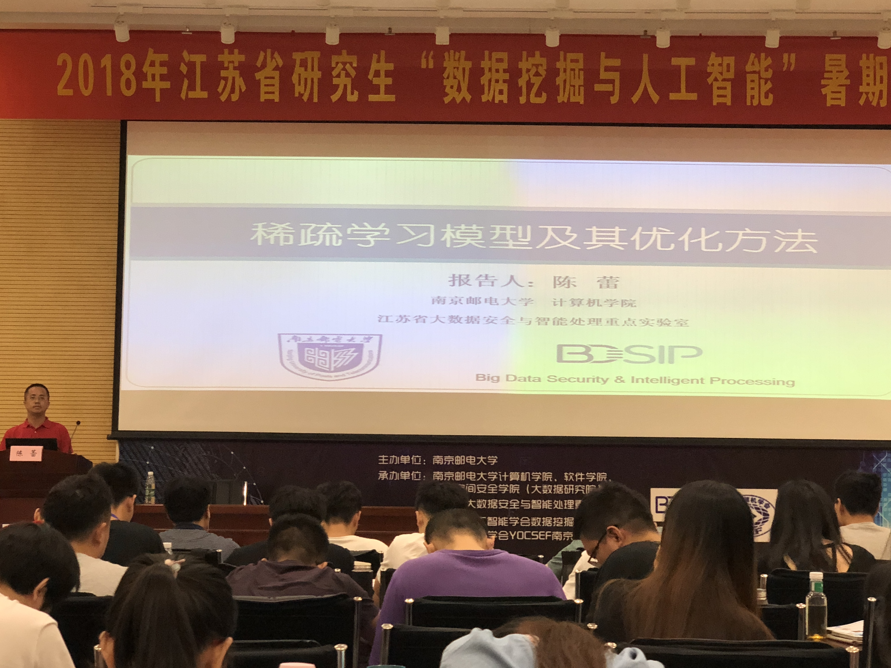

矩阵奇异值分解（SVD）-> 思想：把一个矩阵分成三个，然后并行进行计算，最后合在一起

梯度下降的本质：函数做一个一阶泰勒展开

一个数学表达式，n种方法求解

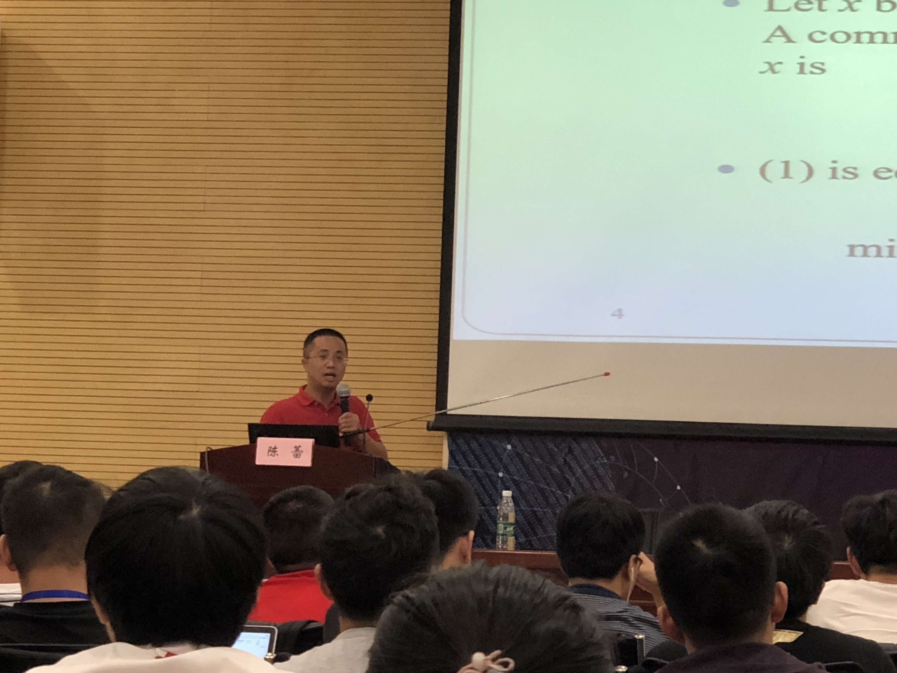

#### AlphaGo原理与实现：朱天驰，刘杰

改进方法：

1. 剪枝
2. 减少浪费/防止错判：利用confidence进行判断是否走另一条路。慢慢两条路的confidence会趋于平衡
3. 减少只visit过一次的node

MCTS = Monte Carlo Tree Search

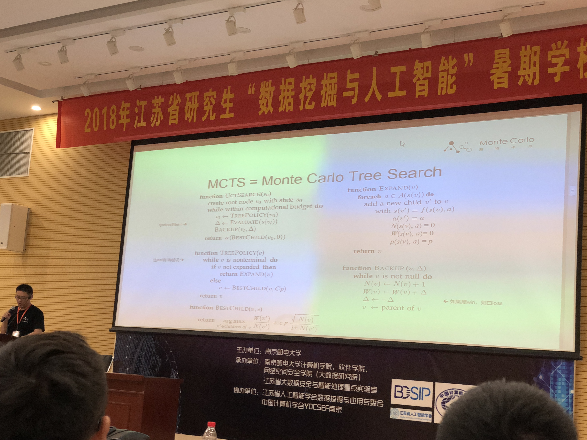

算法原理，如图所示

怎样学习P(s,a;$\theta$)

RL的哲学：从随机的步骤开始，慢慢让机器进行学习

#### 卷积神经网络的前世今生：寇佳新 阿里巴巴

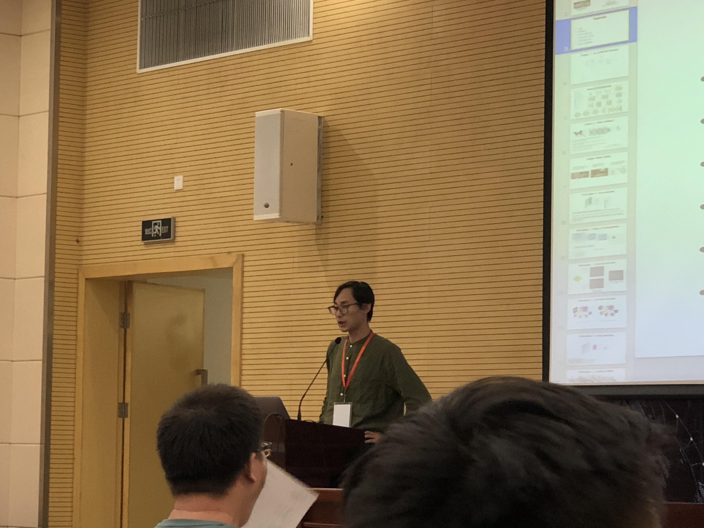

卷积神经网络：卷积后，尺寸变小，要多加一些feature，进行填充，以保持原有的尺寸。

原则：多种kernels，分别进行不同的计算

多种kernel,有不同的属性，有的是取最大值，有的是缩小向量的大小长度。

#### 腾讯金融科技技术演进：程伟 腾讯金融

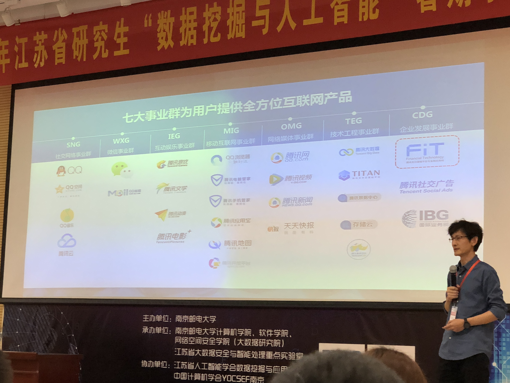

CAP定理：Consistency(一致性)，Availability(可用性)，Partition Tolerance(分区容错性)

技术不可能解决所有的业务问题，思考能否转变技术方式，用其他的技术来解决业务问题。

平台运营挑战与实现：

- 弹性供给能力
- 金融业务支撑
- 秒级监控能力
- 容灾能力
- 安全能力

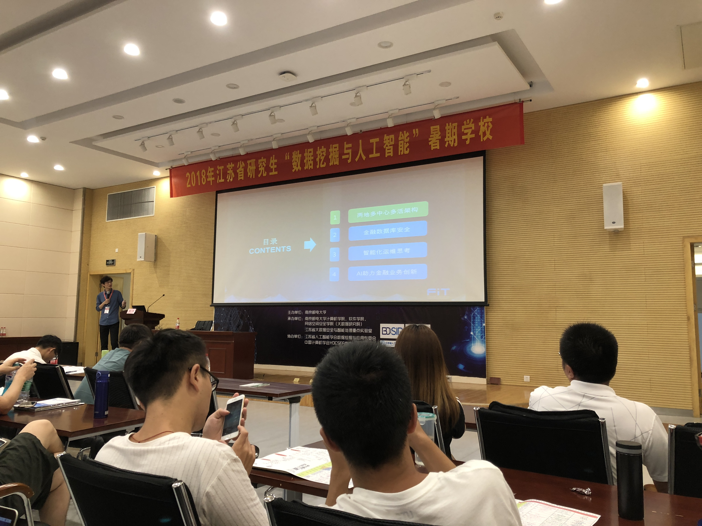

**目录**

1. 两地多中心多活架构
2. 金融数据库安全
3. 智能化运维思考
4. AI助力金融业务创新

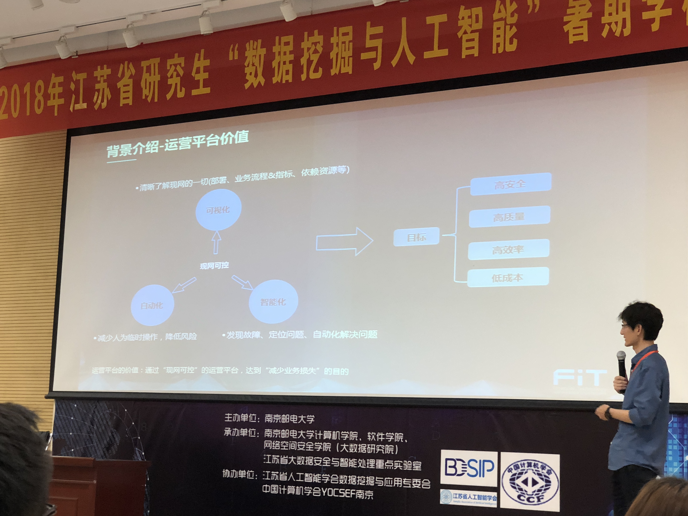

业务架构：如图所示