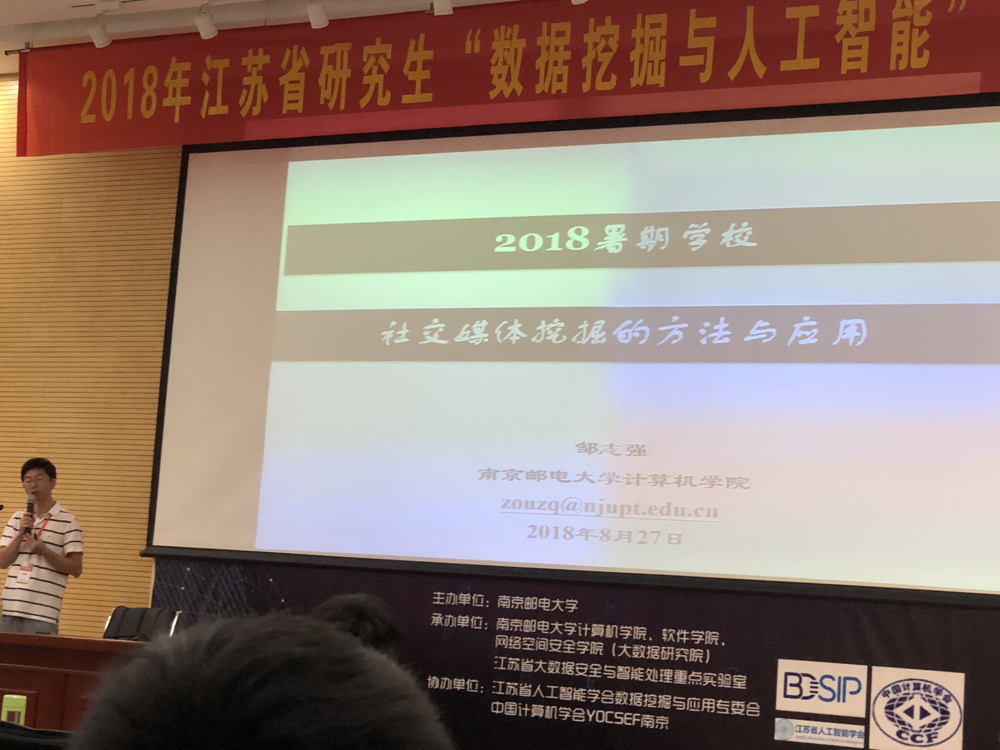
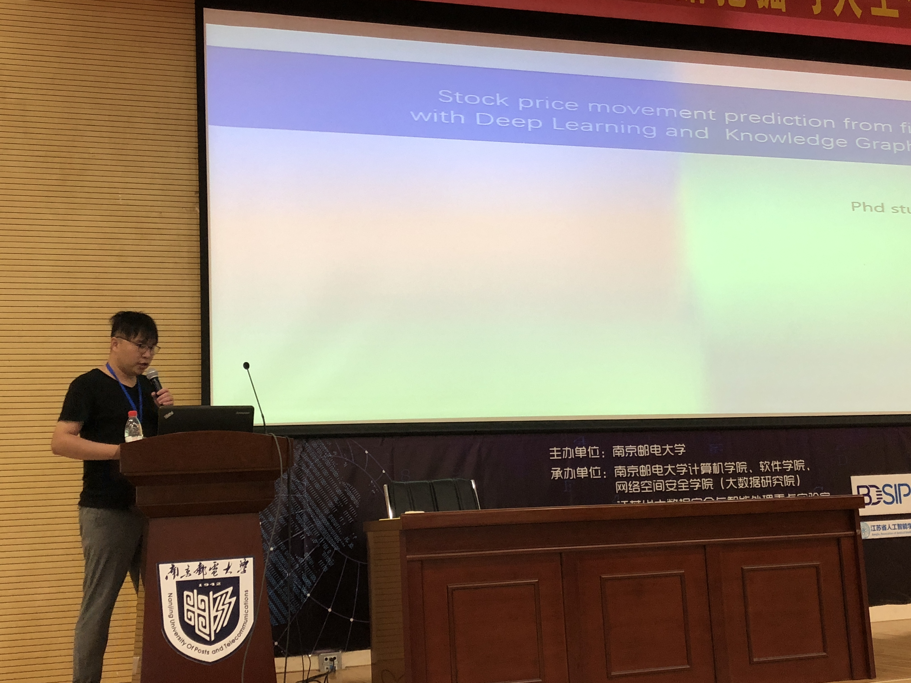
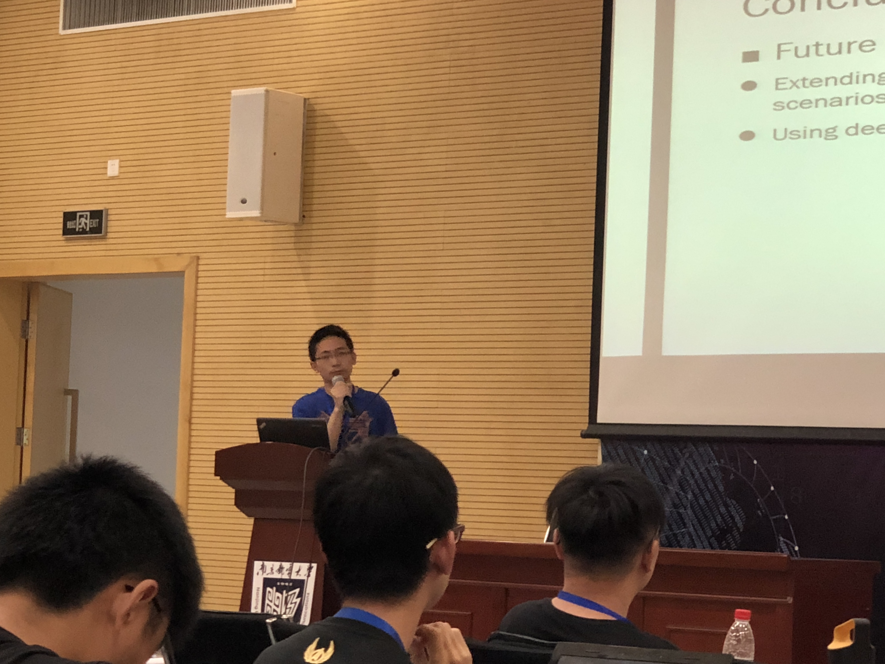
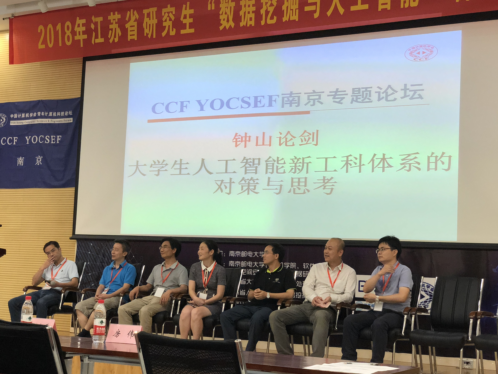

### Day 8: 学术报告 & 分组交流

#### 社交媒体挖掘的方法与应用：邹志强

对于朋友圈的分析：位置、ID、评论等

本质是图的结构

利用历史事件对将来进行预测

从杂乱的数据中，提取出**有意义**的内容

大数据，小任务

程序大数据挖掘的相关研究：

- 分布式存储
- 大数据分析
- 对用户行为模式的分析

社交媒体挖掘中兴趣点提取

#### 分组交流

- 刘洋：股票价格预测
- 曹猛：图像识别的算法提取
- 监督网络denseNet
- 特征选择

CCF论坛

