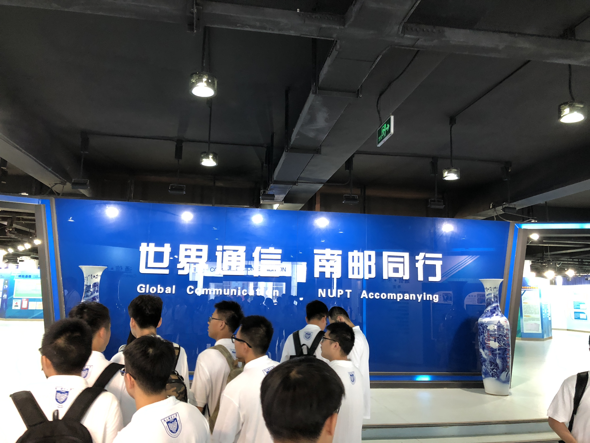
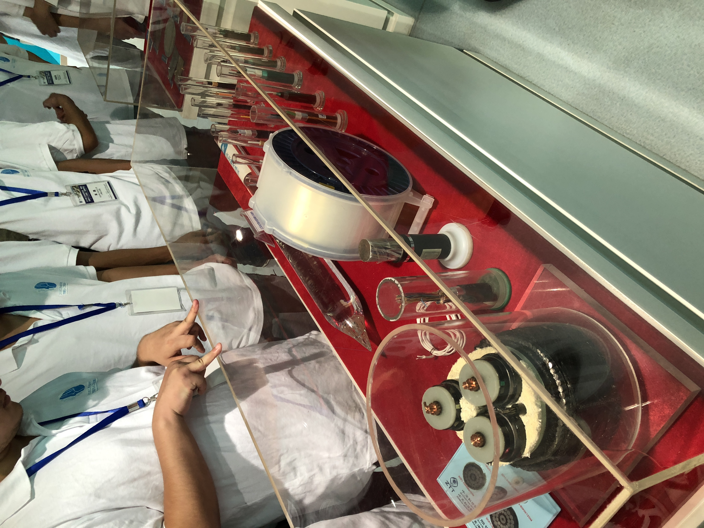
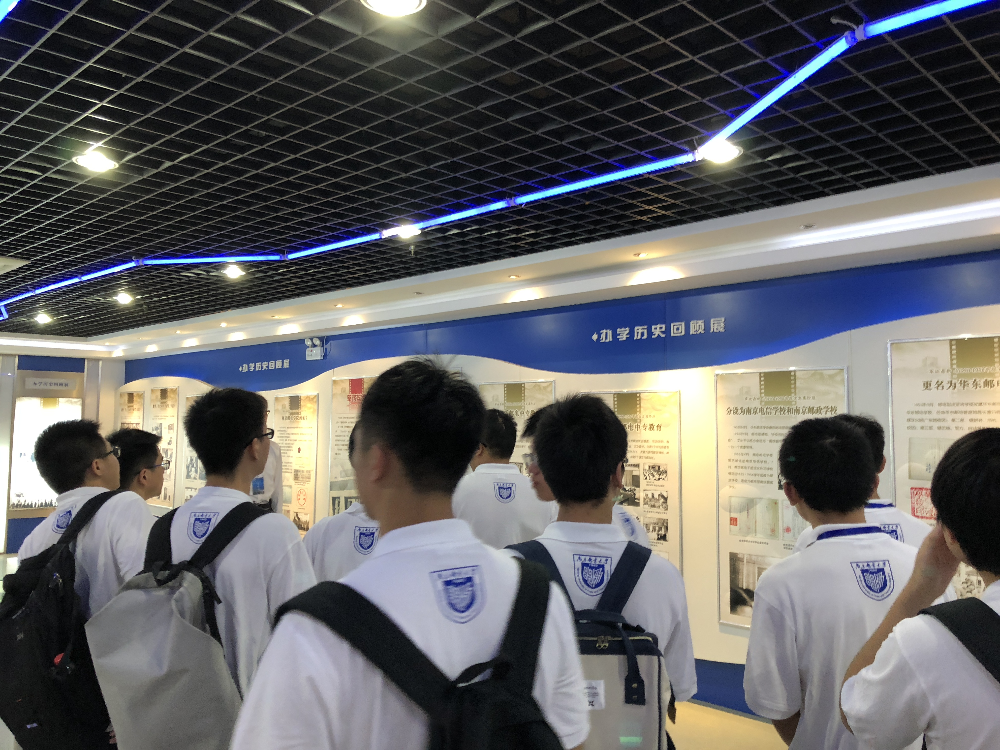
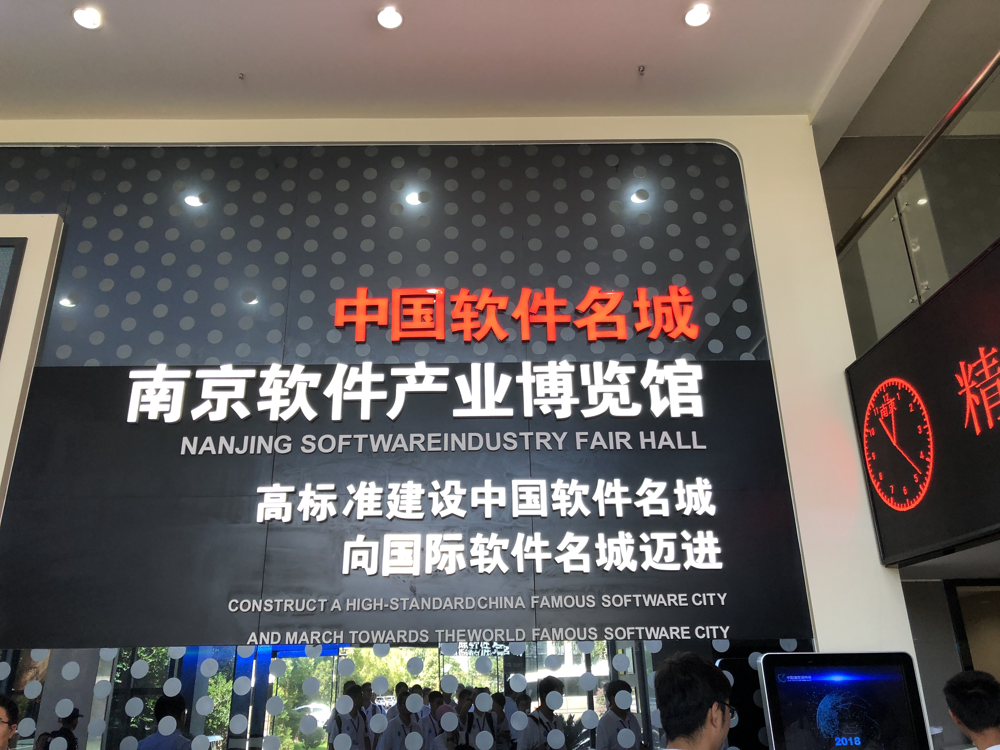
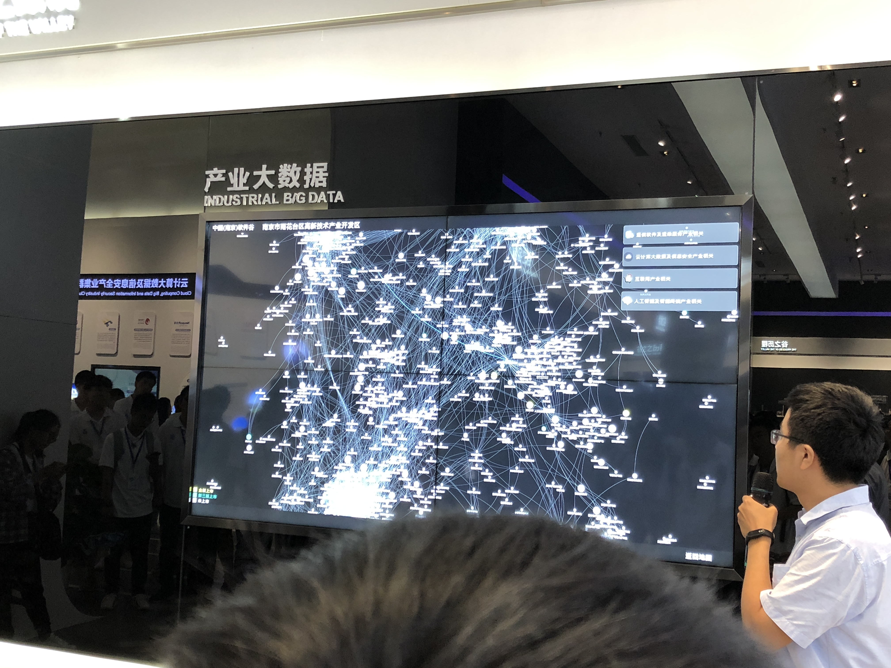
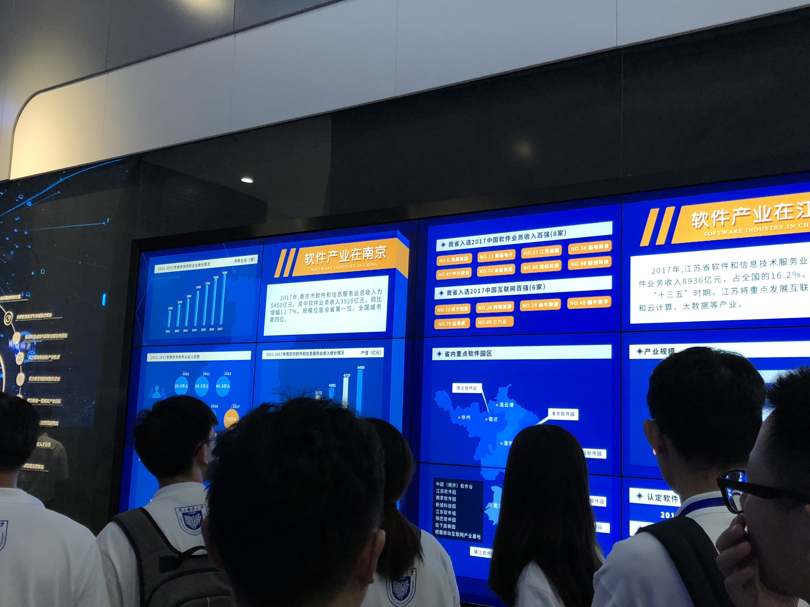

### Day 9: 企业参观 & 闭幕总结

​	最后一天，分别的时刻来了。写这段感想的时候，我的心情是，很复杂的。一方面，是最后一篇笔记；一方面，又舍不得我的小伙伴们。虽然一共只有十天，但能认识到逗比的你们，一起插科打诨、一起吃饭睡觉，也是件非常幸福的事情呢！话不多说，让我们开始吧。

#### 上午：通信展览馆 + 校史馆 + 雨花软件谷

​	首先，是上午的行程。上午我们参观了南邮校史馆和通信展览馆。南邮的前身是成立于1958年的“战时邮务总局干部训练班“。当时是专门为了训练邮电通讯人才而成立的。然后，学校慢慢发展壮大，先后几易校名，才慢慢转为“南京邮电大学”。参观校史馆期间给我最深印象，就是南邮一大批优秀学长，最后都到三大运营商了啊😂然后还看到了以前的粮票饭票之类的物品，感触还是很深的。参观完校史馆就是通信馆。在通信展览馆我们回顾了从古老的书信通信慢慢到现在的英特网通信的转变。现场还见到了镇馆之宝——一大块水晶，据说能拉长变成上万公里长的网线=_=嗯，剩下来的我就贴图了233

然后，我们跟随大巴去了雨花软件谷。这部分参观我感觉商业气氛太重，没有学到什么太多的东西，故省略了。

#### 下午：地平线机器人 + face++（旷世）公司 + 闭幕式

下午我觉得，才是真正有意思的地方。首先去的是地平线机器人公司。公司规模不大，但是每个人都挺拼的。偶遇了一起集训的学长，感觉非常亲切😇

地平线机器人主要业务还是实时捕捉行人道路标志并做一些判断，从视频可以看出产品判断十分准确，而且性能也是很棒的！核心还是计算机视觉中的物体检测与判断功能。然后给我印象最深的就是他们team leader说的，永不满足现有的成果，要更进一步。这也是一个科技公司所宝贵的一种精神吧。

然后，下一站我们来到了旷世公司。该公司在人脸识别能力方面，是国内顶尖的水平。这个公司的环境氛围感觉是非常棒的。不过我们看到的工作人员，好像都在做特征标记=_= 真正的算法部分，好像是在办公室里面进行交流的。一个公司的环境是非常重要的。现场还有一个大的演示区，果然这个人脸识别效率是非常高的。更多的情况可以参见图。

最后，到了闭幕式，大家再次进入了报告厅，但这一次，是将要离别的时刻。副院长发言，黄院长发言，然后就是结业证书和优秀学员颁奖。很荣幸我和王纪涛学长都得到了优秀学员的奖项。

优秀学员合影

最后，我们四人组，关系最好的铁哥们和马姐的合影

最后，想感谢南邮研究生院，能够给予我这次暑期学校的机会，去接触各种最新的学术成果和公司的情况。这十天我学到了很多，也明白了很多。在以后的学习生活中，我也将会把暑期生活的精神，去运用到每一天的进步中。加油💪我也想感谢所有持续关注我的小伙伴们，如果不是你们的关注，我也不会坚持完成这个系列，谢谢大家的督促！最后，想对这十天授课的老师、同学们，以及在一起同甘共苦的小伙伴们说一句：辛苦了❤️咱们，有缘再见~

