## 南京邮电大学暑期学校全纪实~~

首先，很荣幸，自己能被选上参加这次暑期学校。

为了不浪费这十天的宝贵时间，创建了这个repo，希望大家也能从中获益。

这个repo呢，主要是想记录，从报道开始10天的南邮暑期学校的所学知识和每天的感受的。

然后，我会每天晚上更新当天的markdown笔记，请大家多多支持我😘

### 链接（建议通过点击链接到单个文档观看，方便查找）

[Day 0: 报道](Day_0.md)

[Day 1: 开幕 & 讲座报告](Day_1.md)

[Day 2: 科研方法写作 & 大数据实践](Day_2.md)

[Day 3: 讲座报告](Day_3.md) 

[Day 4:学术报告 & 深度学习实践](Day_4.md) 

[Day 5:学术报告](Day_5.md) 

[Day 6: 讲座报告](Day_6.md)

[Day 7:学术报告](Day_7.md) 

[Day 8: 学术报告 & 分组交流](Day_8.md)

[Day 9: 企业参观 & 闭幕总结](Day_9.md) 

### 目录

[TOC]

- Day 0 :报道

  今天是第一天，暑期学校的开始。中午和厉害的王纪涛学长碰了面，然后一起到达了报到地点，开始了暑期学校之旅。

  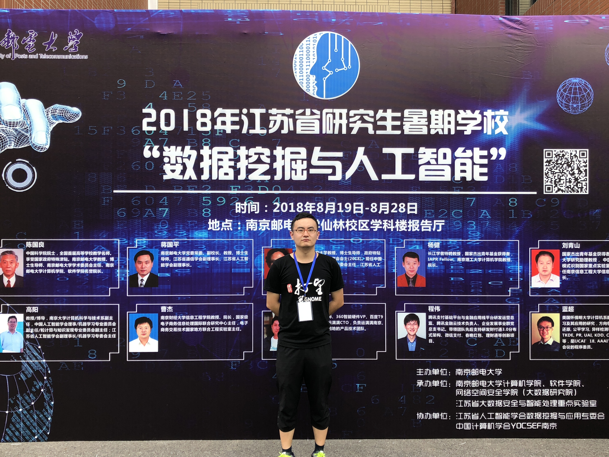

  <center>这是在报道墙前的个人照</center>

  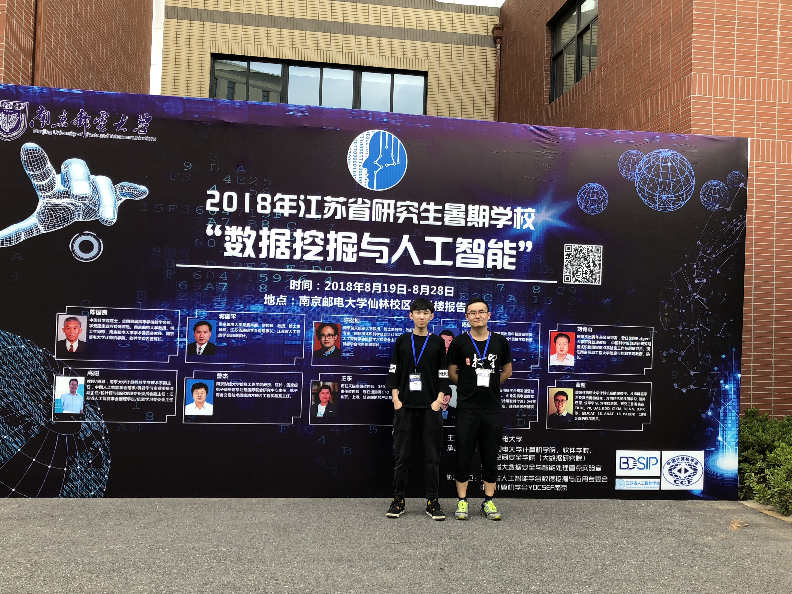

  <center>这是和区块链大佬王纪涛学长的合影</center>

  真的是感觉这次活动非常良心了，现场提供了很多的教材等众多学习资料。当然最重要的是每天40块钱的补助hiahiahia~

  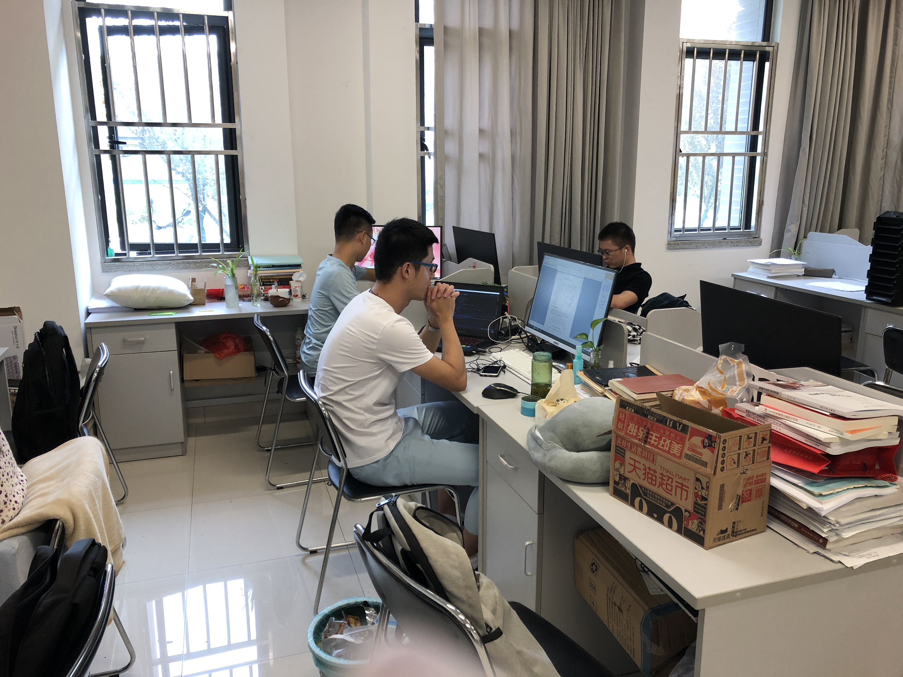

  <center>在学长的带领下，走进了教研室(未来可能会进入的地方😋)。最大的感受是书多！而且显示屏很赞！</center>

  	简单解决了一下吃饭问题之后，我们就正式进入了活动。晚上七点，在大礼堂召开了“迎新晚会”，大家都围坐在一起，愉快地分享自己以前的经历和兴趣爱好。

  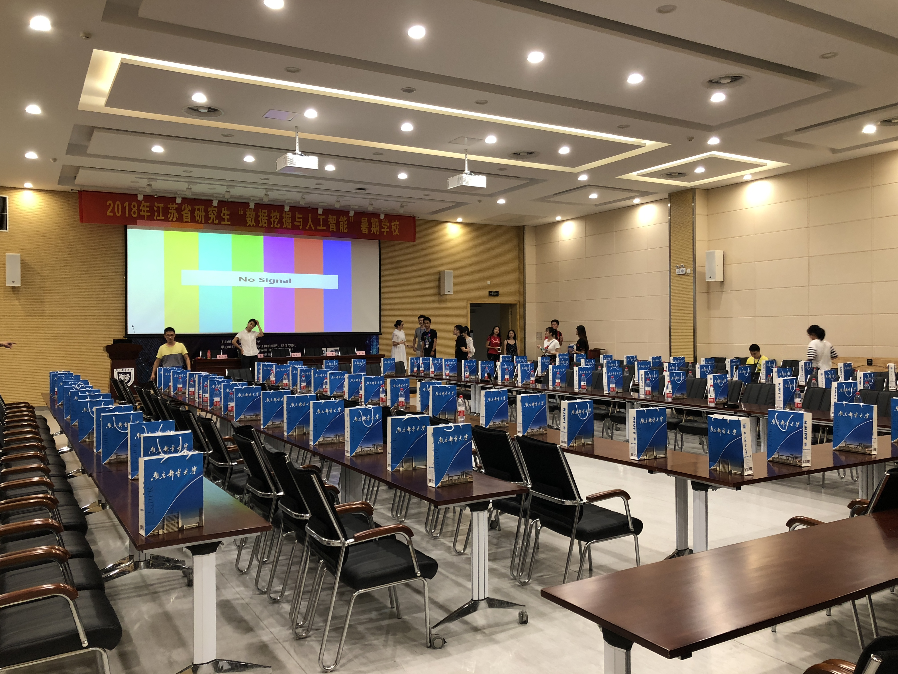

  <center>最初的礼堂布置</center>

  

  <center>挨个轮流交流自己的经历与兴趣，非常有趣！</center>

  我印象最深的几位同学的分享：

  1. 一位同学是南京医科大学的硕士研究生，方向是生物信息方向，通过机器学习控制基因的重组与构建（大概这个意思，可能会有偏差）
  2. 一位同学最近在做的一个项目，是对脑电信号进行预判与分析，也用到了机器学习的方法
  3. 一位同学研究生是经济与管理类的，但是最近在做的是金融大数据，也就是面对海量的数据从中分析、归纳出有效的信息，也很有意思
  4. 物体检测是一个热门方向，现场至少有五个左右的研究生是这个方向了
  5. 除了深度学习，强化学习也可能是一个有趣的方向。百度了一下，AlphaGo就是运用了强化学习，通过分数奖励机制来不断“激励”计算机，期望得到更高的分数，从而做出更智能的预测
  6. 现场还有一位南大的博士生来参加暑期学校🌚

  现场还有很多精彩的自我介绍，不过限制于篇幅，我只罗列了自己认为有趣的方向。

  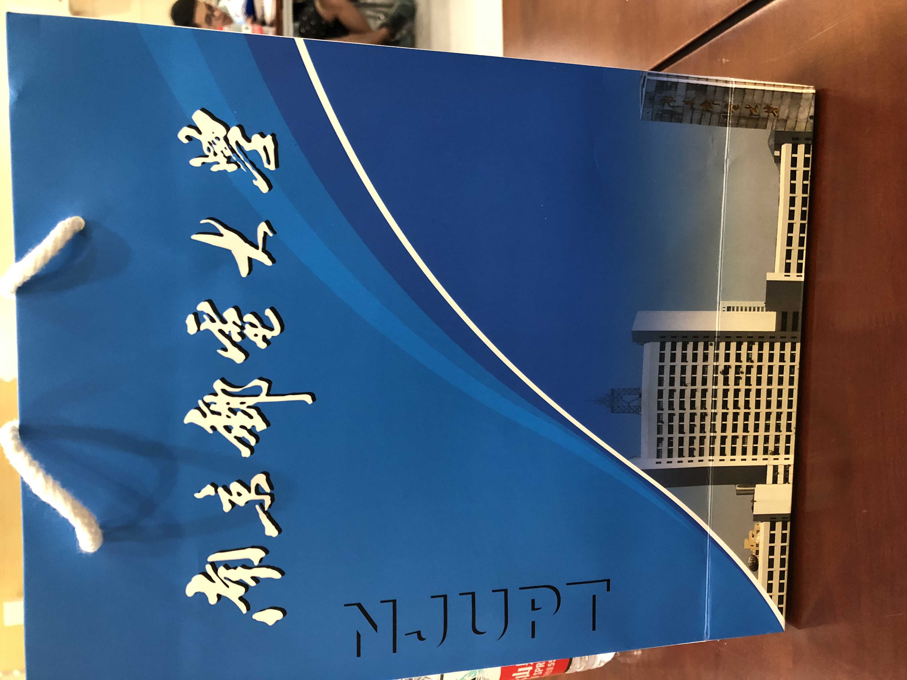

  <center>这是所发的教材和宣传册等内容，具体明天我会更细致地分析(有本书巨厚，保留点悬念辣~)</center>

  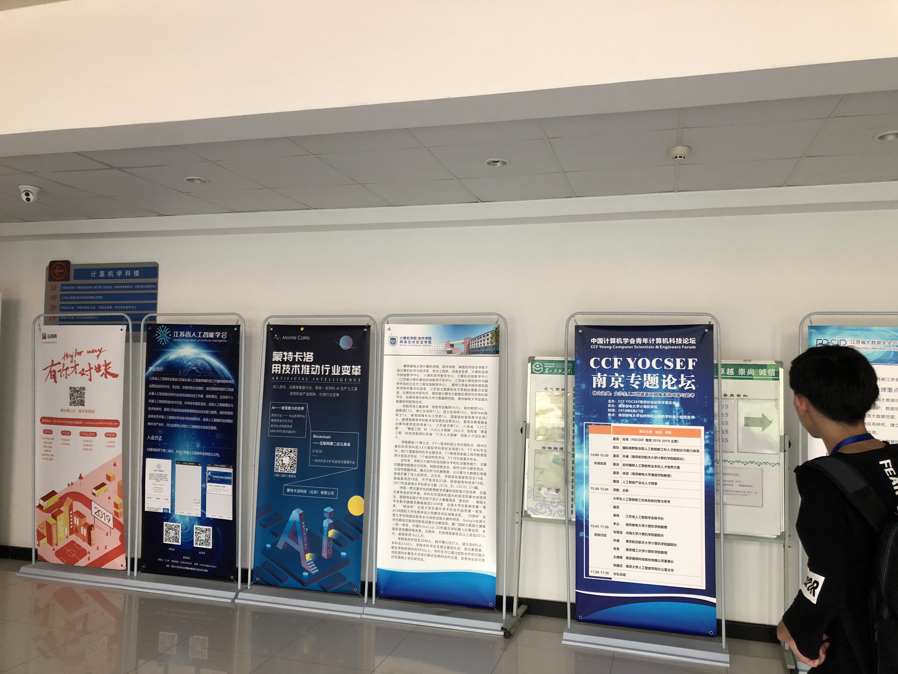

  <center>现场也吸引了不少的公司参会</center>

  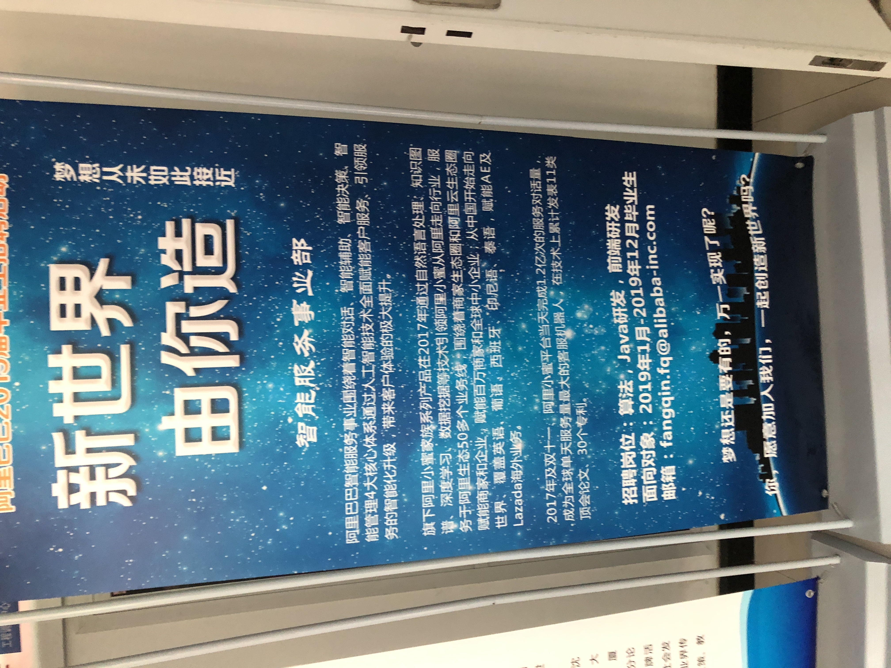

  <center>这是阿里巴巴的招聘，有三个方向的招聘：算法，Java研发 和 前端研发</center>

  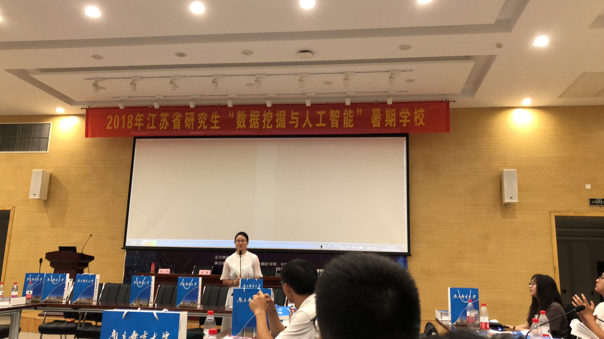

  <center>最后，玲姐镇楼！感谢老师和志愿者的付出！</center>

  第一天先写到这吧，虽然有些仓促，但是也是用了心写的。期望这十天的暑期学校能达到自己所期待的水平和高度~

  晚安啦各位💤

- Day 1 : 开幕 & 讲座报告

  今天，是暑期学校正式开幕的第一天，开幕式在上午八点正式开始。

  首先，副校长蒋国平教授等多人进行了致辞，大致表达了希望我们从暑期学校中学到更多的知识和充实自我的期望。

  

  <center>开幕式及致辞</center>

  然后，结束了开幕式，我们在场外进行了合影留念（照片还未拿到，待补充）

  紧接着，正式开始了暑期学校的学习。


  #### 蒋国平教授：复杂网络:理论及其应用

  

  说实在的，第一场讲座实在是非常学术的，以至于当时听得非常朦胧，但是还好，由于是第一场，还是记录了很多的笔记。刚开始比较基础，都是数据结构的内容，慢慢就开始高深了=_=

  首先，蒋国平教授把讲座分为了四部分：网络拓扑结构、网络行为特征、复杂网络的同步和传播以及网络控制。

  

  <center>讲座的纲要</center>

  1. 网络拓扑

     首先，介绍了网络有诸多的类别: Internet网、交通网、生物网络、神经网络等。

     网络的构成：结点(Vertex) + 连边(Edge)

     网络的典型特征: 1.聚类系数：形容节点间的稠密程度

     			     2.二八定律 -> 较大的度数数量少

     然后引入了度分布:网络中随机选取一个节点度为k的概率$P(k) = N_k / N$

     经典的六度分离：地球上任意两个人之间的平均距离是6

     最后，介绍了三种生成模型，其中最有代表性的是Scale-free Network，

     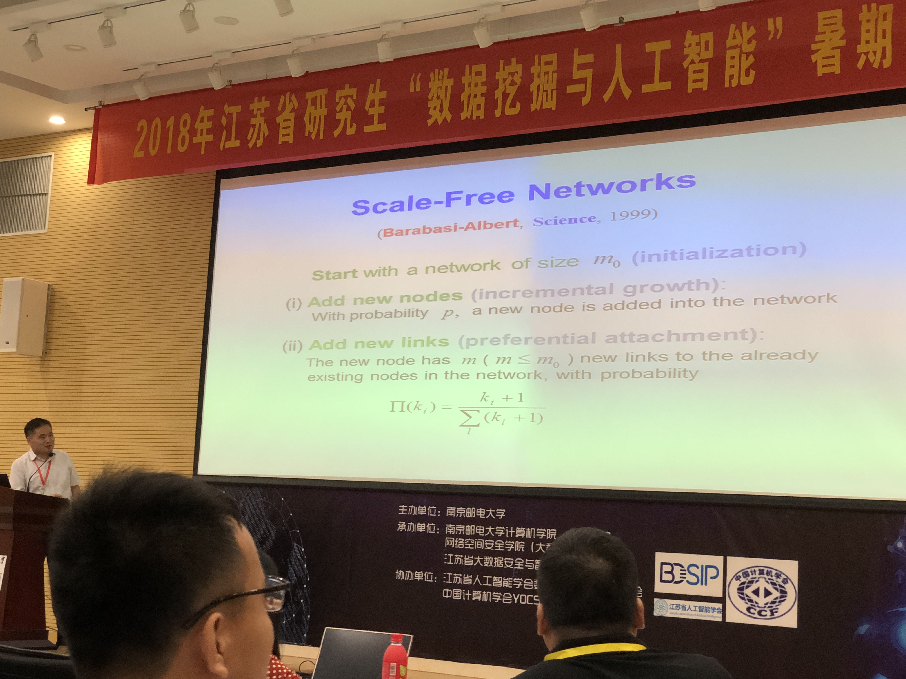

     该算法的思想是：根据某一概率，随机加入新的节点；然后，根据某一新的概率，随机选取两个点，并将这两个点之间连边。

     特点：

     1. 具有连通性
     2. 度多的节点，连边多，数量少，符合日常的生活规律
     3. 节点可以不断增加，有增长机制

  2. 网络行为特征

     

     这一部分主要与生活现象联系紧密，研究的也不单纯是理论

     1. 群体性：在一个群体中，数量越大，越容易形成集聚，即抱团现象
     2. 同步性与非同步性：两者之间的行为可为同步可为非同步（这部分有些迷，不是很懂）

  3. 复杂网络的同步与传播

     这一部分主要介绍了网络与网络之间的联系与模型。

     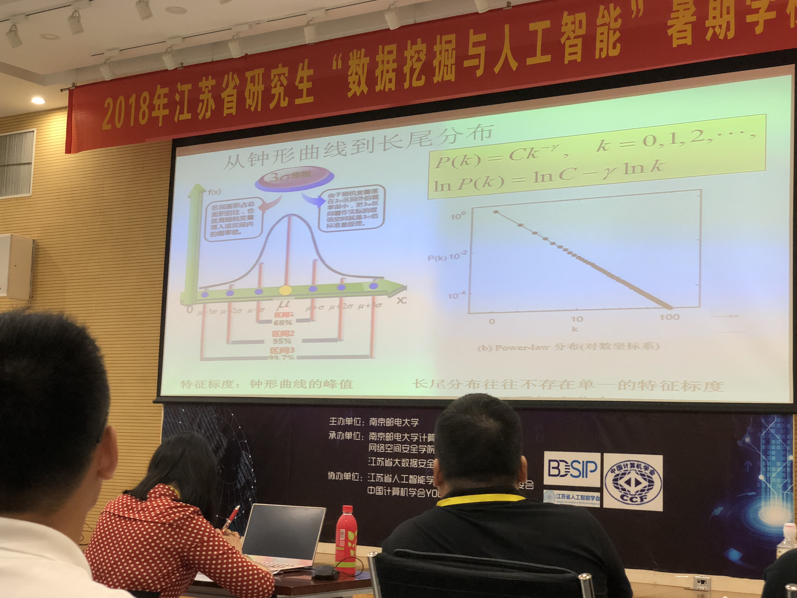

     网络可分为两种：平均网络（符合泊松分布）以及抑制网络（先高后低的形状）

     模型有三种模型: SIS、SIR和SI传播模型

     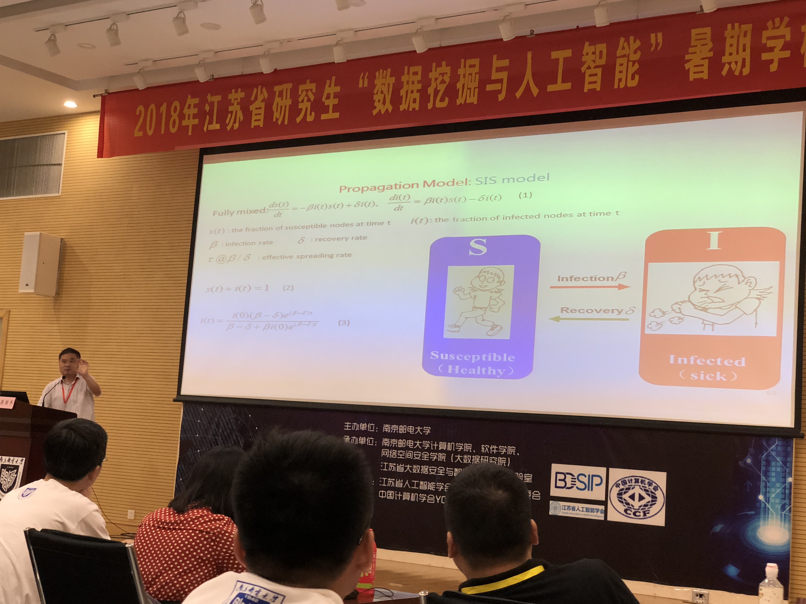

     这一段听得头皮发麻！真的是触摸到知识的盲区了，表达式看的也挺懵，不懂不懂......

  4. 网络控制

     这一段主要说明了节点与节点之间的联系与沟通。一个网络的正常运转当且仅当各个节点都能得到很好地联系与认可。（我和学长一起想到了区块链的应用233，主要就是各个节点相互认可，去中心化的一种思想）

  总结：第一场讲座比较学术，前半段还好，后半段简直头皮发麻🌚但给我最深的印象还是蒋老师的试验方法：从一个理想情况开始，先不考虑其他可能情况，当简单情况研究成熟后再慢慢加上新的影响要素。

  #### 王东CTO：运满满在大数据和AI的应用

  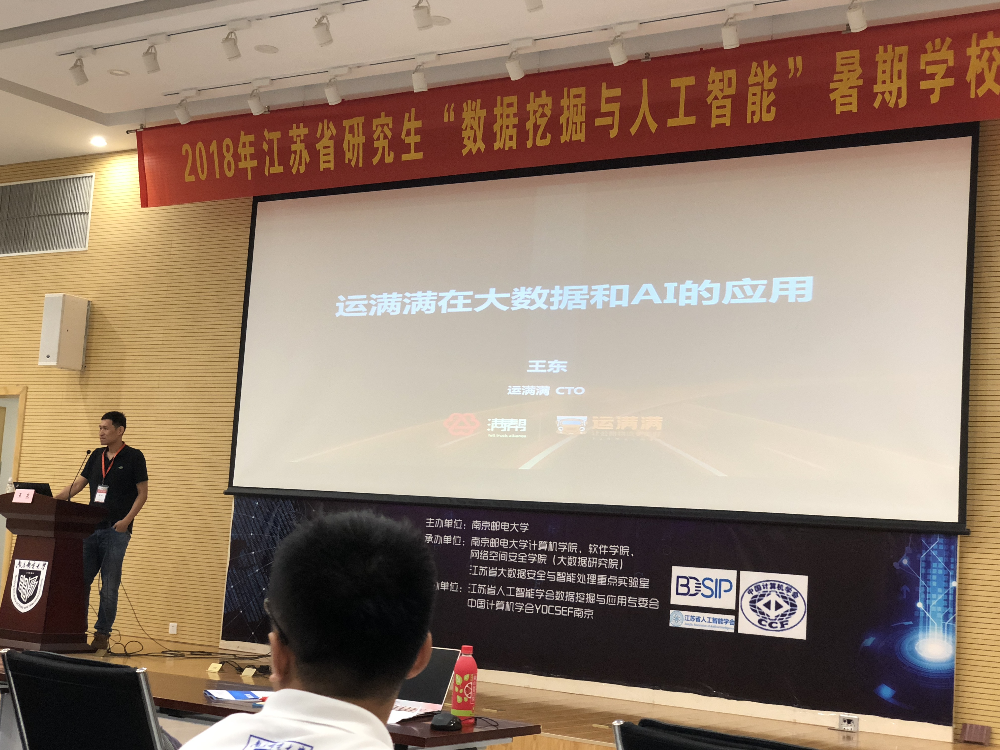

  讲真，这是上午听得最爽的一场了！！因为是首席技术总监（CTO）的缘故，这个讲座非常的技！术！化！

  王总通过对公司所获得的大数据进行的处理与加工，从而得到对用户有效的信息，然后精确地将货物与司机匹配在一起，得到利益的最大化。这场讲座我觉得干货满满，不像之前的学术化，很多的思想和工程算法都能听懂，真的是有种大彻大悟的感觉😂接下来我会就着图分析一下运满满公司是怎样利用大数据来精准推荐的。

  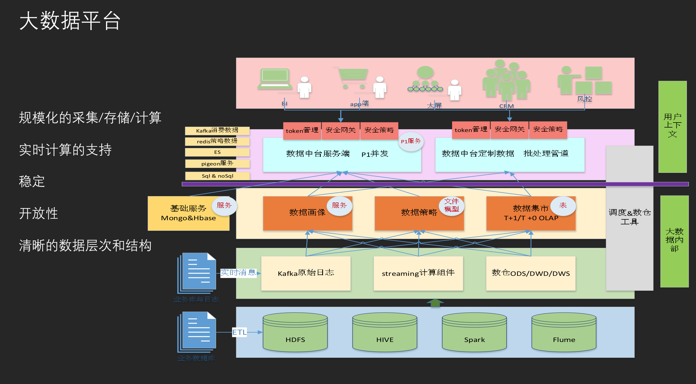

  首先，这是该公司大数据平台的一个架构。公司旗下的两款APP，分别对应着供货端与司机端。目标是把相应的货物匹配到最合适的司机上，然后收取合理的利润。

  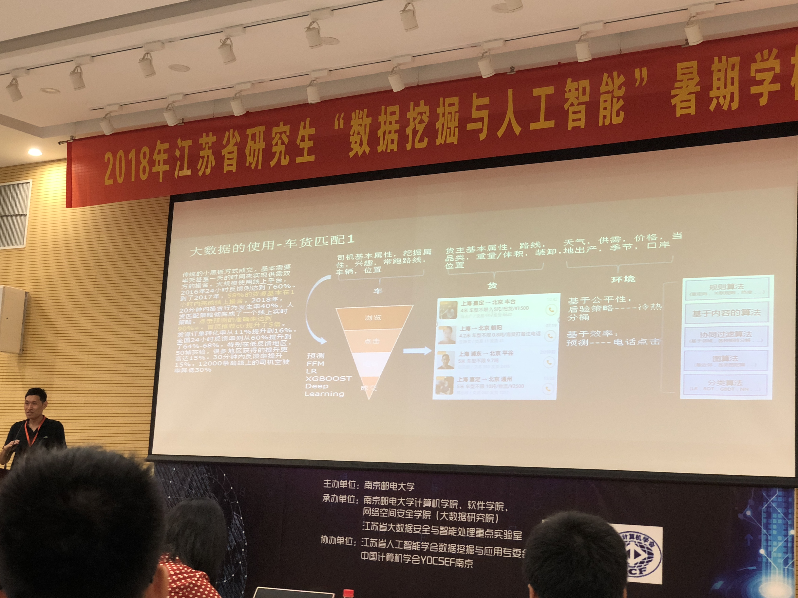

  车货匹配：首先，这是一个建模的过程，首先定位了需要解决的问题：匹配问题、推荐问题与用户画像。

  匹配问题：可以通过基于内容与协同过滤的算法来解决货物与司机的匹配

  推荐问题：将最适合的司机对应最适合的货物，利用了推荐算法与规则算法

  用户画像：通过手机各个用户在APP上的行为，将用户进行归类与打标签，并且对于不同的用户采用不同的风险控制模型进行用户管理，采用的是分类算法

  经过上述算法的优化，运满满大大缩短了货物的匹配时间。平均匹配时间从以前的三天下降到了一小时

  另外，在定价策略方面，也要考虑到供给关系、货主司机画像、旺季与淡季和地区因素。

  紧接着，介绍了最新的无人驾驶技术，包括了以下方面:规划、感知、预测、决策、控制

  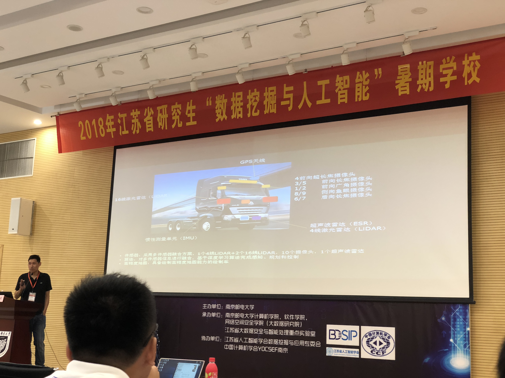

  <center>运满满公司在码头和高速试行的无人卡车项目</center>

  最后，王总提出了智慧物流的概念：融合了机器视觉，自然语言，人脸识别（防疲劳），智能客服，语音发货，智能助手等技术。

  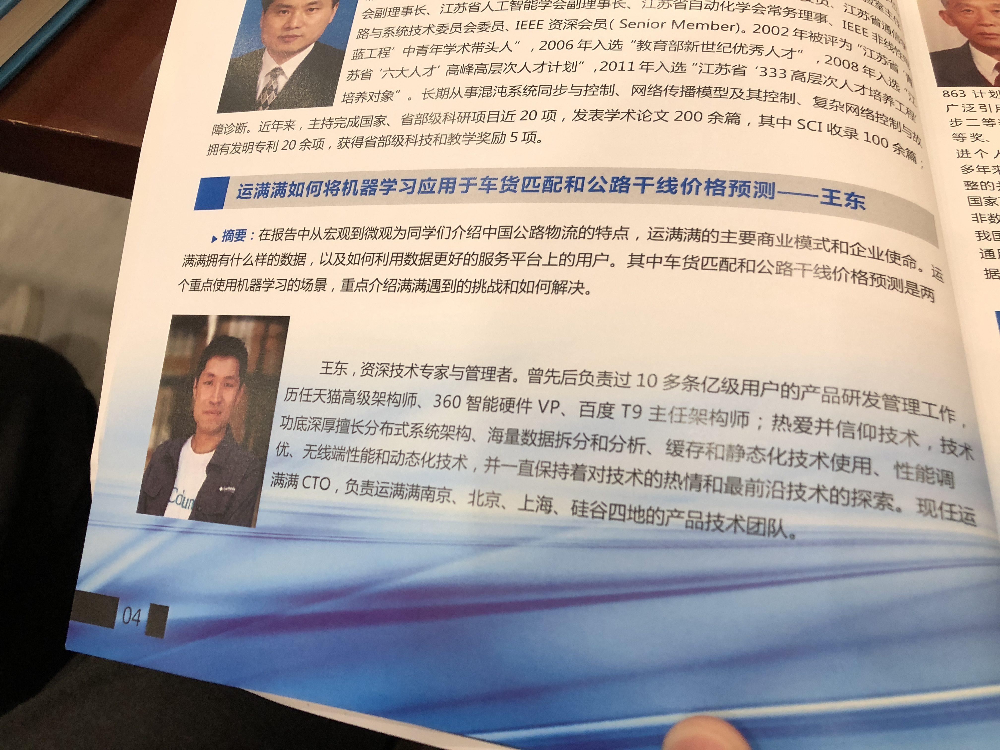

  <center>真的是技术大牛，百度T9，这简历无敌了=_=</center>

  总结：在大数据时代，企业是最容易将技术用于实践的地方。由于企业掌握了T级的大数据，如何从众多数据中提炼并发掘出数据背后的实际价值是最重要的。今天听了王总的分享，对app的推荐算法又明白了一些。而企业中的大数据平台分为很多模块，如何将各个模块协同处理，每个模块之间又如何进行连接与合作也是重要的一环。听完今天的技术分享，更让我认识到了自己的不足，还要再多多学习。

  #### 陈国良院士：大数据并行与交互式计算

  

  嗯，终于轮到了压轴人物出场了：毕业于中国科学院大学的陈院士！这也是我第一次能见到院士。现已80高龄的陈国良院士仍然非常精神，着实令人敬佩。今天陈院士分享的主题是理论计算问题，接下来我会简要将重点整理在下方。

  首先，在生活中，我们经常遇到要求解一系列问题。在求解中，我们一般运用时间复杂度来记录解决所需要的时间。如果是线性时间内能得到解决，那么就是O(kn),k为常数，如果时间为一个多项式，那么计算的时间将会显著变大，这时我们可以通过降低复杂度的方法进行求解与优化。

  接下来，陈院士引入了P与NP问题的定义。所谓P类问题，就是可以在多项式时间内可以**计算**出的问题；所谓NP类问题，就是能在多项式时间内通过**猜测**将答案猜出来，且只能猜一次（注：从这可以发现，NP问题很少有直观的解法，更多的方法是通过碰运气进行求解）

  那么，现在问题来了，这是一般的情况下，那么，在超大规模的数据情况下，原来的方法结论还成立吗？当然不能成立了。为了解决大规模的问题，针对P类问题，由于原来可经多项式时间内求解，故我们可以采用并行的方法，对原有的算法进行加速，通过并行提高速度；针对NP类问题，由于原先只能猜一次，所以我们可以采用交互式计算的方法，即**多猜几次**，通过对原有的计算方法进行改良的方法，从而改进猜测的质量。

  接下来，陈院士话锋一转，谈到了计算科学的三要素：

  1. 计算手段机械化：则通过一个既定的程序来求解
  2. 计算描述抽象化：在理论研究中，要找到一个普适性的方法，使得对于任何一种生活中的情况，都能得到对应的解决方案，而不应只停留在具体案例上
  3. 计算过程自动化：在计算中，算法应能自动脱离人的控制而完成，而不应被人的行为所影响

  紧接着，陈院士介绍了图灵机，分为了确定图灵机和不确定图灵机，区别在于是否只有唯一的一条路线可供选择。

  

  最后，陈院士展示了一个框架，通过框架，我们能够更轻松地了解P与NP问题的关联与区别。

  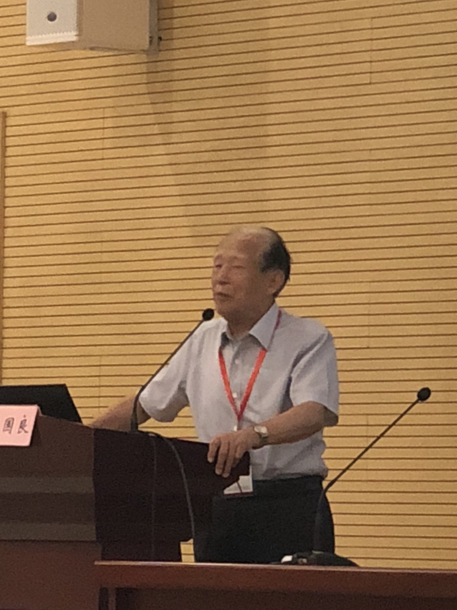

  总结：陈国良院士今天的讲座还是很通俗易懂的，没有讲到过多的理论知识，听起来还是比较容易懂的。在讲座中间，陈院士还回顾了自己上大学时候的一些所见所闻与奇闻异事，其中偷爬窗户占座那段我觉得最有意思😂生活中陈院士还是一个挺幽默的老师，在学术上他也是非常厉害的。通过今天的讲座，我了解了以前一直听说的P与NP问题到底是什么，以及发现计算问题，离我们并不遥远。衷心希望陈院士能在三尺讲台上再奉献更多精彩的讲座！

  #### 陈可佳博士：金融+机器学习

  

  最后一场，也是传说中的，陈可佳女博士带来的机器学习讲座。

  这场讲座我个人觉得，虽然面十分广，但是感觉不够精，很多部分都在泛泛而谈，再加上后期精力有些跟不上了，所以笔记做的有些少，望理解=_=

  首先，由于金融行业的特殊性，在金融行业的深度学习中的参数，需要经过理论推导与证明安全后，才能投入使用，故此，在金融中的风险控制中：

  1. 主要是基于计量经济学理论
  2. 统计学为主要分析方法

  那么，在机器学习中，**特征工程**也是很重要的一环，选取一个良好的特征训练，将会收到更好的效果。反之，则会直接影响预判结果的正确性。

  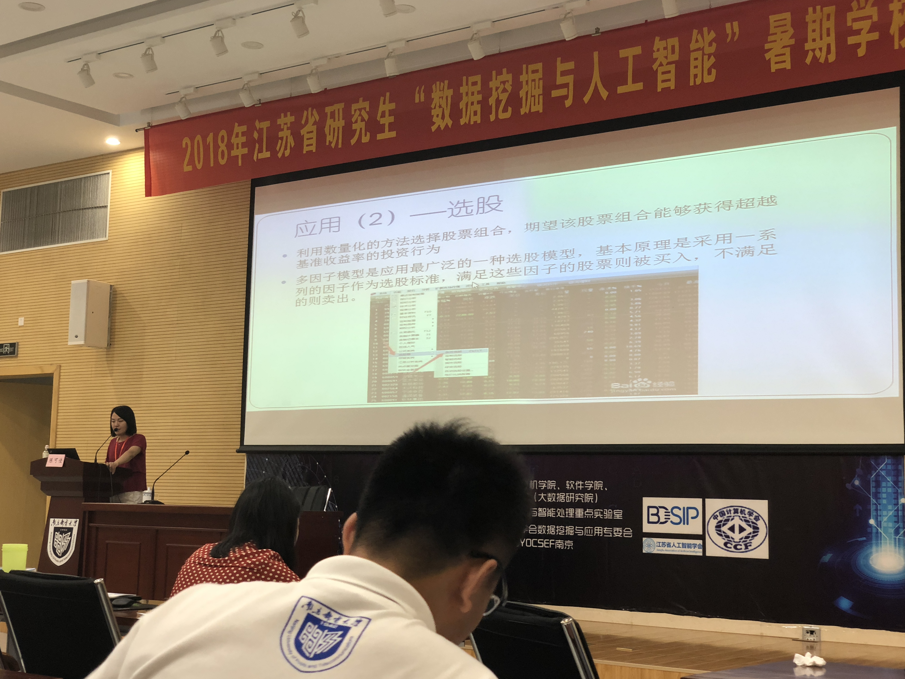

  在使用机器学习进行选股时，股票因子与权重占有很重要的位置；复杂情况下，多因子选股时，要分清每一因子所影响的范围及互相间的变化，谨慎选择最优的方案。

  

  那么，这就是Day 1的全部内容，感谢各位的留意与观看，我们明天再见😀晚安💤

- Day 2 : 科研方法写作 & 大数据实践

  首先非常抱歉，由于今天晚上事情比较多，导致我真正开始写的时间已经是比较晚了，所以没能很及时更新当天的笔记，内容也会进行适当的缩水，还是希望大家能够理解，谢谢！

  今天主要讲授的是关于科研方法写作与大数据实践部分，分上下午。上午为讲座，下午为上机。下面我会将两块分开来记录。

  #### 科研方法：王磊博士

  

  本次科研方法讲座，主要讲述了进入研究生阶段后，应该注意的一些事情，怎样与导师相处以及怎样提高自己。

  首先，王磊教授分享了为什么要进入研究生阶段：提升自己的能力、格局、平台和朋友圈；然后，主要分析了研究生与本科生的不同。在撰写论文时，与本科阶段不同，不是按部就班，而应该有所创新，通过与导师接触，或是各种学术交流学术报告中获取自己的灵感，同时在自己的空闲时间要了解学术潮流，多关心身边人在做什么以及自己能不能从中借鉴。

  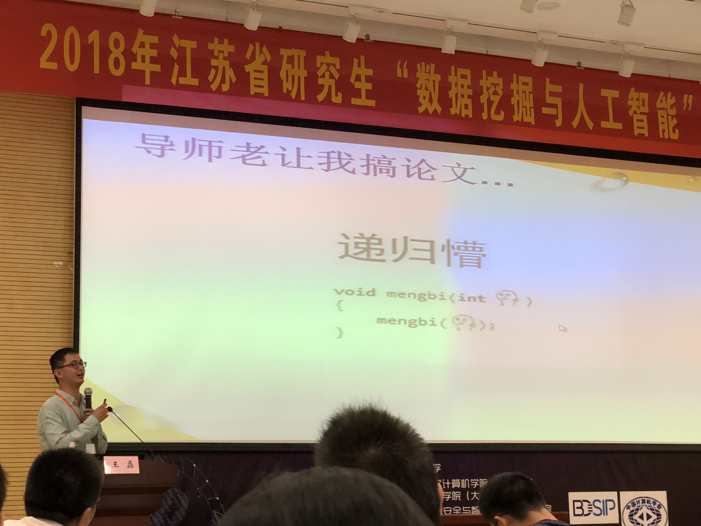

  几个重要的观点与论述中心：

  1. 研究生选题：

     - 导师提供idea，照做，相对轻松
     - 导师不管，可以自己学，选取自己真正感兴趣的方向，这类导师也不能说不好，留给自主的时间将会更多

  2. 如何获得好的idea:

     - 大量阅读文献，多听学术报告，多与同行探讨
     - 广泛阅读文献
     - 多联系周边的教授，多交流，找机会认识牛人

  3. 关于论文投稿阶段：见图

     

     论文提交后的发稿流程，大致为图上所示

  4. 比较好用的文献管理工具：Zotero，自动排版，能自动生成简洁、规范的文献布局

  5. 决定论文在周刊中的重要程度：1. 周刊的影响因子 2. H-Index反应作者的学术水平（可在Google Scholar查到）

  6. 既然选择了科研的道路，就注定自己有时候是孤独的，所以要享受工作，做个工作狂

  总结：我很欣赏王磊博士的演讲，生动中又穿插着幽默，听起来非常有趣，不累。虽然科研方法离我还有一段距离，但分享的一些经历在我的生活也是息息相关的。

  #### 科研写作：夏彬博士

  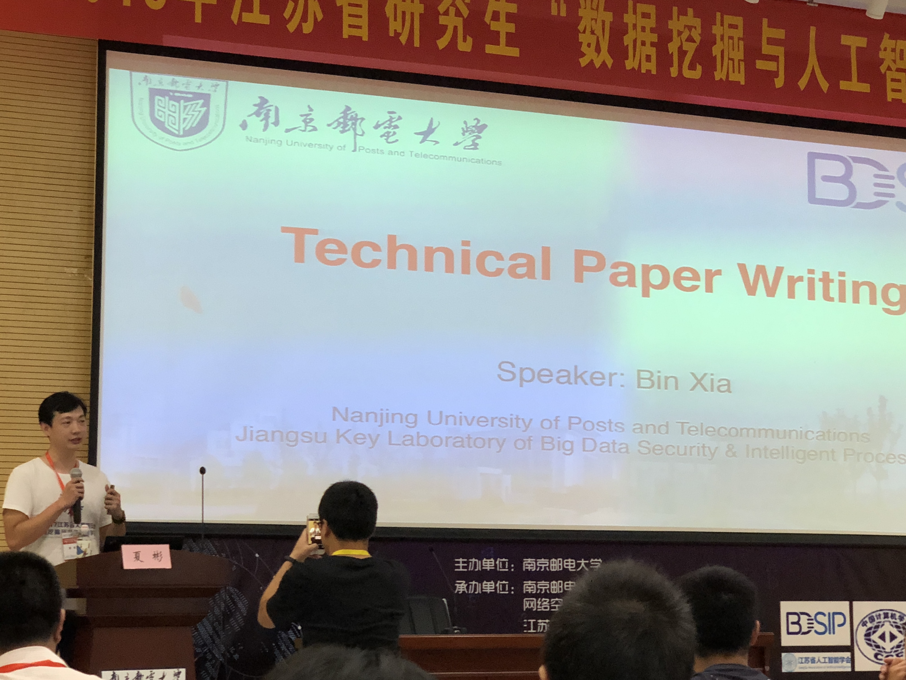

  紧接着，就来到了第二部分：科研写作部分。在这一部分中，夏彬博士主要分析的是英文论文的写作技巧，故这一块的PPT与课件都是英文形式的。科研写作，里面蕴含了非常多的技巧与注意点，夏博士提到了很多很多的技巧，但限于篇幅与时间，我只将重要部分提炼出来。

  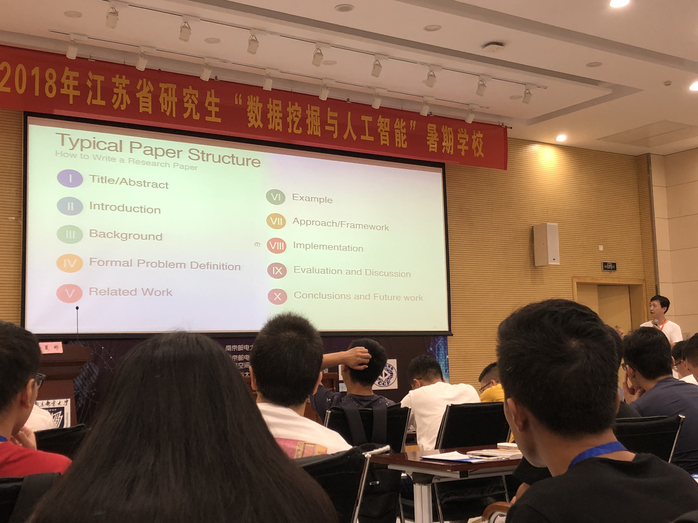

  首先，这是一篇正常论文的结构，夏博士将其中每一块都分开，然后细说了其中的注意点。

  

  其中：

  1. Abstract:需要简介精炼，把文章核心研究点用较少篇幅阐释一下，具体的问题和研究方法应在后续中详细说明。

  1. Introduction:主要是一个简介，经常被认为是Abstract的补充说明，这一部分不是必须要的部分，但是一旦要进行补充，一般的闪光点就应该从中提现出来。

     Background:经常被用作论文的研究背景、学术背景。同样，不同的期刊都有不同的背景侧重：例如在生物信息学这种交叉学科中，如果投偏重生物的期刊，则background应重点交代大数据的场景；同样，如果投偏重数据挖掘的期刊，则background应侧重生物学的背景，不同类期刊有不同类的侧重。

  2. Formal Problem Definition:是一个具体的问题描述。在理论研究中，由于问题有时候会十分抽象，所以经常会通过这一块对问题进行一个解释，试图让研究人员能够更清楚地了解问题。

     Related Work:通常会在中间大致提到相似的研究还有哪些人在做。与最后的Reference不同，此时只需提到，不需要细致到期刊文章。

  3. Example:是文章中如果涉及到一个具体的案例，则会在此处提出，作为对一个问题的解释。通过提出案例，能让研究人员更容易理解相关的概念。

     Approach/Framework:这部分通常是论文的重点。为了达到目标和效果，作者运用了什么样的方法和框架，其中涉及到了什么算法，算法的可行性、效率如何。这里主要解决的就是论文中的How问题。

  4. Implementation:是论文的一个算法的实现。如果论文中的现象能通过实验得到复现的话，将会大大加强该理论的可靠性。但implementation并不是必须的部分，也是可选的。

     Evaluation & Discussion:是对已有研究的结果进行一个评估和讨论。在此处，作者不应回避研究中出现的问题和研究的局限性，而应将positive和negative的两面都进行一个阐述。

  5. Conclusions & Future Work:是对自己的一个研究进行的总结，和对未来可能的进一步研究提出的一个展望。在这一块，要用尽可能精炼的语言，提取出自己大体上的一个思想，通过怎样的过程达到了怎样的结果。切忌长篇大论，要简洁。

  自此，就是每一块的分论述，我认为这也是这场讲座的核心（打字打到手指都有些发麻了😂）就写这么多了

  #### Python大数据实践: 刘晓迁

  

  Python大数据实战呢，虽然是上机，但是感觉，由于之前已经自学了一段，所以现在感觉也没有什么太大的难度。代码我放在了ppt的文件夹中，有需要的可以自行查看。

  Python实战主要给我们介绍了Python的基本语法，numpy与matplotlib,jupyter,scipy的使用，再到后面的决策树算法实现（但是决策树的性能并不是很好），还是不错的，但难度有些低，也没有上升到代码开发的这种高度，所以也没有太多的可以记录的。

  好，这就是Day 2的全部内容，非常感谢现在还能关注我文章的同学，写完的时候已经是凌晨，但是做完的感觉还是很舒服的😂大家晚安💤

- Day 3 :讲座报告

#### 关于多视图统计学习和矩阵复原的一点贡献：蓝超博士

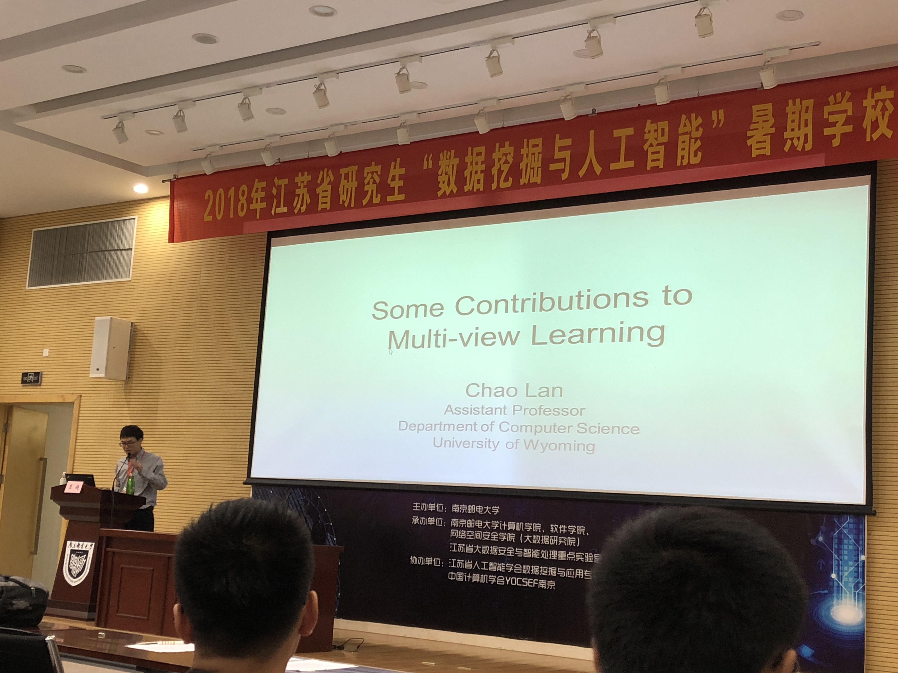

第一场报告是由蓝超博士带来的。蓝博士的讲座有一个很特别的现象，由于经常在国外演讲，他比较喜欢在中间询问是否有问题并希望听众能在讲座中间打断他提问。或许这是国外跟中国的一个区别吧。


首先，蓝博士主要介绍了多视图的概念和特征，并强调了机器学习的特征：对多组特征进行的相互标注。


然后，蓝博士介绍了Co-Learning和Co-Regularization两种算法。第一种算法适用于半监督学习方法，主要通过标记一个，然后迁移到另一个视图进行标记；由于第一种算法比较耗时，而且工作量比较大，故简化并优化了第一种算法到Co-Regularization。这个算法的特征是通过公式进行计算与建立损失函数进行最小化优化，从而收敛到一个范围，能够更快地达到目标。

接着，蓝博士介绍了多视图的聚类：首先，聚类是算类与类之间的关系，然后以一个值进行相似度的比较，将联系紧密的类进行标记并联系起来。

为了改进无监督学习的样本复杂度，通常运用一种叫联合矩阵分解(Collective Matrix Factorization)的方式进行分而治之的求解。


最后，蓝教授通过举机器学习中，出现的性别歧视的现象，提出了机器学习的公平性问题。这是一个在机器学习中普遍出现的问题。在做决策时，由于样本也是采集于生活中，这类歧视不可避免，于是就会将训练后的模型也带入其中。为了解决这类问题，我们要对样本集进行一些模糊化的处理（例如隐藏性别等某些可能会导致歧视的方面），然后再丢入模型进行训练。

总结：我很喜欢蓝超博士的讲座特点，比较生动具体，不是非常理论，但也让我们理解了很多的概念与实验。而且，我也是第一次感受，在中间问大家有没有搞懂的这种现象的，还是挺有趣的。

#### 2DPCA表示学习（模式识别）:杨健博士


讲真，这是我听过最懵的讲座！上来就讲PCA我也是很醉啊。没有任何铺垫直接就开始各种公式理论推导，简直头皮发麻……实在是没有搞懂他在讲什么，课件我也放到了ppt文件下，有需要的同学可查看该课件，我就不再分析了。

#### 人工智能与图像识别: 刘青山博士

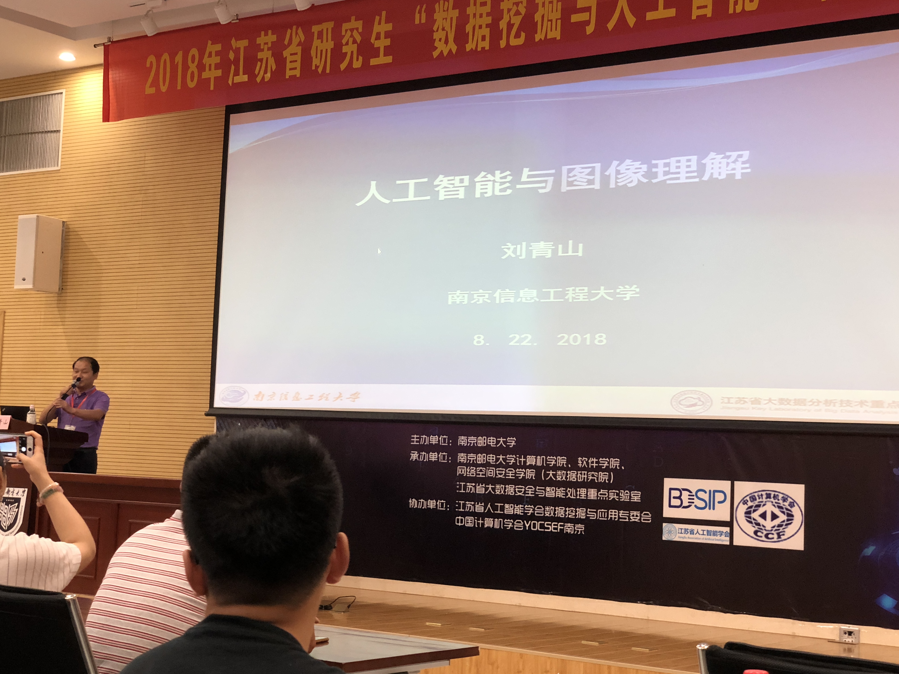

首先，想为刘博士点个赞。这场讲座是我觉得最有意思的一场讲座之一。这次讲座中，第一次出现了演示环节，而且做出来的东西性能特别高效，不同于其他任何的框架臃肿的特性，当然这些都是后话。

首先，刘博士介绍了人工智能已上升到了国家战略，并主要专注于大数据智能、群体智能、跨媒体智能等多种方面。

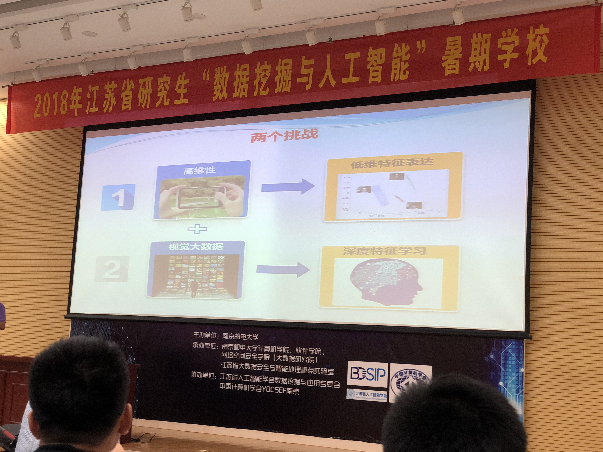

然后，刘博士提出了两大挑战，并由此引入了怎样将高位数据进行降维。我们可以通过主成成分分析（PCA）的方法，剔除少量的细节，从而将高维度的细节降维，从而缩短计算时间与复杂度。还经常用的一种方法为SVM，效果同理。

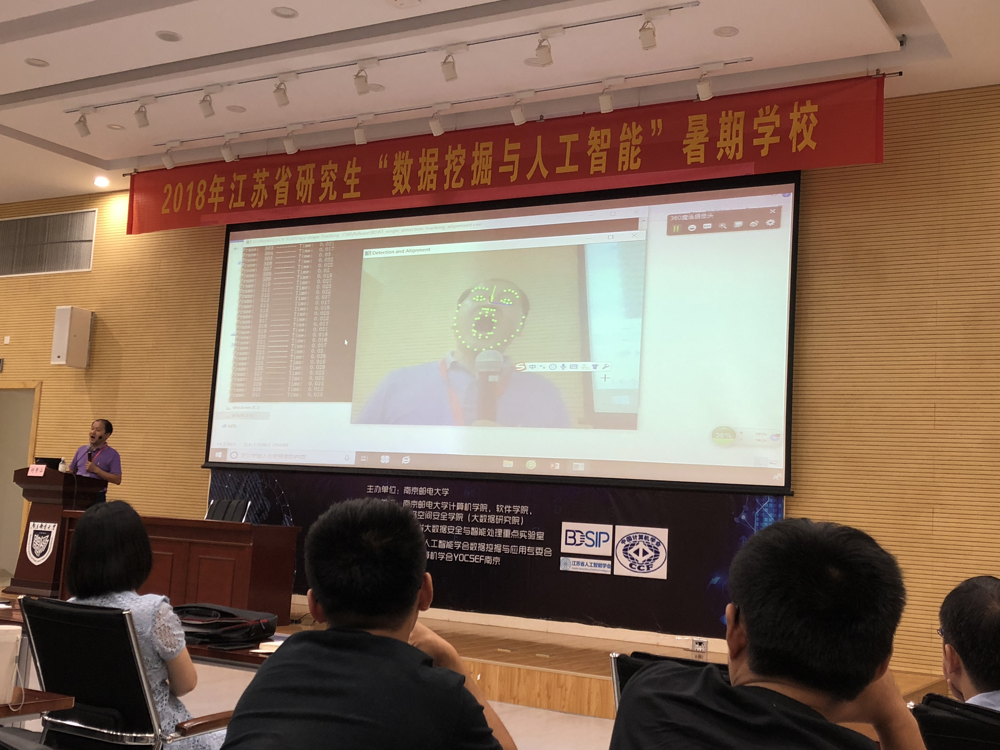

最后，刘博士现场演示了人脸识别的技术。该识别技术不仅很准，而且速度性能还特别的好，真的很好奇是用怎样的算法进行的优化=_= 这张图我感觉也是今日最佳了😂


这张也是非常好玩了，还和<del>杨洋</del>某位明星同台出镜了2333这个人脸识别率，真的是相当的高。

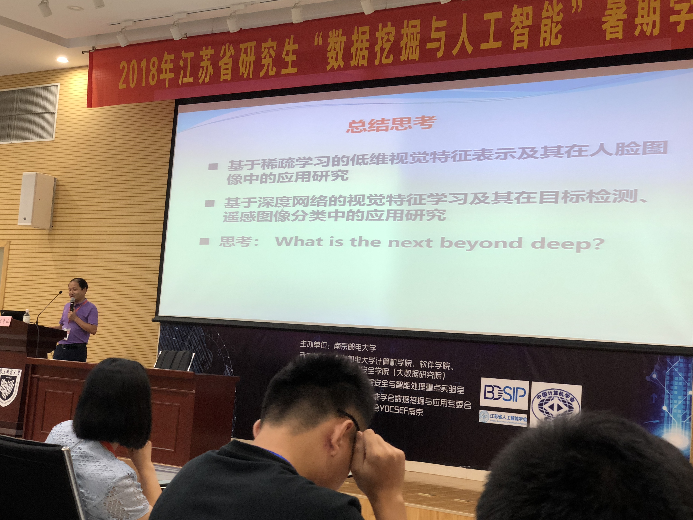

最后，刘博士进行了总结，并希望我们展望未来，去通过不懈的努力去追寻真理。

#### 强化学习简介：俞扬博士

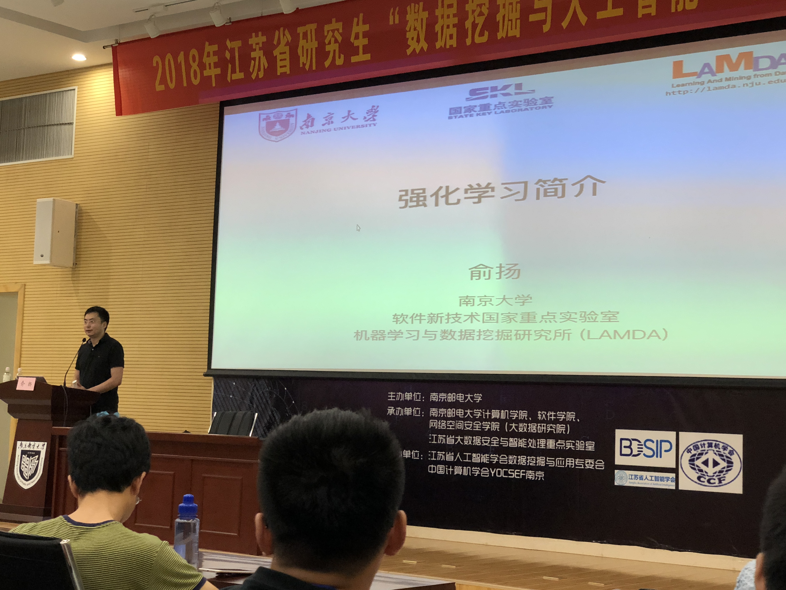

俞博士，主要讲的是强化学习的相关内容。如果将强化学习与监督学习进行一个比较的话，强化学习侧重决策，而监督学习则偏重于预测，是两种不同的任务。而现在很多的游戏等多种反馈的任务，使用强化学习都可以得到一个很好的结果。

应用：

1. 游戏，机器通过一次次试错玩出高分
2. AlphaGo System
3. 推荐系统（根据商品的特征）


这段是一个三部曲的流程图，分别是建模，组织架构和数据

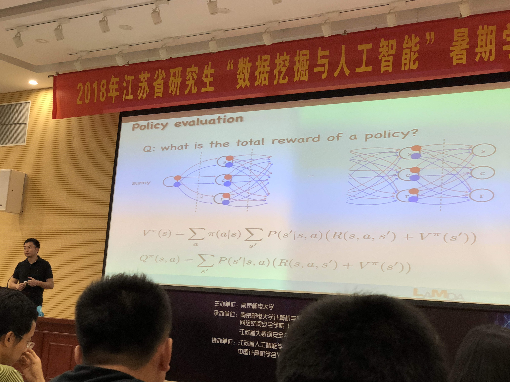

一个常用的算法架构，常用作policy-free模式中

- Day 4 :学术报告 & 深度学习实践

#### 半监督分类学习: 汪云云博士


分类学习：训练数据--训练->学习模型--预测->新数据

应用：征信评估、文本分类、图像分类

普通的监督分类学习：寻找一个分类函数，能够尽可能好地将数据分为两类。每个数据样本都会被贴上标签进行学习。缺点：标注费时费力，有时候不可取。

半监督分类： 利用大量无标记样本和少量有标记样本进行训练

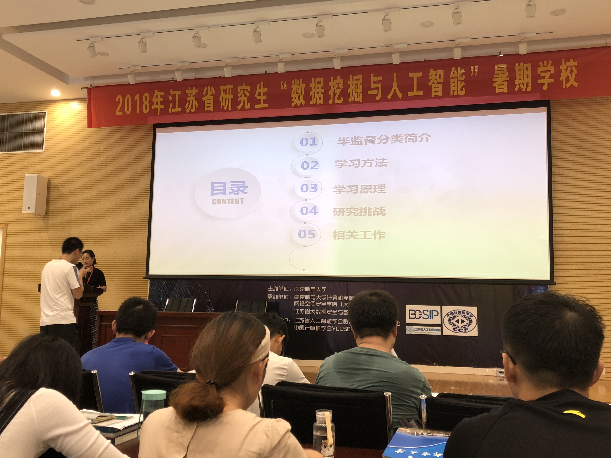

学习方法：

- 生成式方法：估计参数，期望最大化。
- 大间隔半监督分类方法：使用SVM算法。最大化所有样本上的类间间隔（有标记+无标记）
- 基于图的半监督分类方法：基于流形结构图（以到线段长度为准），然后通过分类函数最小化值。
- 协同训练（**co-training**）方法：分别训练两个学习模型，然后将有信心的样本加入并迭代训练。

学习原理：

- 目的：利用无标号样本帮助提升学习性能。聚类假设、模型假设
- 聚类假设：如果在分布上靠近，互相聚成一类，则符合聚类假设
- 模型假设：符合某一种模型的特征。在这种情况下，就可以使用模型假设。

研究挑战：

- 半监督学习的不安全特性：有时，利用半监督学习可能会造成性能下降。

  原因：部分无标号样本不可靠—>对无标记样本进行选择

- 引入平衡因子，解决半监督学习的不安全问题

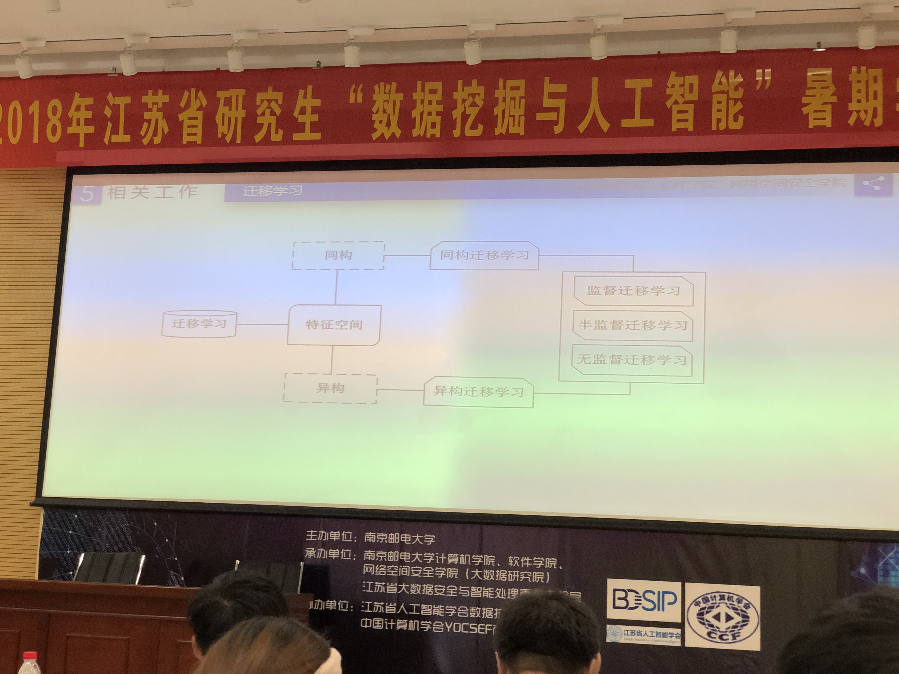

相关工作：

1. 弱监督分类学习
2. 迁移机器学习:同构+异构的迁移学习
   - 基于实例的迁移学习
   - 基于特征的迁移学习
   - 基于参数的迁移学习
   - 基于关系的迁移学习

#### 数据处理过程中的隐私保护：杨庚教授


互联网发展：互联网->+互联网->互联网+

棱镜门事件，标志着隐私问题开始得到注意。

如何定位到一个黑客地点和行为呢？


(这部分，杨教授从一个案例出发，详细叙述了怎样从网上发现该黑客，并从蛛丝马迹中一步步定位到这个人的。非常有意思！)

隐私泄露的方面：

- 个人信息泄露：电话住址等
- 受钓鱼网站欺骗
- 城市监控

安全问题产生原因：

- 软件bug
- 硬件设备
- 用户过失
- 自然灾害
- 管理缺失

隐私保护的目标：

- 机密性：加密，入侵检测，防火墙
- 完整性：数字签名，水印，病毒检测
- 可用性：访问控制，用户授权，审计
- 不可否认/可控性

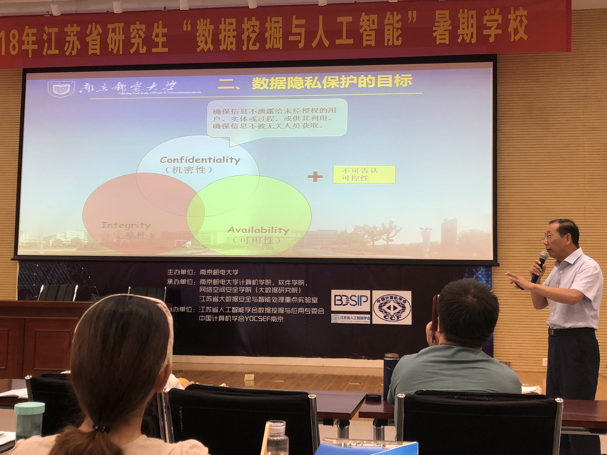

数据环境的安全问题：

- 数据本身的信息泄露
- 数据宿主的隐私信息泄露
- 数据使用者的隐私信息泄露
- 数据处理隐私信息泄露

差分隐私：给附近加入一些噪声，使得信息经过截获后减少损失。

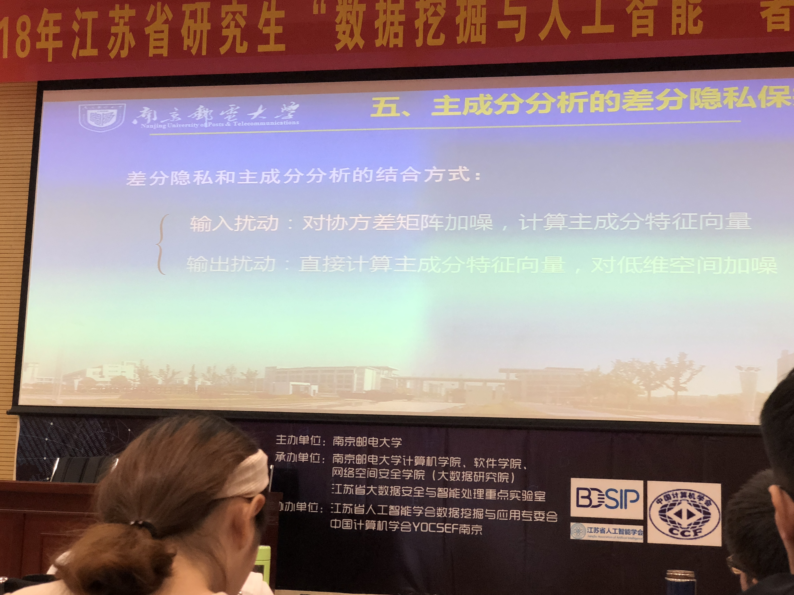

常用噪声机制：

- Laplace机制
- 指数机制

主成分分析的差分隐私保护：

主成分分析，简称PCA，是一种利用降维的方式把多变量转换为主要几个变量的统计分析方法。

这些主要变量能够表示原始数据的绝大部分信息，揭示数据的本质。

差分隐私和主成分分析的结合方式：

- 输入扰动：对协方差矩阵加噪，计算主成分特征向量
- 输出扰动：直接计算主成分特征向量，对低维空间加噪

#### 深度学习实战

本次深度学习的实战内容，主要介绍了深度学习的应用于全连接、BP网络等内容。由于主要是代码实践内容，故不做笔记。在PPT中有课件，有需要的可以查阅ppt文件夹。

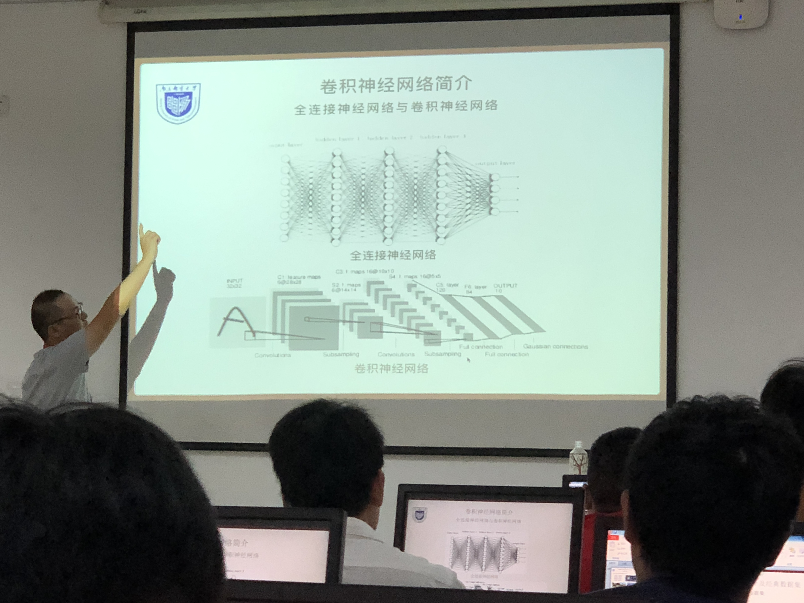

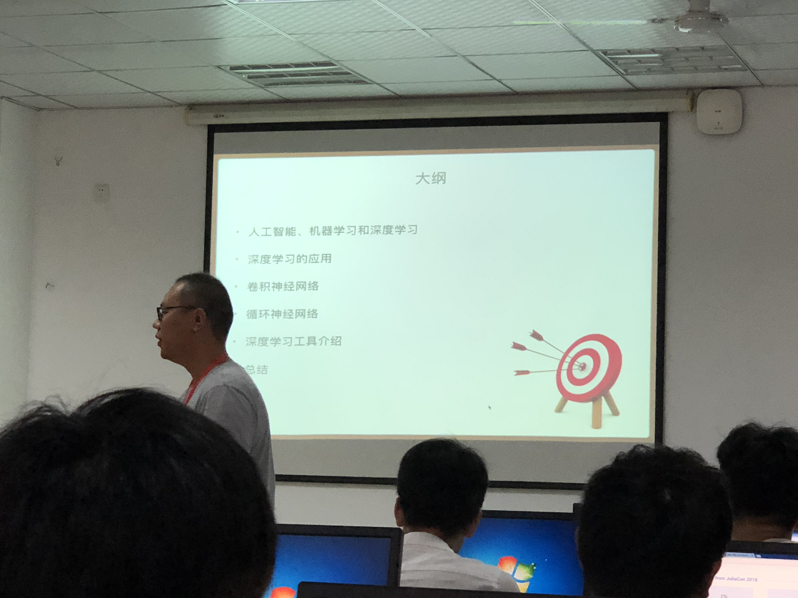

- Day 5 :学术报告

#### 基于机器学习的软件工程与图像视频分析的新问题、新方法研究：荆晓远


偏向自动化学院的机器学习：硬件 + 软件

图像视频分析方向聚焦于行人重识别，高位数据特征提取技术

**软件缺陷预测**

困难：类不平衡、误分类代价

不同软件模块之间存在一定相似性。通过构造软件缺陷数据的稀疏表示

**类不平衡问题：**

- 项目内：数据类的不平衡分布导致了缺陷预测的准确率较低
- 跨项目：现有的处理跨项目类不平衡的缺陷预测方法中，在欠采样和过采样的进程中会伴随原始信息的丢失以及综合信息的加入

解决方法：

- 项目内：引入子类判别分析（SDA）

**基于典型相关分析的异质跨公司缺陷预测：**

```flow
st=>start: 在现实中，
不同公司的软件缺陷
无论在度量类型还是
度量集的大小都是不同的
op1=>operation: 异质问题
op2=>operation: 统一源数据和目标公司数据的度量表
e=>end
st->op1->op2->e
```

**软件工作量估计：**

工作量估计是软件开发的关键步骤

工作量估计研究内容：

1. 工作量估计数据缺失不全
2. 工作量估计数据隐私保护
3. 工作量估计数据缺乏问题

#### 面向O2O智能商务的大数据挖掘与应用：曹杰院长

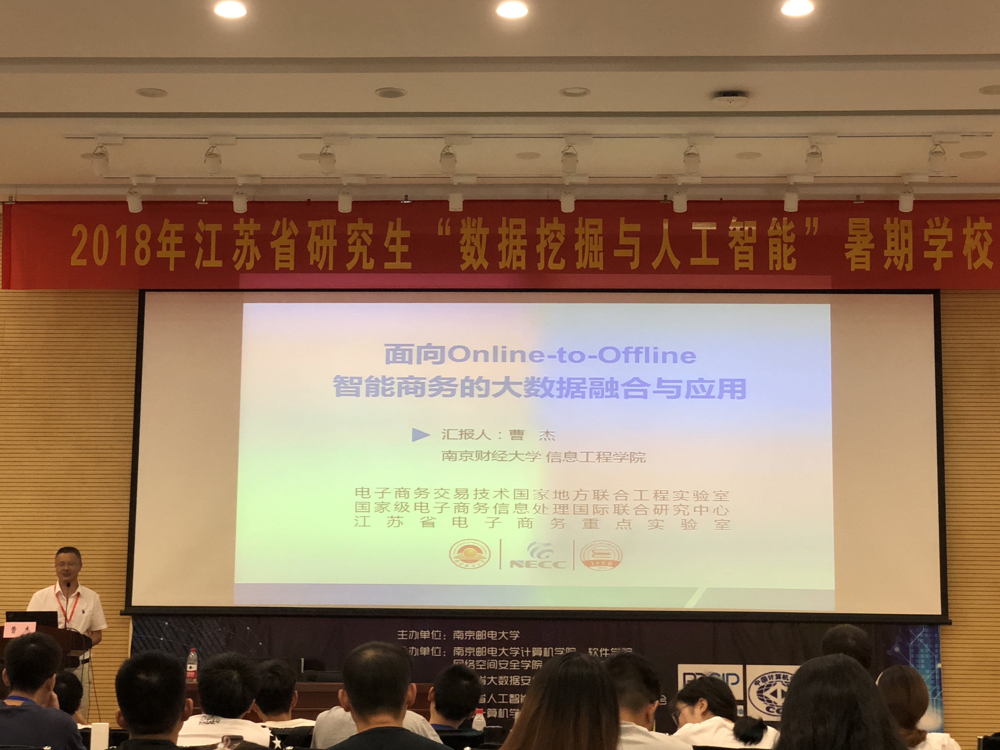

O2O: Online To Offline

异构数据类型：

- 结构化交易数据
- 轨迹数据
- 日志数据
- 用户生成内容，文本数据
- 网络结构......

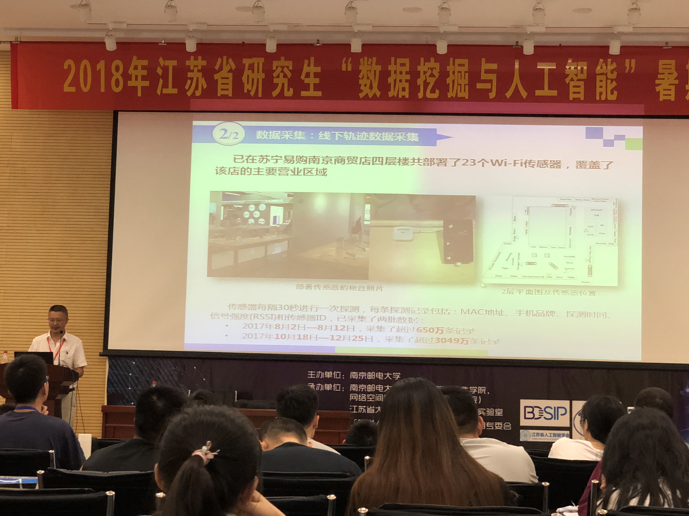

研究方面：

- 数据层面
- 模型层面
- 应用层面
- 系统层面

轨迹数据研究：

- 驻留热点识别
- 时序价值模式挖掘
- 轨迹模式语义建模与标注

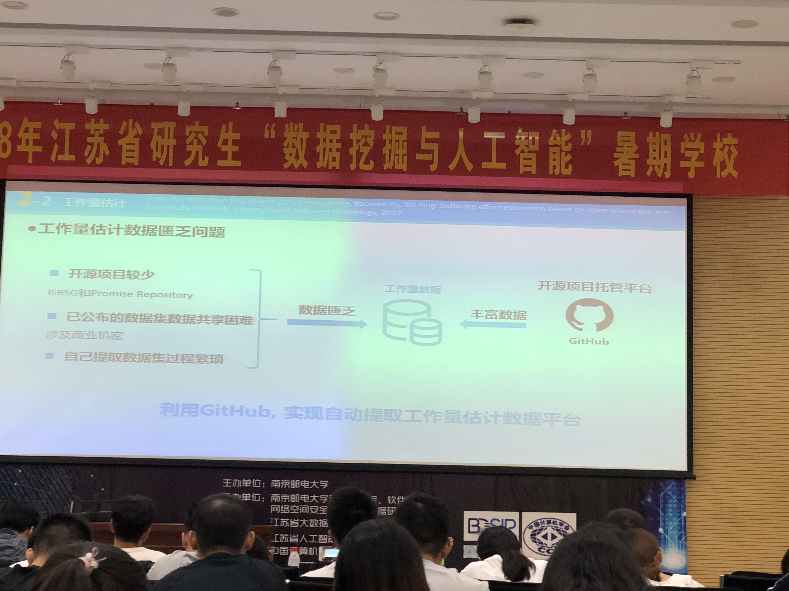

关键问题与技术路线：

- 多渠道知识融合
- 协同演化推荐
- 广告精准投放

#### 机器学习及其对抗性研究：李云教授

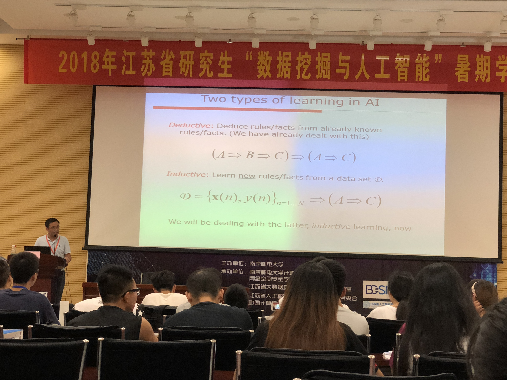

两方面：

- 分类
- 回归

数据拟合中，选用模型尽可能要简单，考虑模型的复杂度

机器学习中，通过**分类器**，捕捉其中的细节，进行交叉检验

Procedure: Feature -> Classifier -> Cross Validation

线性回归：$f(x) = g_{\theta}(x) + \epsilon$


<center>本图为真实的一个机器学习问题</center>

方式：

- 决策树（Disition Tree）
  - 思想：分而治之(Divide and Conquer)
  - 通过不同取值把样本分割
  - 通过学习近似学习出hypothesis参数

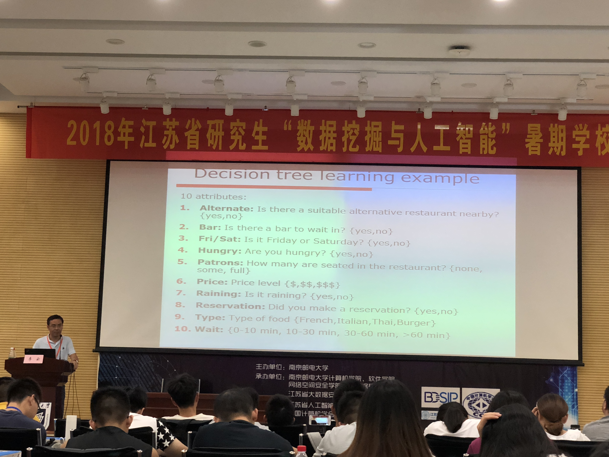

<center>此图为决策树的例子</center>

- Day 6 : 讲座报告

#### 游戏人工智能：陈兴国博士

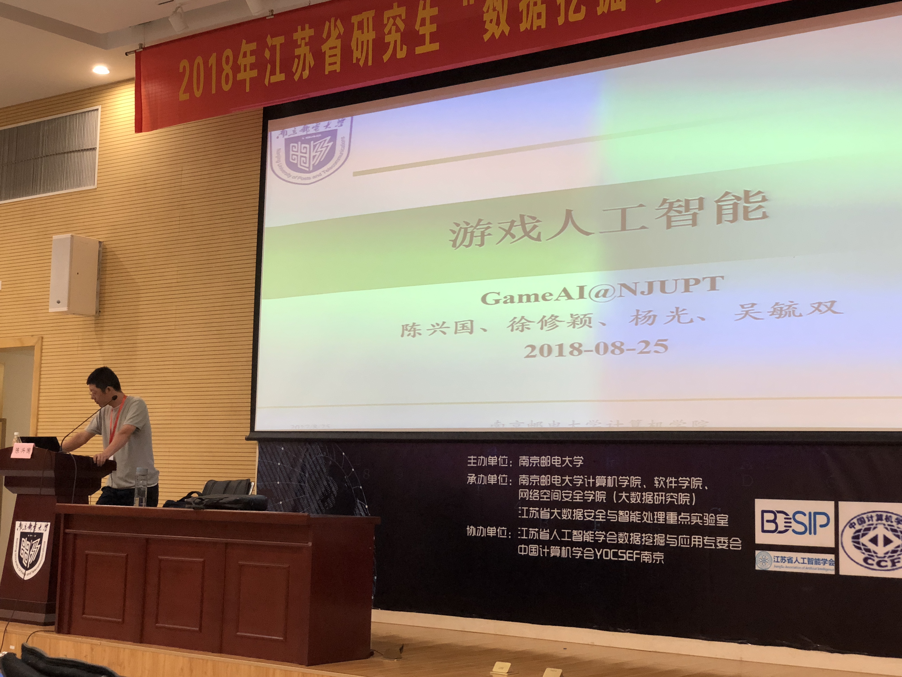

游戏的四个特性：

- 有趣
- 不确定
- 规则
- 虚构

游戏分类：

- 完全博弈：棋、AlphaGo
- 非完全博弈：卡牌游戏

人数角度：

- 个人游戏：俄罗斯方块，2048等
- 多人游戏：中国象棋，卡牌等

游戏的复杂度：

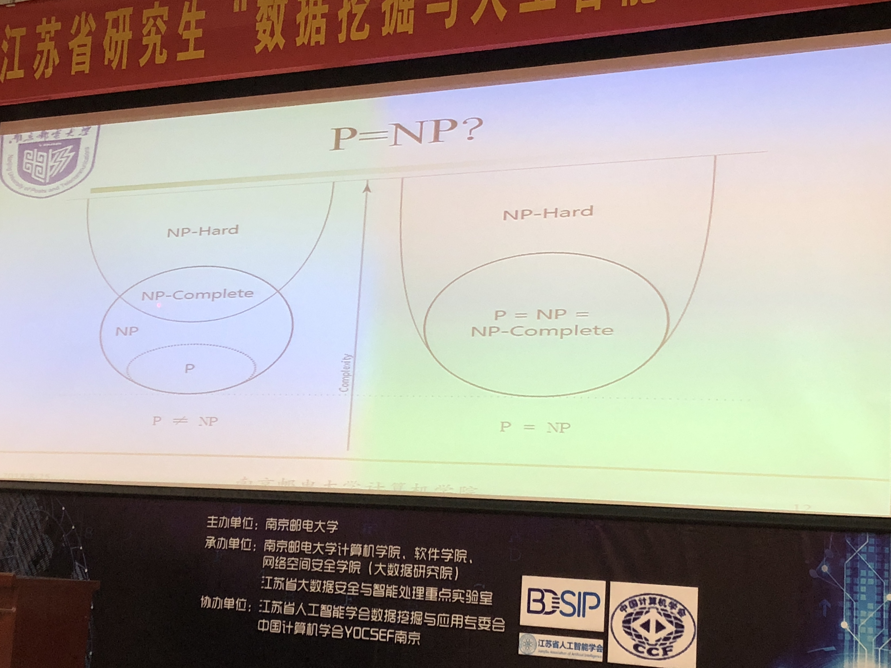

- 算法的复杂度：
  - P：在多项式时间内可以完成的问题
  - NP：在多项式时间内非确定性可以完成的问题
  - NP-Complete
  - NP-Hard
- 游戏的复杂度
  - 俄罗斯方块的NP-Complete问题

**P = NP?**

Cook's theorem

- SAT问题的求解
- NP中最困难的问题可转换为P问题

经典问题：

- 欧拉回路：给定一个图，从某一点出发每条边走且仅走一次，最后回到出发点
  - 充要条件：连通、所有节点度数为偶数
  - Floyd算法
- Hamilton回路
  - 给定一个图，问能否找一条经过每个顶点一次且恰好一次，最后走回来的路
  - NP-Complete问题
- 3-Partition
- TSP问题：旅行商问题
  - 给定所有顶点和距离，问访问所有节点的最短路径路线
  - NP-Hard问题

俄罗斯方块：

- 七种方块等概率出现
- 以1的概率失败
  - 轮流掉落
- NP-Complete问题的解决：
  - 消除一行，有时候很简单，有时候很难
  - 求解算法的目标：难
    - 给定初始形状
    - 给定顺序
- 找到一个带变量n的问题
- 给定一个解（下落位置和旋转的序列）
  - NP
- 利用三分问题求解，再进行求和操作

游戏的复杂度

- 算法复杂度
- NP-Hard问题

玩游戏的人工智能

- 形式化
- 马尔科夫博弈
  - MDP流程：Agent 环境

流程如图所示：

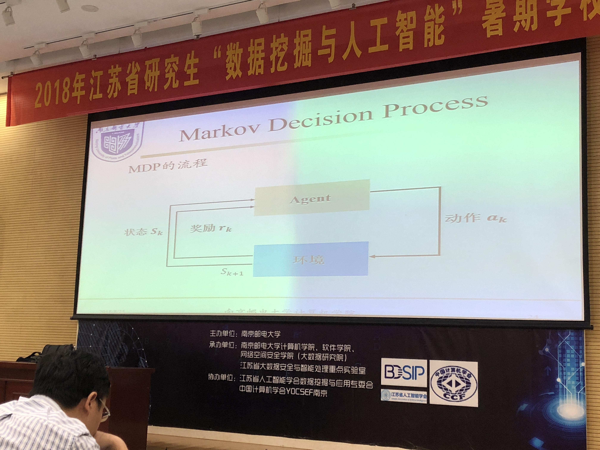

游戏怎么玩：

- 看得远
- 看得准

搜索：

- min-max搜索


核心思想：对手选对自己最不利的，我方选对自己最有利的

- 一个最差情况的解
  - 在零项和情况下，退化成纳什均衡

- $\alpha - \beta $ 剪枝搜索

把一些不可能的情况剪枝掉

如何看得准：

- 评估函数：蒙特卡罗算法

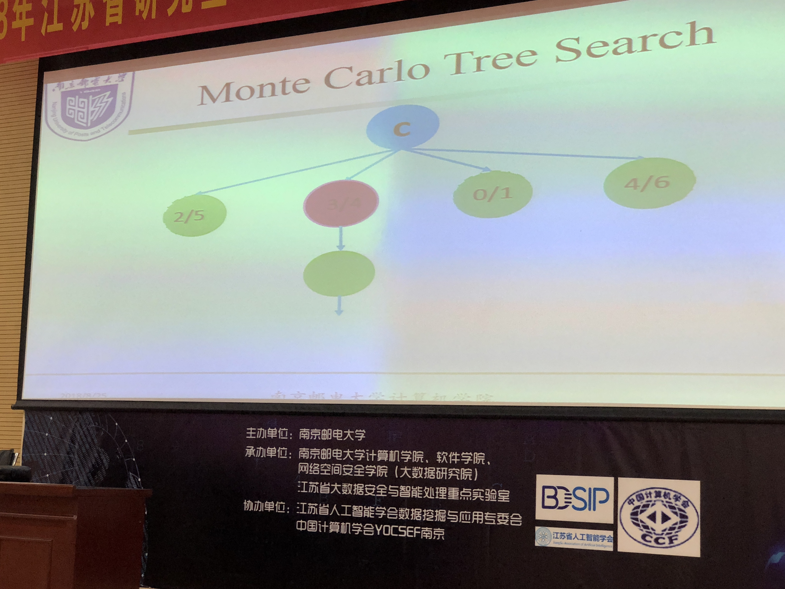

**机器学习分类（反馈）**

- 监督学习
- 半监督学习
- 无监督学习
- 强化学习、游戏

训练的数据：

- 监督学习中样例Instance：<x,y>
- MDP中的数据
  - 一步< V(s) ,r + rV(s') >
  - 目标最小化MSE = $\sum_{S}(r+rV(s') - V(s))^2$

总结：

- 游戏的复杂度
- 玩游戏的人工智能
  - 模型
  - 常见思路

展望：

- 更高效、更优的解
- 如何游戏开发中提高效率
- 智能算法与传统文化

#### 分布式数据库——大数据管理的基础支撑：韩京宇教授

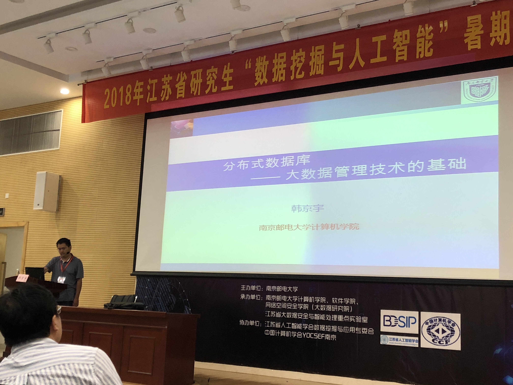

- 基础概念
- 数据分布技术
- 查询优化技术
- 事务提交技术
- 技术发展

基础概念：

两种类型：物理上分布，逻辑上集中；物理上分布，逻辑上分布

DDS主要特点：

- 数据是分布的
- 分布的数据是相关的
- 由DDBMS统一管理

物理分布、逻辑分布的数据库：

1. 实现现存的，分布的，异构的多个数据集合融合应用
2. 各个节点独立自治，且协商合作
3. 无全局模式

数据分布方式：

1. 划分式
2. 重复式
3. 混合式

关系数据库的数据分布单位：

- 水平分割
- 垂直分割

要求：

1. 完备性
2. 可重构性
3. 不相交性

分布式查询优化：

- IO代价
- CPU代价

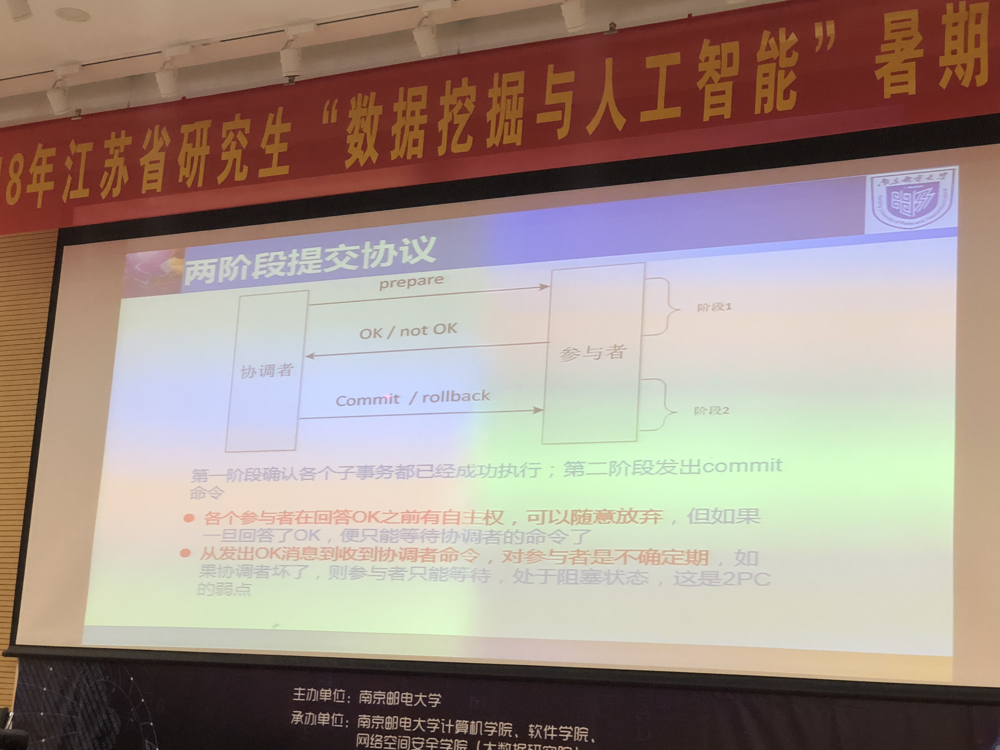

- Day 7 : 学术报告

[TOC]

#### 人工智能（AI）及机器学习简介：陈松灿教授


- AI简史和技术、局限和挑战
- 机器学习简介

应用：

- AlphaGo Zero
- 图像识别
- 无人驾驶
- 医学诊断
- 脑瘤诊断
- 金融工程

发展历程:萌芽期、推理期、知识期、学习期

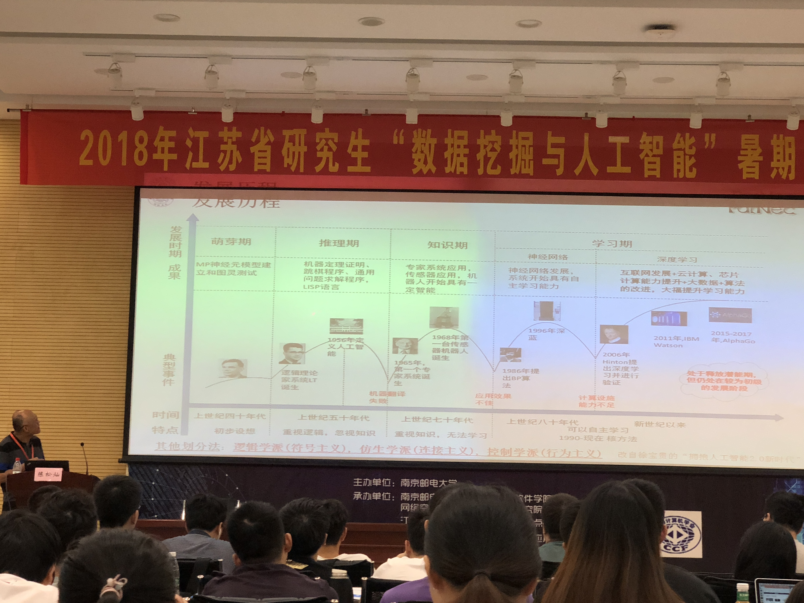

三种形态：

- 弱人工智能：擅长于单方面的人工智能
- 强人工智能：在各个方面都能和人类比肩的人工智能
- 超人工智能：在某些方面可以超过人的方面

**机器学习：**

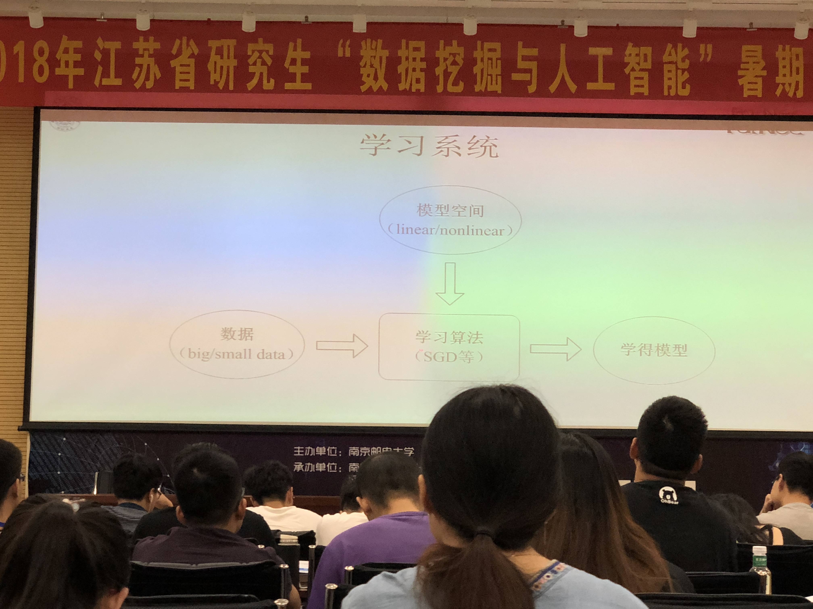

回顾历程：逻辑推理 -> 知识工程 -> 机器学习（AI的核心）

> 推理；知识：专家系统；学习

当前AI的局限与挑战

- 目前AI成功的应用主要在感知领域
- 共同面对的挑战
  - 安全的AI：不确定性问题，不可解释性问题
  - 小数据，大任务范式
  - 物理、社会常识缺乏
  - 认知问题
  - 知识表示，运用、理解
  - 数据共享，隐私保护问题

技术层面：四大趋势 -> 九大挑战

我国AI目标：

1. 大数据智能
2. 跨媒体智能
3. 自主智能
4. 混合增强智能

4大开放创新平台：

1. 自动驾驶：百度
2. 城市大脑：阿里
3. 医疗影像：腾讯
4. 智能语音：科大讯飞

学习系统：模型空间，数据，学习算法，学得模型

数据层面：

- 静态与动态
- 小数据与大数据
- 同质与异质
- 单态与多态
- 小类数与大类数

学习方法关系图


机器学习：建模和模型的选择

相关要素：

- 模型、映射函数f(.)刻画
- 确定目标、损失函数并优化获得模型
- 评测：泛化性能（可解释为举一反三的能力）

模型选择指导原则：

- 没有免费午餐定理（No Free Lunch Theorem） -> 模型选择

  没有天生优越的学习器，只有相对好的

- 丑小鸭定理（Ugly Duckling Theorem）-> 特征表示(Representation Learning)

  没有天生好的特征，只有结合了问题表示的知识表示才是好的

  -> 表示学习（Representation Learning）

为何用正则化？

意图：病态 -> 良态

Tikhonov正则化：借助某个辅助非负泛函/模型实现解的稳定化

深度学习网络中的：

1. 全衰减(Weight Decay)
2. 退出（Dropout）
3. 早期终止（Early Stopping）

本质：结合问题先验去建模

> 泛化Generalization = 数据Data + 知识Knowledge

总结：在有限样本下为未来建模，涉及：

- 特征层面
- 模型层面
- 优化层面

需要关注的机器学习方法

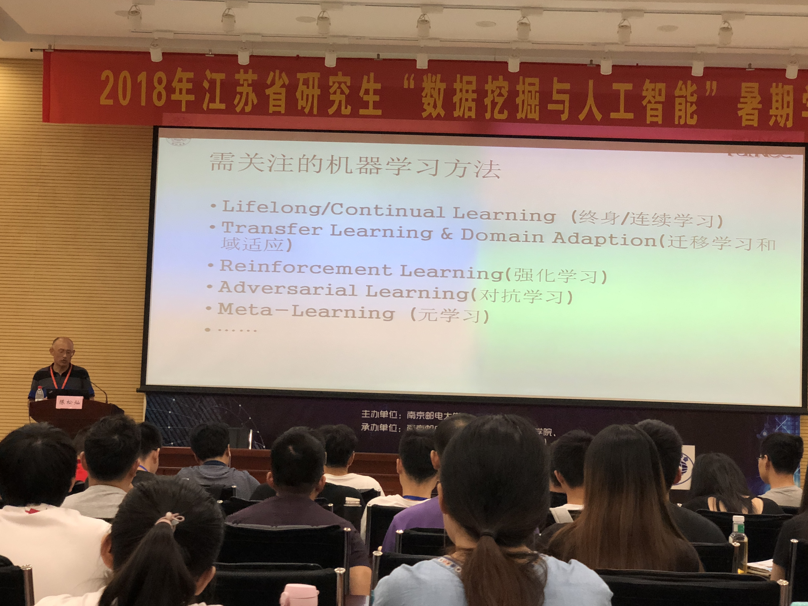

挑战依然存在，目前AI还在路上，还远远未成为理论完备的学科，任重道远。问题不在于技术，而是利益如何分配。

#### 稀疏学习模型及其优化：陈蕾

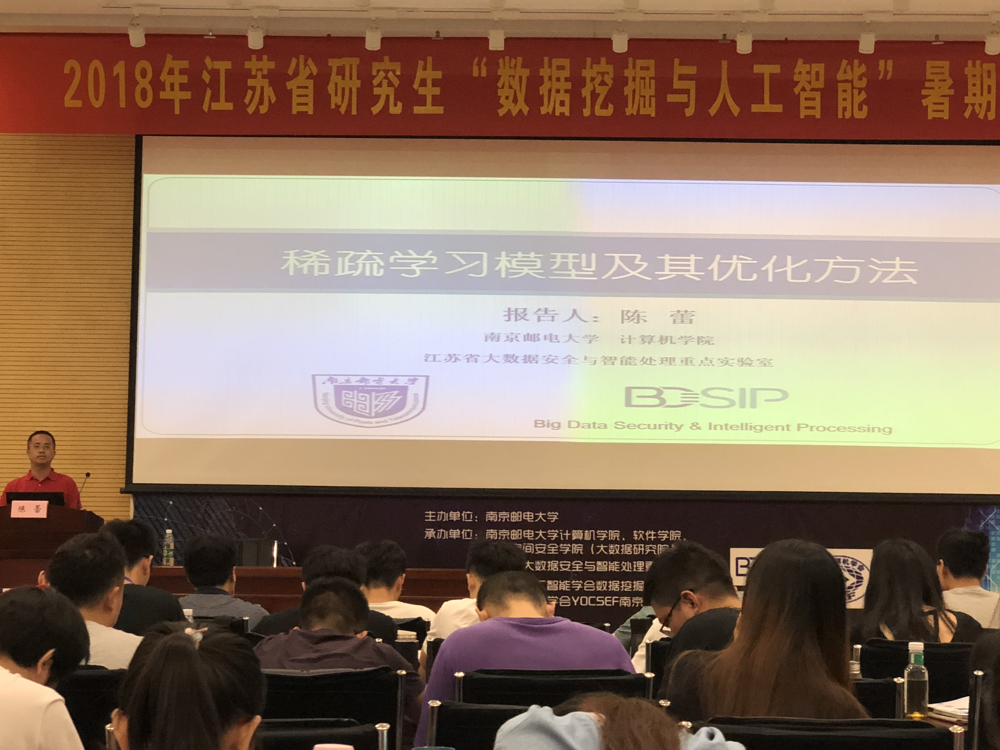

矩阵奇异值分解（SVD）-> 思想：把一个矩阵分成三个，然后并行进行计算，最后合在一起

梯度下降的本质：函数做一个一阶泰勒展开

一个数学表达式，n种方法求解

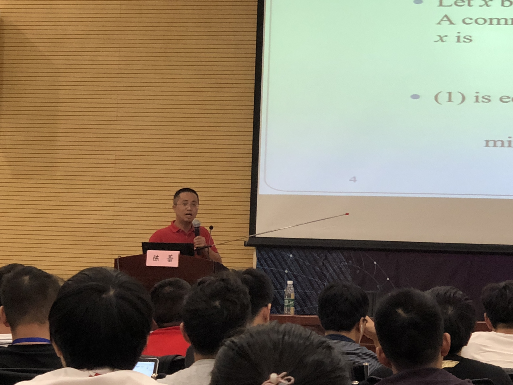

#### AlphaGo原理与实现：朱天驰，刘杰

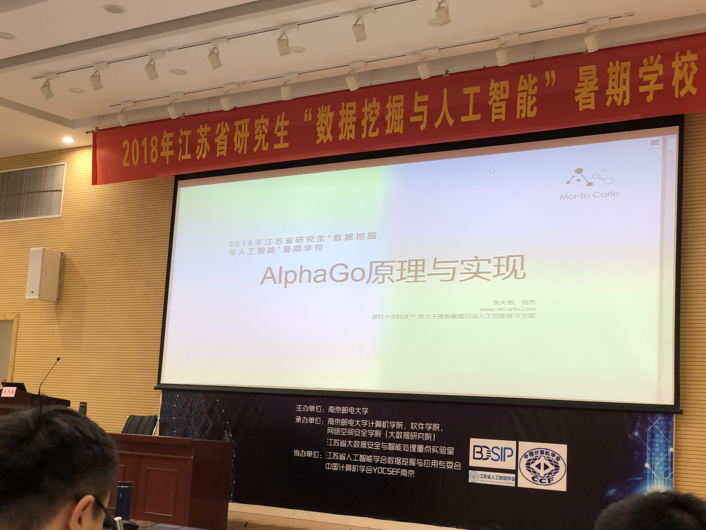

改进方法：

1. 剪枝
2. 减少浪费/防止错判：利用confidence进行判断是否走另一条路。慢慢两条路的confidence会趋于平衡
3. 减少只visit过一次的node

MCTS = Monte Carlo Tree Search


算法原理，如图所示

怎样学习P(s,a;$\theta$)

RL的哲学：从随机的步骤开始，慢慢让机器进行学习

#### 卷积神经网络的前世今生：寇佳新 阿里巴巴


卷积神经网络：卷积后，尺寸变小，要多加一些feature，进行填充，以保持原有的尺寸。

原则：多种kernels，分别进行不同的计算

多种kernel,有不同的属性，有的是取最大值，有的是缩小向量的大小长度。


#### 腾讯金融科技技术演进：程伟 腾讯金融

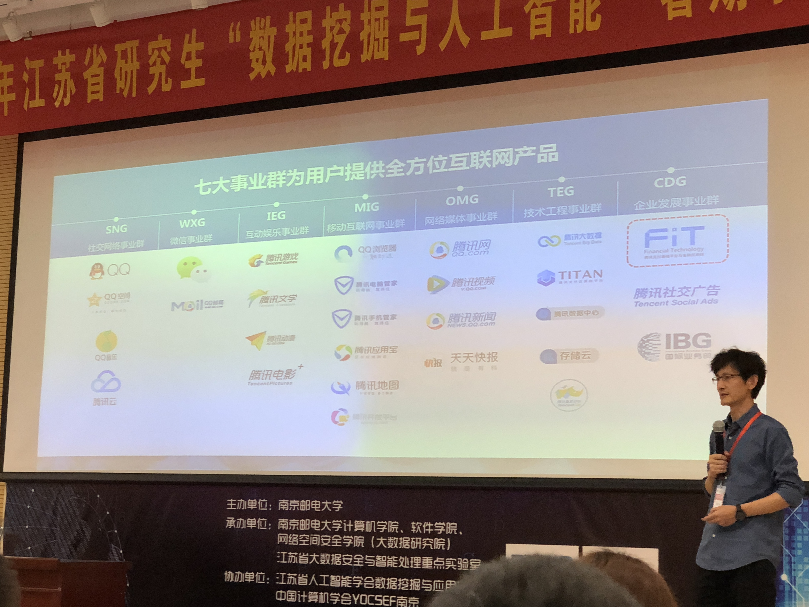

CAP定理：Consistency(一致性)，Availability(可用性)，Partition Tolerance(分区容错性)

技术不可能解决所有的业务问题，思考能否转变技术方式，用其他的技术来解决业务问题。

平台运营挑战与实现：

- 弹性供给能力
- 金融业务支撑
- 秒级监控能力
- 容灾能力
- 安全能力


**目录**

1. 两地多中心多活架构
2. 金融数据库安全
3. 智能化运维思考
4. AI助力金融业务创新

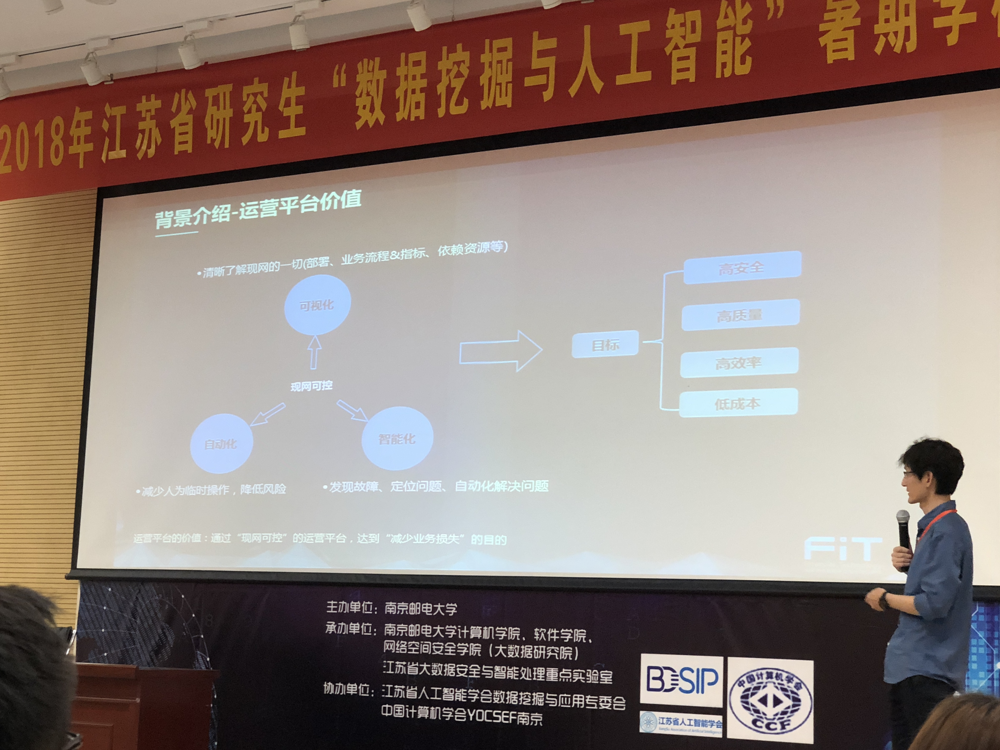

业务架构：如图所示

- Day 8 : 学术报告 & 分组交流

#### 社交媒体挖掘的方法与应用：邹志强

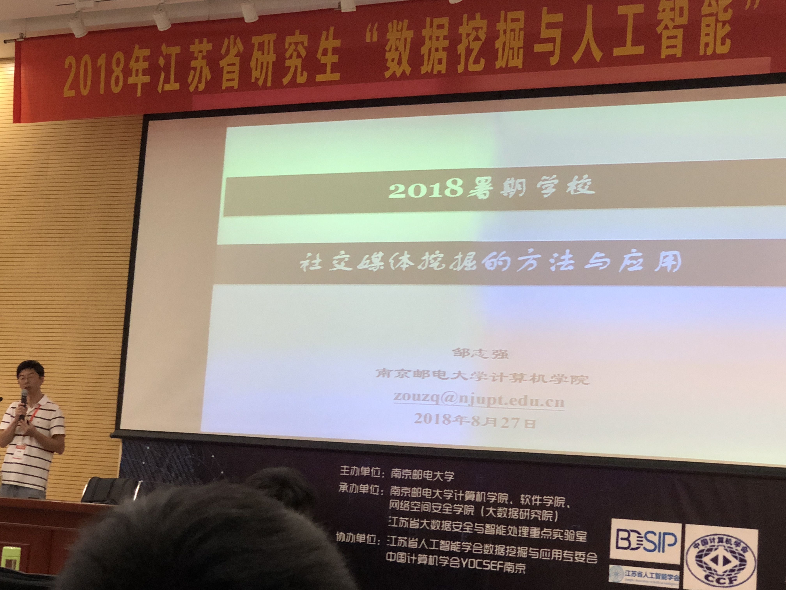

对于朋友圈的分析：位置、ID、评论等

本质是图的结构

利用历史事件对将来进行预测

从杂乱的数据中，提取出**有意义**的内容

大数据，小任务

程序大数据挖掘的相关研究：

- 分布式存储
- 大数据分析
- 对用户行为模式的分析

社交媒体挖掘中兴趣点提取

#### 分组交流

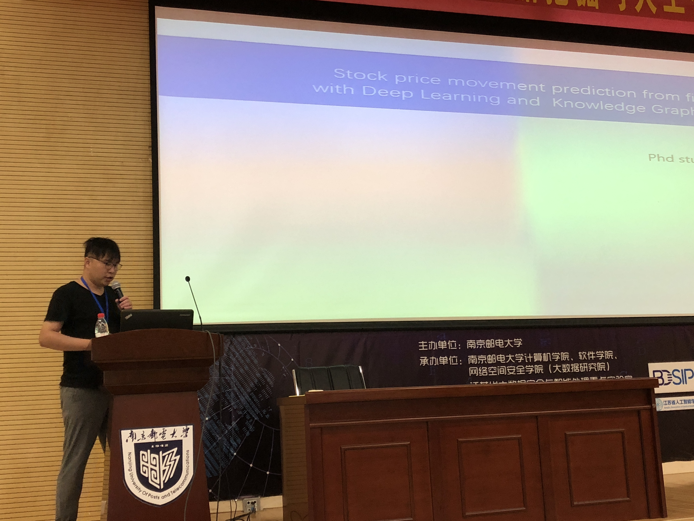

- 刘洋：股票价格预测
- 曹猛：图像识别的算法提取
- 监督网络denseNet
- 特征选择

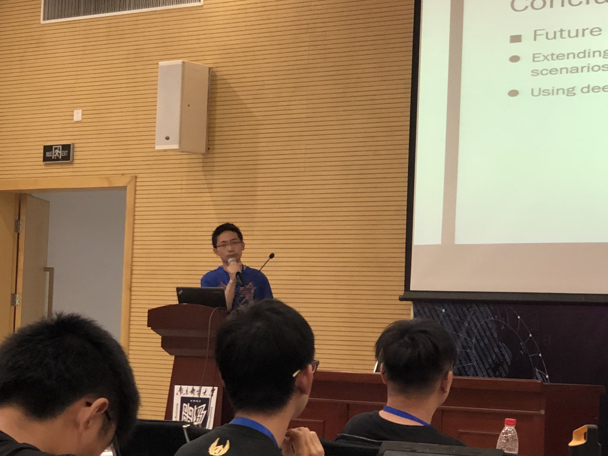

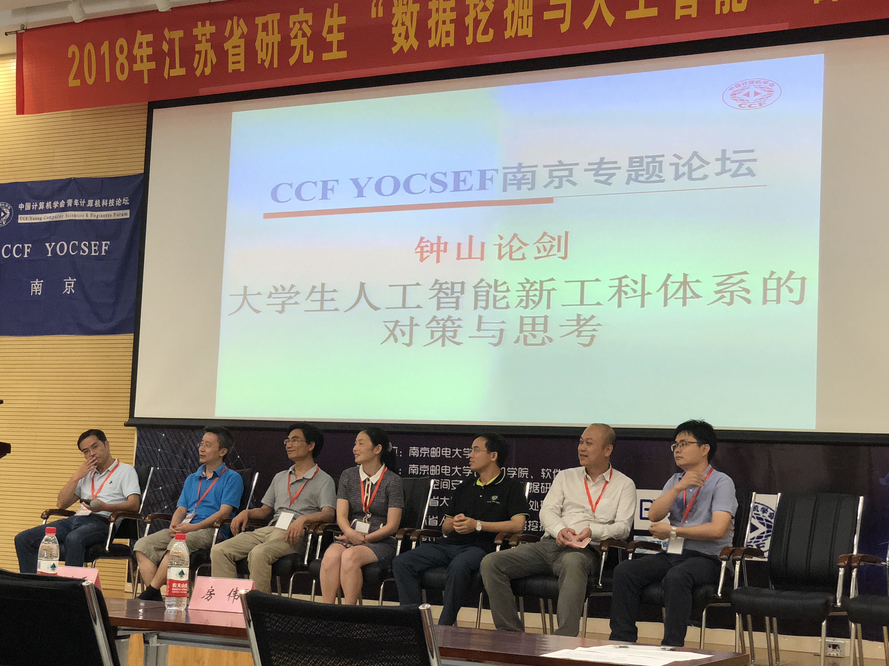

<center>CCF论坛</center>


- Day 9 :